# 整合式人員、經銷商、庫存與巡店資料庫設計規格

> 文件狀態：討論版設計基準  
> 建立日期：2026-07-18  
> 用途：供後續討論、資料表設計、T-SQL 實作、匯入程式、手機巡店功能及 AI 工作階段使用。  
> 人員、處所、經銷商負責關係及既有 Sales 規則，沿用已完成的《業務人員與經銷商資料庫設計規格》。  
> Sell in 的唯一鍵、退貨表示方式尚未確認；實作前必須先處理本文件「待確認事項」。

## 1. 設計範圍

本設計整合下列功能：

1. 員工基本資料。
2. 員工職級歷史。
3. 員工所屬處所歷史。
4. 經銷商負責業務歷史。
5. 既有 Sales 資料及其負責人歸屬。
6. 產品主檔。
7. 月度期初庫存匯入。
8. Sell in 進貨資料重複匯入。
9. 業務巡店紀錄。
10. 巡店期間實銷數量。
11. 巡店當下陳列數量。
12. 經銷商、產品及指定日期的推估庫存計算。

## 2. 核心設計原則

### 2.1 不以一張庫存表反覆覆寫

庫存相關資料代表不同性質的事實：

| 資料 | 性質 | 粒度 |
|---|---|---|
| 月度期初庫存 | 月初庫存基準 | 匯入批次＋經銷商＋產品 |
| Sell in | 進貨交易流量 | 來源交易／文件項次＋經銷商＋產品 |
| 巡店實銷 | 兩次巡店間的實銷流量 | 巡店＋產品 |
| 巡店陳列 | 巡店當下的陳列快照 | 巡店＋產品 |

### 2.2 推估庫存不建立獨立實體表

初期以查詢計算：

```text
推估庫存
＝正式批次中的月度期初庫存
＋指定期間內的有效 Sell in
－指定期間內有效巡店的實銷數量
```

陳列數量不參與庫存加減。陳列數量是經銷商庫存中，巡店當下放在賣場供顧客看見的數量。

### 2.3 歷史資料不可因換線或離職消失

- 離職員工不得刪除。
- 員工職級、處所、經銷商負責關係保留歷史。
- Sales 與巡店紀錄保存事件發生當時的負責關係及負責員工。
- 修改者不會因修改資料而成為該事件的負責人。

### 2.4 有效期間採前閉後開

```text
StartDateTime <= TargetDateTime
AND (EndDateTime IS NULL OR TargetDateTime < EndDateTime)
```

- 開始時間包含在有效期間內。
- 結束時間不包含在有效期間內。
- 結束時間為 NULL 表示目前仍有效。

## 3. 已確認的業務規則

### 3.1 員工職級

職級由低至高為：

1. 業務
2. 處長
3. 經理

- 一名員工同一時間只能有一個有效職級。
- 處長可以親自負責經銷商，不需要同時再保存一個業務職級。
- 是否負責經銷商，由有效的經銷商負責關係判斷。

### 3.2 處所與處長

- 一名員工同一時間只能屬於一個處所。
- 同一處所可以同時有多名處長。
- 不建立員工與主管的獨立對應表。
- 處長定義為：目前在職、目前屬於該處所、目前有效職級為處長。
- 同處所的所有有效處長具有相同的處所查看權限。

### 3.3 經銷商負責關係

- 一個經銷商同一時間只能有一名負責員工。
- 經銷商可以更換負責員工。
- 換線時結束舊負責關係，再新增接手人的負責關係。
- 不修改舊負責紀錄中的員工，也不刪除舊紀錄。
- 目前不需要主要、協助、代理等 AssignmentType。

### 3.4 經銷商代碼

- `DealerCode` 是經銷商業務上的唯一值。
- 例如 `TW002351001H` 唯一代表一個經銷商。
- 期初庫存與 Sell in 匯入時，使用經銷商代碼查找 `DealerId`。
- 不建立經銷商來源代碼對照表。

### 3.5 產品與型號

- `Product.ProductCode` 保存系統標準品號且必須唯一。
- 來源型號可透過明確規則轉成正確的標準品號。
- 不建立產品來源品號對照表。
- 匯入時若標準化後仍找不到產品，不得自動新增產品，也不得寫入正式庫存或進貨資料；整批匯入失敗並重新上傳。

### 3.6 既有 Sales 歸屬

- Sales 以 `DealerId＋SaleDateTime` 查找當時有效的 `DealerAssignmentId`。
- Sales 保存 `ResponsibleEmployeeId` 作為交易當時負責人的快照。
- `ResponsibleEmployeeId` 必須等於該 `DealerAssignmentId` 的 `EmployeeId`。
- 修改 `DealerId` 或 `SaleDateTime` 時，必須重新計算負責關係。
- 修改其他內容時不重新計算負責人。
- Sales 建立後 120 小時內可以修改，判斷使用資料庫伺服器時間。
- `CreatedAt` 一旦建立不得修改。

### 3.7 月度期初庫存

- 每月匯入一次期初庫存，用於建立及核對月初庫存基準。
- `202606期末` 的期末數量，作為 `202607` 的正式期初庫存。
- 一份期初庫存 Excel 包含所有經銷商。
- 不建立月度庫存快照表。
- 一次正式期初庫存匯入批次，直接對應多筆月度期初庫存明細。
- 同一正式批次中，同一經銷商、同一產品只能有一筆期初庫存明細。
- 同一資料月份只能有一個有效的正式期初庫存批次。

### 3.8 期初庫存整批替換

- 原始 Excel 永久保存。
- 若匯入內容有問題，不修改個別正式明細。
- 舊批次標記為 `Superseded` 或 `Voided`，再匯入新批次。
- 新批次以 `ReplacedBatchId` 指向被取代的舊批次。
- 正式庫存計算只採用目前有效的正式批次。
- 舊批次及其明細不物理刪除，以保留追查能力。

### 3.9 匯入原始檔案

- 不建立匯入原始資料列 Table。
- 每份原始 Excel 必須永久保存且不得被覆蓋。
- 實際儲存檔名應使用批次 ID 或其他唯一值。
- `ImportBatch` 保存原始檔名、實際儲存位置、檔案雜湊值及檔案大小。
- 正式明細保存 `ImportBatchId` 與 `SourceRowNumber`，可回到原始檔案的指定列追查。
- 資料庫備份與原始檔案備份必須配套。

### 3.10 Sell in

- Sell in 是經銷商的進貨交易流量。
- 同一月份會重複匯入多次。
- 目前暫時以 `BillingDate` 作為 `InventoryEffectiveDate`。
- 每筆正式進貨交易保存來源匯入批次及 Excel 列號。
- 重複匯入、交易更新、取消與退貨的最終規則尚待確認。

### 3.11 巡店

- 業務到店或經銷商自行回報時建立一筆 `StoreVisit`。
- `ReportDateTime` 不可為 NULL，由資料庫在建立回報時自動寫入。
- `EntrySourceType` 區分 `EMPLOYEE`（業務／助理填寫）與 `DEALER`（經銷商自行回報）。
- `DealerAssignmentId` 保存回報當時的正式負責業務關係；實際填寫者由 `CreatedByUserAccountId` 保存，兩者不得混用。
- `CreatedByUserAccountId` 用於分析正式業務現場填寫、助理代填、經銷商主動回報頻率，以及未來經銷商回報獎勵。
- `StoreVisitProductDetail` 保存該次回報中有填寫內容之產品的實銷日期、實銷數量與陳列數量。
- 同一次巡店、同一產品只能有一筆巡店產品明細。
- 實銷日期由 `StoreVisitProductDetail.SellOutDate` 保存，不在 `StoreVisit` 保存統計起訖期間。
- 陳列數量代表本次巡店當下看到的陳列快照。
- `SellOutQuantity` 與 `DisplayQuantity` 都以完整個數計算，使用 `int`，並允許 `NULL`。
- 數量為 `NULL` 表示本次沒有填寫；數量為 0 表示已明確回報數量為零；正整數表示實際回報數量。
- 填寫畫面的實銷日期預設為當天，使用者可以改為其他日期；只有陳列數量時，實銷日期可以不保存。
- `RecordStatus` 保存資料是否有效，目前使用 `ACTIVE`／`VOIDED`；`VOIDED` 不參與庫存計算。

### 3.12 巡店／回報修改期限

- 巡店／回報資料只允許在 `ReportDateTime` 後 72 小時內由一般使用者修改。
- 使用資料庫伺服器時間判斷。
- 72 小時期限即時計算，不另外保存 `LOCKED` 狀態。
- `CreatedAt` 不得修改。
- 超過 72 小時後，一般使用者不得修改。
- `UpdatedAt` 與 `UpdatedByUserAccountId` 保存最後修改時間與實際修改帳號。
- 只要任一 `StoreVisitProductDetail` 被新增、修改或刪除，必須同步更新所屬 `StoreVisit.UpdatedAt` 與 `StoreVisit.UpdatedByUserAccountId`。

## 4. 資料表清單

### 4.1 已完成的人員、經銷商與 Sales

1. `Employee`：員工基本資料。
2. `EmployeePositionHistory`：員工職級歷史。
3. `OrganizationUnit`：處所主檔。
4. `EmployeeOrgAssignmentHistory`：員工處所歸屬歷史。
5. `Dealer`：經銷商主檔。
6. `DealerLevelHistory`：經銷商等級與結束經銷歷程。
7. `DealerAssignmentHistory`：經銷商負責員工歷史。
8. `Sales`：既有銷售資料及當時負責人歸屬。

### 4.2 新增的庫存、匯入與巡店

9. `Product`：產品主檔。
10. `ImportBatch`：匯入批次及永久保存原始檔案的追蹤資料。
11. `MonthlyOpeningInventoryDetail`：月度期初庫存明細。
12. `SellInTransaction`：Sell in 進貨交易。
13. `StoreVisit`：巡店主檔。
14. `StoreVisitProductDetail`：巡店產品實銷及陳列明細。

### 4.3 巡店任務

15. `VisitTask`：公司建立的巡店任務主檔。
16. `VisitTaskExecution`：系統為每個任務及經銷商建立的待辦與執行回報。
17. `VisitTaskPhoto`：樣本照片及一般業務逐張對應的任務照片。

## 5. 資料表欄位

### 5.1 Employee

- `EmployeeId` PK
- `EmployeeNo` UK
- `EmployeeName`
- `HireDate`
- `TerminationDate`
- `IsLoginEnabled`

### 5.2 EmployeePositionHistory

- `EmployeePositionHistoryId` PK
- `EmployeeId` FK
- `PositionLevel`
- `StartDateTime`
- `EndDateTime`
- `ChangeReason`
- `CreatedAt`
- `CreatedByEmployeeId` FK

同一員工的有效職級期間不得重疊。

### 5.3 OrganizationUnit

- `OrgUnitId` PK
- `OrgUnitCode` UK
- `OrgUnitName`
- `IsActive`

### 5.4 EmployeeOrgAssignmentHistory

- `EmployeeOrgAssignmentId` PK
- `EmployeeId` FK
- `OrgUnitId` FK
- `StartDateTime`
- `EndDateTime`
- `ChangeReason`
- `CreatedAt`
- `CreatedByEmployeeId` FK

同一員工的處所歸屬期間不得重疊。

### 5.5 Dealer

- `DealerId` PK
- `DealerCode` UK
- `DealerName`
- `CreatedAt`

`CreatedAt` 表示經銷商主檔在系統中的建立時間，不表示開始經銷或等級生效時間。

### 5.6 DealerLevelHistory

- `DealerLevelHistoryId` PK
- `DealerId` FK
- `DealerStatus` `char(1)`：`A`、`B`、`C`、`D`、`E` 為經銷商等級；`Z` 表示結束經銷
- `StartDateTime`
- `EndDateTime` NULL
- `ChangeReason` `varchar(MAX)` NULL
- `CreatedAt`

`Dealer` 與 `DealerLevelHistory` 為 1:N。每次升等、降等或結束經銷都新增一筆歷程；原有效歷程的 `EndDateTime` 同時結束，新歷程的 `StartDateTime` 由該異動生效時間開始。`ChangeReason` 用於記錄升等、降等或結束經銷原因。

同一經銷商的等級有效期間不得重疊，且同一時間最多只能有一筆 `EndDateTime IS NULL` 的目前歷程。目前歷程為 `Z` 時代表已結束經銷；目前歷程為 `A`～`E` 時代表其現行等級。等級代碼應以 `CHECK (DealerStatus IN ('A','B','C','D','E','Z'))` 或等效機制限制。

### 5.7 DealerAssignmentHistory

- `DealerAssignmentId` PK
- `DealerId` FK
- `EmployeeId` FK
- `StartDateTime`
- `EndDateTime`
- `ChangeReason`
- `CreatedAt`
- `CreatedByEmployeeId` FK

同一經銷商的負責期間不得重疊。

### 5.8 Sales

- `SaleId` PK
- `DealerId` FK
- `SaleDateTime`
- `Amount`
- `DealerAssignmentId` FK
- `ResponsibleEmployeeId` FK
- `CreatedAt`
- `CreatedByEmployeeId` FK
- `UpdatedAt`
- `UpdatedByEmployeeId` FK

### 5.9 Product

- `ProductId` PK
- `ProductCode` UK
- `ProductName`
- `CategoryLevel1`
- `CategoryLevel2`
- `IsActive`
- `CreatedAt`

### 5.10 ImportBatch

- `ImportBatchId` PK
- `ImportType`
- `DataMonth`
- `DataDate`
- `OriginalFileName`
- `StoredFileName`
- `StoredFilePath`
- `FileHash`
- `FileSize`
- `ImportStatus`
- `ReplacedBatchId` FK，可為 NULL
- `TotalRowCount`
- `SuccessRowCount`
- `ErrorRowCount`
- `ErrorSummary`
- `ErrorReportPath`
- `ImportedAt`
- `ImportedByEmployeeId` FK

建議匯入狀態至少包含：

```text
Processing
Failed
Official
Superseded
Voided
```

### 5.11 MonthlyOpeningInventoryDetail

- `OpeningInventoryDetailId` PK
- `ImportBatchId` FK
- `SourceRowNumber`
- `DealerId` FK
- `ProductId` FK
- `OpeningQuantity`

唯一性概念：

```text
ImportBatchId＋DealerId＋ProductId
```

### 5.12 SellInTransaction

- `SellInTransactionId` PK
- `ImportBatchId` FK
- `SourceRowNumber`
- `DealerId` FK
- `ProductId` FK
- `SalesDocumentNo`
- `SalesDocumentItemNo`
- `InvoiceNo`
- `OrderDate`
- `BillingDate`
- `InvoiceDate`
- `InventoryEffectiveDate`
- `Quantity`
- `TransactionType`
- `TransactionStatus`
- `ReviewStatus`
- `CreatedAt`
- `UpdatedAt`

### 5.13 StoreVisit

- `StoreVisitId` PK
- `DealerId` FK
- `DealerAssignmentId` FK，可為 NULL
- `EntrySourceType`，`EMPLOYEE`／`DEALER`
- `ReportDateTime`，NOT NULL，由資料庫自動寫入
- `RecordStatus`，`ACTIVE`／`VOIDED`
- `CreatedAt`
- `CreatedByUserAccountId` FK
- `UpdatedAt`
- `UpdatedByUserAccountId` FK，可為 NULL

`ReportDateTime` 是回報時間及 72 小時修改期限起算點。`CreatedAt` 是資料列實際寫入資料庫的不可變稽核時間。`CreatedByUserAccountId` 必須保存真正操作的登入帳號，不可改填正式負責業務。

### 5.14 StoreVisitProductDetail

- `StoreVisitProductDetailId` PK
- `StoreVisitId` FK
- `ProductId` FK
- `SellOutQuantity`，`int`，可為 NULL
- `SellOutDate`，`date`，可為 NULL；畫面預設當天且可修改
- `DisplayQuantity`，`int`，可為 NULL
- `CreatedAt`
- `UpdatedAt`，可為 NULL

唯一性概念：

```text
StoreVisitId＋ProductId
```

資料紀錄規則：

- `SellOutQuantity` 與 `DisplayQuantity` 只接受 `NULL`、0 或正整數，不接受負數。
- `NULL` 表示本次沒有填寫；0 表示使用者明確回報數量為零。
- `SellOutDate` 是實銷日期，與 `DisplayQuantity` 沒有必然關係。
- 畫面可以預先顯示所有可回報商品；若某商品的 `SellOutQuantity`、`SellOutDate` 與 `DisplayQuantity` 全部為 NULL，則不建立該商品的明細資料列。
- `CreatedAt` 是該商品明細資料列的建立時間；`UpdatedAt` 是該資料列最後修改時間，並不表示哪一個欄位被修改。
- 明細被新增、修改或刪除時，必須同步更新 `StoreVisit.UpdatedAt` 與 `StoreVisit.UpdatedByUserAccountId`，使表頭反映整張回報單最後的異動時間與異動者。

### 5.15 VisitTask

- `VisitTaskId` PK
- `TaskTitle`，任務標題，例如「新機上市布置」
- `Instruction`，`nvarchar(max)`，任務詳細說明
- `ValidFrom`，`date`，任務開始執行日期
- `DueDate`，`date`，任務完成期限
- `RecordStatus`，`ACTIVE`／`VOIDED`
- `SampleTaskExecutionId` FK、UQ，可為 NULL，指定唯一樣本執行
- `SampleApprovedByEmployeeId` FK，可為 NULL，樣本核准員工
- `SampleApprovedAt`，可為 NULL，樣本核准時間
- `CreatedByEmployeeId` FK，實際建立任務的員工
- `CreatedAt`，資料庫寫入的建立時間
- `UpdatedByEmployeeId` FK，可為 NULL，最後修改任務的員工
- `UpdatedAt`，可為 NULL，最後修改時間

任務規則：

- 任務建立人不限定為經理；經理、助理或其他員工能否建立任務，由後端權限控制。
- `CreatedByEmployeeId` 與 `CreatedAt` 建立後不得因任務被修改而變更。
- `UpdatedAt` 有值時，`UpdatedByEmployeeId` 必須有值；尚未修改時兩者均為 NULL。
- `DueDate` 不得早於 `ValidFrom`。
- `RecordStatus` 只表示任務資料是否有效；`ACTIVE` 表示有效，`VOIDED` 表示作廢。
- 尚未開始、執行中及已截止由目前日期與 `ValidFrom`／`DueDate` 即時計算，不另外存入 `VisitTask`。
- 不保存 `IsSampleExecution`。樣本搜尋條件是 `VisitTask.SampleTaskExecutionId = VisitTaskExecution.TaskExecutionId`，被指到的執行紀錄就是唯一樣本。
- 為避免任務 A 指到任務 B 的執行紀錄，使用 `(VisitTaskId, SampleTaskExecutionId)` 對應 `VisitTaskExecution(VisitTaskId, TaskExecutionId)` 的複合外鍵概念。
- `SampleTaskExecutionId` 為 NULL 表示尚未指定樣本；樣本 `SubmittedAt` 為 NULL 表示製作中；樣本已送出但 `SampleApprovedAt` 為 NULL 表示等待核准；`SampleApprovedAt` 有值後其他業務才可執行。

### 5.16 VisitTaskExecution

- `TaskExecutionId` PK
- `VisitTaskId` FK、UQ1
- `DealerId` FK、UQ1
- `ResponsibleEmployeeId` FK，任務發布時負責該經銷商的業務快照
- `CompletedByEmployeeId` FK，可為 NULL，實際回報員工
- `ExecutionNote`，`nvarchar(max)`，可為 NULL，執行或未執行的狀況說明
- `SubmittedAt`，可為 NULL，正式送出時間
- `CreatedAt`，系統建立待辦資料的時間

執行規則：

- 不使用 `VisitTaskAssignment`；任務發布時，系統依有效的 `DealerAssignmentHistory` 自動為所有應回報經銷商建立待辦資料。
- `VisitTaskId＋DealerId` 必須唯一，所以同一任務、同一家經銷商必須且只能有一筆執行資料。
- `SubmittedAt` 為 NULL 表示尚未正式回報。
- 正式送出時 `ExecutionNote` 必填；有完整照片表示已執行，沒有照片則表示未執行，說明中必須寫明原因。
- 任務執行獨立於巡店，不保存 `StoreVisitId`。

### 5.17 VisitTaskPhoto

- `TaskPhotoId` PK
- `TaskExecutionId` FK
- `SampleTaskPhotoId` FK，可為 NULL，一般照片所對應的樣本照片
- `PhotoDescription`，樣本照片說明
- `StoredFileName`
- `StoredFilePath`
- `CapturedAt`
- `SortOrder`
- `UploadedAt`

照片規則：

- 樣本照片的 `SampleTaskPhotoId` 為 NULL，且 `PhotoDescription`、`SortOrder` 必填。
- 樣本照片例如依序定義「跳跳牌照片」、「製冰盒照片」、「鏡面烤漆照片」。
- 一般業務的每張照片必須以 `SampleTaskPhotoId` 指向一張樣本照片。
- 一般業務不可修改照片說明與順序；畫面必須從所指向的樣本照片讀取 `PhotoDescription` 及 `SortOrder`。
- 樣本有幾個照片項目，一般已執行回報就必須完成幾個對應照片，因此不保存 `MinPhotoCount`。

## 6. 整合 ER Model

```mermaid
erDiagram
    Employee {
        bigint 員工ID_EmployeeId PK
        nvarchar 員工編號_EmployeeNo UK
        nvarchar 員工姓名_EmployeeName
        datetime2 到職時間_HireDate
        datetime2 離職時間_TerminationDate
        bit 允許登入_IsLoginEnabled
    }

    EmployeePositionHistory {
        bigint 職級歷史ID_EmployeePositionHistoryId PK
        bigint 員工ID_EmployeeId FK
        varchar 職級_PositionLevel
        datetime2 開始時間_StartDateTime
        datetime2 結束時間_EndDateTime
        nvarchar 異動原因_ChangeReason
        datetime2 建立時間_CreatedAt
        bigint 建立者員工ID_CreatedByEmployeeId FK
    }

    OrganizationUnit {
        bigint 處所ID_OrgUnitId PK
        varchar 處所代碼_OrgUnitCode UK
        nvarchar 處所名稱_OrgUnitName
        bit 是否啟用_IsActive
    }

    EmployeeOrgAssignmentHistory {
        bigint 處所歸屬歷史ID_EmployeeOrgAssignmentId PK
        bigint 員工ID_EmployeeId FK
        bigint 處所ID_OrgUnitId FK
        datetime2 開始時間_StartDateTime
        datetime2 結束時間_EndDateTime
        nvarchar 異動原因_ChangeReason
        datetime2 建立時間_CreatedAt
        bigint 建立者員工ID_CreatedByEmployeeId FK
    }

    Dealer {
        bigint 經銷商ID_DealerId PK
        varchar 經銷商代碼_DealerCode UK
        nvarchar 經銷商名稱_DealerName
        datetime2 建立時間_CreatedAt
    }

    DealerLevelHistory {
        bigint 經銷商等級歷程ID_DealerLevelHistoryId PK
        bigint 經銷商ID_DealerId FK
        char 經銷商等級或結束狀態_DealerStatus
        datetime2 等級開始時間_StartDateTime
        datetime2 等級結束時間_EndDateTime
        varchar(MAX) 升降等或結束原因_ChangeReason
        datetime2 歷程建立時間_CreatedAt
    }

    DealerAssignmentHistory {
        bigint 經銷商負責歷史ID_DealerAssignmentId PK
        bigint 經銷商ID_DealerId FK
        bigint 負責員工ID_EmployeeId FK
        datetime2 開始時間_StartDateTime
        datetime2 結束時間_EndDateTime
        nvarchar 異動原因_ChangeReason
        datetime2 建立時間_CreatedAt
        bigint 建立者員工ID_CreatedByEmployeeId FK
    }

    Sales {
        bigint 銷售ID_SaleId PK
        bigint 經銷商ID_DealerId FK
        datetime2 銷售發生時間_SaleDateTime
        decimal 銷售金額_Amount
        bigint 經銷商負責歷史ID_DealerAssignmentId FK
        bigint 當時負責員工ID_ResponsibleEmployeeId FK
        datetime2 建立時間_CreatedAt
        bigint 建立者員工ID_CreatedByEmployeeId FK
        datetime2 最後修改時間_UpdatedAt
        bigint 最後修改者員工ID_UpdatedByEmployeeId FK
    }

    Product {
        bigint 產品ID_ProductId PK
        varchar 標準品號_ProductCode UK
        nvarchar 產品名稱_ProductName
        nvarchar 產品大類_CategoryLevel1
        nvarchar 產品細類_CategoryLevel2
        bit 是否啟用_IsActive
        datetime2 建立時間_CreatedAt
    }

    ImportBatch {
        bigint 匯入批次ID_ImportBatchId PK
        varchar 匯入類型_ImportType
        char 資料月份_DataMonth
        date 資料基準日_DataDate
        nvarchar 原始檔名_OriginalFileName
        nvarchar 儲存檔名_StoredFileName
        nvarchar 檔案位置_StoredFilePath
        varchar 檔案雜湊值_FileHash
        bigint 檔案大小_FileSize
        varchar 匯入狀態_ImportStatus
        bigint 取代批次ID_ReplacedBatchId FK
        int 原始列數_TotalRowCount
        int 成功列數_SuccessRowCount
        int 錯誤列數_ErrorRowCount
        nvarchar 錯誤摘要_ErrorSummary
        nvarchar 錯誤報告位置_ErrorReportPath
        datetime2 匯入時間_ImportedAt
        bigint 匯入者員工ID_ImportedByEmployeeId FK
    }

    MonthlyOpeningInventoryDetail {
        bigint 期初庫存明細ID_OpeningInventoryDetailId PK
        bigint 匯入批次ID_ImportBatchId FK
        int Excel列號_SourceRowNumber
        bigint 經銷商ID_DealerId FK
        bigint 產品ID_ProductId FK
        int 期初庫存數量_OpeningQuantity
    }

    SellInTransaction {
        bigint 進貨交易ID_SellInTransactionId PK
        bigint 匯入批次ID_ImportBatchId FK
        int Excel列號_SourceRowNumber
        bigint 經銷商ID_DealerId FK
        bigint 產品ID_ProductId FK
        varchar 銷售文件號碼_SalesDocumentNo
        varchar 文件項次_SalesDocumentItemNo
        varchar 發票號碼_InvoiceNo
        date 訂單日期_OrderDate
        date 計帳日期_BillingDate
        date 發票日期_InvoiceDate
        date 庫存生效日期_InventoryEffectiveDate
        decimal 進貨數量_Quantity
        varchar 交易類型_TransactionType
        varchar 交易狀態_TransactionStatus
        varchar 審核狀態_ReviewStatus
        datetime2 建立時間_CreatedAt
        datetime2 最後更新時間_UpdatedAt
    }

    StoreVisit {
        bigint 巡店ID_StoreVisitId PK
        bigint 經銷商ID_DealerId FK
        bigint 經銷商負責歷史ID_DealerAssignmentId FK
        varchar 填寫來源_EntrySourceType
        datetime2 回報時間_ReportDateTime
        varchar 資料狀態_RecordStatus
        datetime2 建立時間_CreatedAt
        bigint 實際建立帳號ID_CreatedByUserAccountId FK
        datetime2 最後修改時間_UpdatedAt
        bigint 最後修改帳號ID_UpdatedByUserAccountId FK
    }

    StoreVisitProductDetail {
        bigint 巡店產品明細ID_StoreVisitProductDetailId PK
        bigint 巡店ID_StoreVisitId FK
        bigint 產品ID_ProductId FK
        int 實銷數量_SellOutQuantity
        date 實銷日期_SellOutDate
        int 陳列數量_DisplayQuantity
        datetime2 建立時間_CreatedAt
        datetime2 最後修改時間_UpdatedAt
    }

    VisitTask {
        bigint 巡店任務ID_VisitTaskId PK
        nvarchar 任務標題_TaskTitle
        nvarchar 任務說明_Instruction
        date 開始執行日期_ValidFrom
        date 完成期限_DueDate
        varchar 資料狀態_RecordStatus
        bigint 唯一樣本執行ID_SampleTaskExecutionId FK
        bigint 樣本核准員工ID_SampleApprovedByEmployeeId FK
        datetime2 樣本核准時間_SampleApprovedAt
        bigint 建立者員工ID_CreatedByEmployeeId FK
        datetime2 建立時間_CreatedAt
        bigint 最後修改者員工ID_UpdatedByEmployeeId FK
        datetime2 最後修改時間_UpdatedAt
    }

    VisitTaskExecution {
        bigint 任務執行ID_TaskExecutionId PK
        bigint 巡店任務ID_VisitTaskId FK
        bigint 經銷商ID_DealerId FK
        bigint 發布時負責業務ID_ResponsibleEmployeeId FK
        bigint 實際回報員工ID_CompletedByEmployeeId FK
        nvarchar 任務狀況說明_ExecutionNote
        datetime2 正式送出時間_SubmittedAt
        datetime2 待辦建立時間_CreatedAt
    }

    VisitTaskPhoto {
        bigint 任務照片ID_TaskPhotoId PK
        bigint 任務執行ID_TaskExecutionId FK
        bigint 對應樣本照片ID_SampleTaskPhotoId FK
        nvarchar 樣本照片說明_PhotoDescription
        nvarchar 儲存檔名_StoredFileName
        nvarchar 儲存路徑_StoredFilePath
        datetime2 拍照時間_CapturedAt
        int 顯示順序_SortOrder
        datetime2 上傳時間_UploadedAt
    }

    Employee ||--o{ EmployeePositionHistory : "具有職級歷史"
    Employee ||--o{ EmployeeOrgAssignmentHistory : "具有處所歷史"
    OrganizationUnit ||--o{ EmployeeOrgAssignmentHistory : "包含人員"

    Employee ||--o{ DealerAssignmentHistory : "負責經銷商"
    Dealer ||--o{ DealerAssignmentHistory : "具有負責歷史"
    Dealer ||--o{ DealerLevelHistory : "具有等級歷程"

    Dealer ||--o{ Sales : "發生銷售"
    DealerAssignmentHistory ||--o{ Sales : "決定銷售歸屬"
    Employee ||--o{ Sales : "負責或建立修改"

    Employee ||--o{ EmployeePositionHistory : "建立職級異動"
    Employee ||--o{ EmployeeOrgAssignmentHistory : "建立處所異動"
    Employee ||--o{ DealerAssignmentHistory : "建立換線異動"

    Employee ||--o{ ImportBatch : "執行匯入"
    ImportBatch o|--o{ ImportBatch : "整批取代"

    ImportBatch ||--o{ MonthlyOpeningInventoryDetail : "產生期初庫存"
    Dealer ||--o{ MonthlyOpeningInventoryDetail : "具有期初庫存"
    Product ||--o{ MonthlyOpeningInventoryDetail : "期初庫存產品"

    ImportBatch ||--o{ SellInTransaction : "產生進貨交易"
    Dealer ||--o{ SellInTransaction : "收到進貨"
    Product ||--o{ SellInTransaction : "進貨產品"

    Dealer ||--o{ StoreVisit : "接受巡店"
    DealerAssignmentHistory ||--o{ StoreVisit : "巡店當時負責關係"
    UserAccount ||--o{ StoreVisit : "實際建立或修改"

    StoreVisit ||--o{ StoreVisitProductDetail : "包含產品資料"
    Product ||--o{ StoreVisitProductDetail : "被巡查產品"
    Employee ||--o{ VisitTask : "建立或修改任務"
    VisitTask ||--o{ VisitTaskExecution : "每家經銷商執行資料"
    Dealer ||--o{ VisitTaskExecution : "必須回報任務"
    Employee ||--o{ VisitTaskExecution : "負責或實際回報"
    VisitTaskExecution o|--o| VisitTask : "被指定為唯一樣本"
    VisitTaskExecution ||--o{ VisitTaskPhoto : "包含照片"
    VisitTaskPhoto o|--o{ VisitTaskPhoto : "一般照片對應樣本照片"
```



## 7. 推估庫存計算規則

### 7.1 計算維度

推估庫存以以下維度計算：

```text
DealerId＋ProductId＋TargetDateTime
```

### 7.2 計算來源

1. 從目標日期所屬月份的有效正式期初庫存批次，取得 `OpeningQuantity`。
2. 加總期初庫存基準日至目標日期間有效的 `SellInTransaction.Quantity`。
3. 加總並扣除同期間有效巡店中的 `StoreVisitProductDetail.SellOutQuantity`。

### 7.3 完整概念式

```text
EstimatedInventoryQuantity
= OpeningQuantity from MonthlyOpeningInventoryDetail
+ SUM(Quantity from valid SellInTransaction)
- SUM(SellOutQuantity from valid StoreVisitProductDetail)
```

### 7.4 有效資料條件

- 期初庫存所屬 `ImportBatch.ImportStatus = Official`。
- Sell in 所屬匯入批次必須有效，交易狀態也必須納入有效交易定義。
- 巡店狀態必須是已送出或已鎖定等有效狀態。
- 草稿、作廢、已被取代的資料不參與計算。

### 7.5 推估庫存的時間限制

巡店實銷不是即時 POS 銷售，而是業務巡店時回報上次巡店至本次巡店間的數量。因此兩次巡店之間，推估庫存可能高於實際庫存。使用者介面應顯示最近有效巡店時間或庫存資料截至時間。

## 8. 重要不變條件

1. 不刪除離職員工及歷史關係。
2. 同一員工的有效職級期間不得重疊。
3. 同一員工的有效處所歸屬期間不得重疊。
4. 同一經銷商的有效負責期間不得重疊。
5. 同一處所可以同時存在多名處長。
6. `Sales.DealerAssignmentId` 必須符合 `Sales.DealerId＋SaleDateTime`。
7. `Sales.ResponsibleEmployeeId` 必須與其負責關係的員工一致。
8. `StoreVisit.DealerAssignmentId` 有值時，必須符合 `StoreVisit.DealerId＋ReportDateTime` 當時有效的正式負責關係。
9. `StoreVisit.CreatedByUserAccountId` 必須是實際填寫者，不得以正式負責業務取代助理或經銷商帳號。
10. Sales 與巡店的 `CreatedAt` 不得修改。
11. 巡店／回報資料只能在 `ReportDateTime` 後 72 小時內由一般使用者修改。
12. `StoreVisit.RecordStatus = VOIDED` 的資料不得參與實銷及庫存計算。
13. 同一正式期初庫存批次中，`DealerId＋ProductId` 不得重複。
14. 同一月份只能有一個有效的正式期初庫存批次。
15. 同一次巡店中，`ProductId` 不得重複。
16. `SellOutQuantity` 與 `DisplayQuantity` 只能是 NULL、0 或正整數；三個回報欄位全為 NULL 時不得建立空白明細。
17. `VisitTask.DueDate` 不得早於 `ValidFrom`。
18. `VisitTask.CreatedByEmployeeId` 永遠保存原始建立者；修改者只能寫入 `UpdatedByEmployeeId`。
19. `VisitTask.SampleTaskExecutionId` 必須指向同一 `VisitTaskId` 之下的執行紀錄，且一個任務只能指定一筆樣本。
20. 同一任務、同一家經銷商必須且只能有一筆 `VisitTaskExecution`。
21. 樣本照片必須有說明與順序；一般照片必須逐張對應樣本照片，且不得修改樣本說明與順序。
22. 原始匯入 Excel 必須永久保存且不得被覆蓋。
23. 作廢或被取代的匯入批次不得參與正式庫存計算。
24. 型號無法依規則轉為有效 ProductId 時，整批匯入失敗。

## 9. 待確認事項

### 9.1 Sell in 庫存生效日期

目前暫定：

```text
InventoryEffectiveDate = BillingDate
```

仍需確認應採用 `OrderDate`、`BillingDate` 或 `InvoiceDate`。

### 9.2 Sell in 唯一鍵

需要確認來源檔案是否有穩定的文件項次。候選組合可能包含：

```text
SalesDocumentNo＋SalesDocumentItemNo
```

不可在確認前假定 `SalesDocumentNo＋Model` 一定唯一。

### 9.3 退貨、取消與數量更正

需要確認來源系統是：

- 保留原文件號並改變狀態或數量；或
- 新增另一張退貨／沖銷文件。

確認後再定義 `TransactionType`、`TransactionStatus` 及重複匯入更新規則。

### 9.4 Sell in 重複匯入

同月份會重複匯入。待唯一鍵與退貨規則確認後，必須定義：

- 已存在且未變更：略過。
- 已存在但狀態或數量變更：更新或產生狀態歷史。
- 尚未存在：新增。
- 新檔案未出現的舊交易：不得直接刪除，除非確認新檔是完整取代型資料。

## 10. 機器可讀規則

```yaml
specification: integrated_employee_dealer_inventory_visit
status: discussion_baseline
date: 2026-07-18

temporal_interval:
  type: half_open
  predicate: "start <= target AND (end IS NULL OR target < end)"

employee:
  delete_after_termination: false
  active_position_max_count: 1
  active_org_unit_max_count: 1
  positions:
    - sales
    - director
    - manager

organization_unit:
  multiple_directors_allowed: true
  explicit_supervisor_relationship: false

dealer:
  dealer_code_is_unique: true
  external_code_table_required: false

dealer_assignment:
  active_employee_max_count_per_dealer: 1
  overlapping_periods_allowed: false
  history_is_immutable: true
  assignment_type_required: false

product:
  product_code_is_unique: true
  source_code_mapping_table_required: false
  normalize_source_model_by_rule: true
  auto_create_when_not_found: false

sales:
  assignment_basis: dealer_and_sale_datetime
  store_dealer_assignment_id: true
  store_responsible_employee_snapshot: true
  edit_window_hours: 120
  created_at_is_immutable: true

import:
  raw_row_table_required: false
  original_file_permanently_stored: true
  original_file_is_immutable: true
  detail_source_trace:
    - import_batch_id
    - source_row_number
  batch_replacement_supported: true
  physical_delete_replaced_batch: false

opening_inventory:
  snapshot_header_table_required: false
  file_contains_all_dealers: true
  one_official_batch_per_month: true
  correction_method: replace_whole_batch
  unique_detail_key:
    - import_batch_id
    - dealer_id
    - product_id

sell_in:
  repeated_import_during_month: true
  inventory_effective_date: billing_date_provisional
  unique_key: pending_confirmation
  return_and_cancel_rule: pending_confirmation

store_visit:
  store_assignment_snapshot: true
  actual_creator_account_required: true
  entry_source_types:
    - EMPLOYEE
    - DEALER
  report_datetime_required: true
  edit_window_hours: 72
  created_at_is_immutable: true
  record_statuses:
    - ACTIVE
    - VOIDED
  voided_record_affects_inventory: false
  sell_out_date_stored_in_product_detail: true
  sell_out_date_ui_default: current_date
  sell_out_date_is_editable: true
  sell_out_quantity_type: int
  display_quantity_type: int
  null_quantity_means_not_reported: true
  zero_quantity_means_explicit_zero: true
  negative_quantity_allowed: false
  empty_product_detail_is_not_persisted: true
  checked_flag_columns_required: false
  product_detail_change_updates_store_visit_audit: true
  display_is_point_in_time_snapshot: true
  unique_product_detail_key:
    - store_visit_id
    - product_id

visit_task:
  record_statuses:
    - ACTIVE
    - VOIDED
  lifecycle_phase_is_derived_from_dates: true
  assignment_progress_stored_in_task: false
  creator_is_original_employee: true
  creator_is_immutable: true
  updater_employee_required_when_updated_at_exists: true
  due_date_must_not_precede_valid_from: true
  assignment_table_required: false
  sample_execution_pointer_column: sample_task_execution_id
  sample_search_predicate: "visit_task.sample_task_execution_id = visit_task_execution.task_execution_id"
  is_sample_execution_column_stored: false
  sample_execution_must_belong_to_same_task: true
  sample_approval_required_before_general_execution: true
  task_execution_unique_key:
    - visit_task_id
    - dealer_id
  execution_note_required_on_submit: true
  store_visit_link_required: false
  min_photo_count_column_required: false
  general_photo_references_sample_photo: true
  general_photo_description_editable: false

estimated_inventory:
  persisted_table_required: false
  formula: opening_inventory + valid_sell_in - valid_store_visit_sell_out
  display_quantity_affects_inventory: false
```

## 11. 統一登入與 Passkey／Face ID 設計

### 11.1 設計目標

- 員工與經銷商使用同一套登入機制，不再使用傳統使用者名稱與密碼。
- iPhone 使用者可利用 Passkey，由 Face ID、Touch ID 或裝置密碼核准登入。
- Android、Windows 等平台可使用其支援的 Passkey、指紋或 Windows Hello，不把系統綁定於 Apple 或 LINE。
- Python 後端只接收並驗證 WebAuthn 公鑰簽章，不接觸、保存或傳輸臉部及指紋資料。
- 登入身分與 Employee／Dealer 業務資料分離，所有 API 由伺服器端判斷角色及可存取資料範圍。

### 11.2 共用登入身分

新增 `UserAccount` 作為員工與經銷商共用的登入主體：

| 欄位 | 型別 | 規則 |
|---|---|---|
| UserAccountId | bigint | PK |
| AccountType | varchar | EMPLOYEE／DEALER |
| EmployeeId | bigint | FK NULL；員工帳號時必填 |
| DealerId | bigint | FK NULL；經銷商帳號時必填 |
| IsLoginEnabled | bit | 是否允許登入 |
| AccountStatus | varchar | ACTIVE／LOCKED／DISABLED |
| LastLoginAt | datetime2 | NULL；最近登入時間 |
| CreatedAt | datetime2 | 建立時間 |

必要限制：

```text
AccountType = EMPLOYEE：EmployeeId 有值且 DealerId 為 NULL
AccountType = DEALER：DealerId 有值且 EmployeeId 為 NULL
EmployeeId 在 UserAccount 中唯一
DealerId 在 UserAccount 中唯一（目前每家經銷商只有一個登入帳號）
```

### 11.3 Passkey 憑證

新增 `PasskeyCredential` 保存 WebAuthn 公鑰憑證：

| 欄位 | 型別 | 規則 |
|---|---|---|
| PasskeyCredentialId | bigint | PK |
| UserAccountId | bigint | FK |
| CredentialId | varbinary／varchar | UK；WebAuthn Credential ID |
| PublicKey | varbinary | 公鑰；不得保存私鑰 |
| SignCount | bigint | 驗證器簽章計數；允許為 0，僅作風險訊號，不得單獨用來拒絕登入 |
| Transports | varchar | 驗證器傳輸方式；可空 |
| DeviceName | nvarchar | 使用者辨識裝置的名稱；可空 |
| CreatedAt | datetime2 | 建立時間 |
| LastUsedAt | datetime2 | NULL；最近使用時間 |
| RevokedAt | datetime2 | NULL；撤銷時間 |

`UserAccount` 與 `PasskeyCredential` 採 1:N。多筆憑證代表同一登入主體可以註冊主要 iPhone及備援裝置，不代表新增不同的業務權限。每筆憑證可獨立撤銷並保留稽核紀錄。

### 11.4 首次註冊與換機

新增 `PasskeyRegistrationInvitation` 保存一次性註冊邀請：

| 欄位 | 型別 | 規則 |
|---|---|---|
| InvitationId | bigint | PK |
| UserAccountId | bigint | FK |
| TokenHash | varbinary | 只保存高強度隨機 Token 的雜湊值 |
| ExpiresAt | datetime2 | 失效時間，建議 5～15 分鐘 |
| UsedAt | datetime2 | NULL；使用時間 |
| RevokedAt | datetime2 | NULL；撤銷時間 |
| CreatedAt | datetime2 | 建立時間 |
| CreatedByEmployeeId | bigint | FK；簽發邀請的管理人員 |

首次註冊流程：

```text
管理員建立 Employee／Dealer 與 UserAccount
→ 系統產生一次性註冊網址或 QR Code
→ 使用者以 iPhone 開啟
→ Python 產生只能使用一次的 WebAuthn Challenge
→ 使用者以 Face ID 核准建立 Passkey
→ Python 驗證註冊結果並保存 CredentialId 與 PublicKey
→ Invitation 立即標記為已使用
```

換手機、承辦人更換或憑證遺失時，先撤銷舊 `PasskeyCredential`，再由管理員簽發新的註冊邀請。Face ID 及其他生物辨識資料只存在裝置端，不會進入本系統資料庫。

### 11.5 每次登入流程

```text
使用者開啟 index.html
→ index.html 向 Python 取得一次性 WebAuthn Challenge
→ 瀏覽器要求使用 Passkey
→ iPhone 以 Face ID／Touch ID／裝置密碼核准
→ 驗證器以私鑰簽署 Challenge
→ Python 以 PasskeyCredential.PublicKey 驗證簽章
→ Python 取得 UserAccount、AccountType、EmployeeId／DealerId
→ 建立伺服器端 Session 與 HttpOnly、Secure Cookie
→ 後續 API 依 Session 判斷角色及資料範圍
```

WebAuthn 必須設定 `userVerification = required`。Challenge 必須使用密碼學安全亂數、只能使用一次並設短期限，成功或失敗後均不得重播。

### 11.6 跨裝置與各平台登入

#### iPhone 直接開啟網站

```text
使用者以 Safari 開啟正式 HTTPS 網站
→ 點擊使用 Passkey 登入
→ Safari 呼叫 WebAuthn
→ iPhone 以 Face ID／Touch ID／裝置密碼核准
→ Python 驗證簽章並建立 Session
```

Face ID 只負責在 iPhone 上核准使用 Passkey 私鑰，不是由本系統辨識使用者臉部。登入成功後由伺服器端 Session 維持登入，不需要每次操作都重新進行 Face ID；登出、Session 逾時或高風險操作可要求重新驗證。

正式系統不能以 `file://` 直接開啟本機 `index.html` 來使用 Passkey。前端必須由固定網域及 HTTPS 提供，並與 WebAuthn RP ID／Origin 設定一致；本機開發可使用瀏覽器允許的 `localhost` 安全情境。

#### 電腦使用本機 Passkey

Windows 電腦若已保存該 Passkey，可直接使用 Windows Hello 臉部辨識、指紋或 PIN 核准，不需要手機。

#### 電腦使用手機 Passkey

```text
電腦瀏覽器開啟網站並呼叫 WebAuthn
→ 選擇使用其他裝置／附近裝置
→ 瀏覽器或作業系統顯示標準跨裝置 QR Code
→ 使用者以 iPhone 或 Android 掃描
→ 手機以 Face ID／指紋／臉部辨識／螢幕鎖定核准
→ 手機使用私鑰完成簽章
→ 電腦瀏覽器取得登入結果
→ Python 驗證簽章並建立電腦端 Session
```

跨裝置 QR Code 應由瀏覽器／作業系統的標準 WebAuthn 流程產生，不自行設計包含登入 Token 或私鑰的 QR Code。跨裝置驗證通常要求手機與電腦在附近、開啟藍牙且兩端均有網路；私鑰、生物辨識資料及裝置解鎖碼不會傳給電腦或 Python。

#### Android

Android 可使用指紋、支援的臉部辨識、PIN、解鎖圖形或裝置密碼核准 Passkey。Passkey 可保存在 Google Password Manager、Samsung Pass、1Password 或其他支援 Passkey 的密碼管理器。Python 後端仍使用相同 WebAuthn 驗證流程，不需要依 iPhone、Android 或 Windows 分別建立登入 API。

### 11.7 Passkey 同步、換機與計數器

- iCloud Keychain、Google Password Manager 或其他 Passkey Provider 可能以端對端加密方式同步 Passkey；同一個同步憑證在新裝置出現時，不一定會產生新的 `CredentialId`。
- `UserAccount` 與 `PasskeyCredential` 的 1:N 仍用於不同 Credential、備援安全金鑰或可獨立撤銷的其他憑證；不能假設每部實體裝置必然各有一筆資料。
- `DeviceName` 只作使用者辨識與管理提示，不得當成可信任的硬體身分。
- 部分驗證器不實作簽章計數器，`SignCount` 可能長期保持 0。非零計數倒退或未增加是風險訊號，但可能源於同步、競態或驗證器行為，不足以單獨證明憑證遭複製。
- 換手機時，若 Passkey 已由密碼管理器安全同步，可能不需要重新註冊；若無法同步或需要撤銷舊憑證，才由管理員簽發新的註冊邀請。

### 11.8 權限與機密資料

- `UserAccount` 只識別登入主體；經理、業務等公司權限仍由 Employee 的有效職級與組織關係決定。
- 經銷商帳號只能存取 `UserAccount.DealerId` 對應的資料。
- 經銷商目前等級由有效的 `DealerLevelHistory` 決定；各級權利必須由後端依 `A`～`E` 的權限規則驗證，`Z` 不得享有經銷中權利。
- 業務可存取範圍由有效的 `DealerAssignmentHistory` 決定。
- 任務建立權限由有效職級或授權規則判斷，可授予經理、助理或其他員工，不能只相信前端傳入的角色名稱。
- 下載 API 不接受前端任意指定 DealerId 後直接下載；必須由 Python 根據 Session 重新限制查詢範圍。
- 權限驗證必須在每支讀取、修改、上傳照片及下載 API 執行，不能只在 index.html 顯示階段檢查。
- Session Cookie 必須使用 `HttpOnly`、`Secure` 及適當的 `SameSite`，並設定閒置與最長有效時間。
- 正式環境必須使用 HTTPS 與固定網域；Passkey 的 WebAuthn RP ID 綁定該網域。

### 11.9 LINE LIFF 的定位

LINE LIFF／LINE Login 暫不作為主要登入方式。若未來需要 LINE 通知、LINE 官方帳號或備援登入，可新增 `ExternalLoginIdentity` 保存已驗證的 LINE `sub`，但不得以未經後端驗證的前端 userId、姓名或四位數代碼直接建立登入 Session。

目前主要決策如下：

```yaml
authentication:
  primary_method: passkey_webauthn
  password_login_enabled: false
  biometric_data_stored_by_server: false
  user_verification_required: true
  shared_account_table: UserAccount
  credential_table: PasskeyCredential
  registration_invitation_table: PasskeyRegistrationInvitation
  employee_and_dealer_share_authentication_model: true
  one_active_user_account_per_dealer: true
  line_liff_is_primary_login: false
  local_file_origin_supported: false
  production_https_required: true
  cross_device_qr_generated_by_web_authn_client: true
  android_verification:
    - fingerprint
    - supported_face_unlock
    - pin
    - pattern
    - device_password
  synced_passkey_supported: true
  sign_count_zero_allowed: true
  sign_count_is_risk_signal_only: true
```

參考資料：

- Apple：<https://support.apple.com/guide/iphone/use-passkeys-to-sign-in-to-websites-and-apps-iphf538ea8d0/ios>
- Android：<https://support.google.com/android/answer/14124480>
- Google Passkey 支援環境：<https://developers.google.com/identity/passkeys/supported-environments>
- W3C WebAuthn：<https://www.w3.org/TR/webauthn-3/>

## 12. 後續實作順序

在撰寫 T-SQL 前，建議依序完成：

1. 確認 Sell in 唯一鍵。
2. 確認 Sell in 退貨、取消及更正形式。
3. 確認 Sell in 庫存生效日期。
4. 確認 ImportStatus、TransactionStatus 的正式代碼集合；StoreVisit.RecordStatus 固定使用 ACTIVE／VOIDED。
5. 確認巡店第一次沒有上次巡店時，實銷區間開始時間的規則。
6. 確認巡店是否要求實銷與陳列必填，或允許未檢查狀態。
7. 最後才建立 T-SQL Table、Constraint、Index、Trigger／Stored Procedure 及匯入交易流程。
