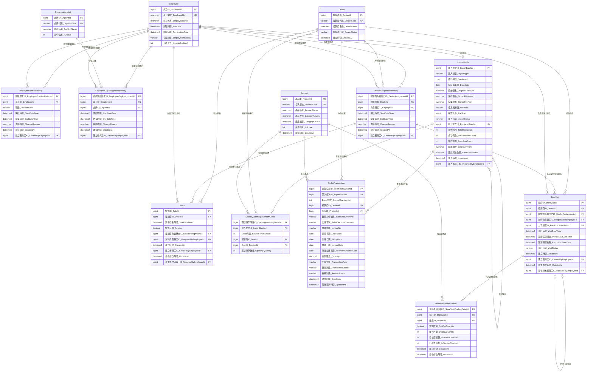

# 整合式人員、經銷商、庫存與巡店資料庫設計規格

> 文件狀態：討論版設計基準  
> 建立日期：2026-07-18  
> 用途：供後續討論、資料表設計、T-SQL 實作、匯入程式、手機巡店功能及 AI 工作階段使用。  
> 人員、處所、經銷商負責關係及既有 Sales 規則，沿用已完成的《業務人員與經銷商資料庫設計規格》。  
> Sell in 的唯一鍵、退貨表示方式尚未確認；實作前必須先處理本文件「待確認事項」。

## 1. 設計範圍

本設計整合下列功能：

1. 員工基本資料與在職狀態。
2. 員工職級歷史。
3. 員工所屬處所歷史。
4. 經銷商負責業務歷史。
5. 既有 Sales 資料及其負責人歸屬。
6. 產品主檔。
7. 月度期初庫存匯入。
8. Sell in 進貨資料重複匯入。
9. 業務巡店紀錄。
10. 巡店期間實銷數量。
11. 巡店當下陳列數量。
12. 經銷商、產品及指定日期的推估庫存計算。

## 2. 核心設計原則

### 2.1 不以一張庫存表反覆覆寫

庫存相關資料代表不同性質的事實：

| 資料 | 性質 | 粒度 |
|---|---|---|
| 月度期初庫存 | 月初庫存基準 | 匯入批次＋經銷商＋產品 |
| Sell in | 進貨交易流量 | 來源交易／文件項次＋經銷商＋產品 |
| 巡店實銷 | 兩次巡店間的實銷流量 | 巡店＋產品 |
| 巡店陳列 | 巡店當下的陳列快照 | 巡店＋產品 |

### 2.2 推估庫存不建立獨立實體表

初期以查詢計算：

```text
推估庫存
＝正式批次中的月度期初庫存
＋指定期間內的有效 Sell in
－指定期間內有效巡店的實銷數量
```

陳列數量不參與庫存加減。陳列數量是經銷商庫存中，巡店當下放在賣場供顧客看見的數量。

### 2.3 歷史資料不可因換線或離職消失

- 離職員工不得刪除。
- 員工職級、處所、經銷商負責關係保留歷史。
- Sales 與巡店紀錄保存事件發生當時的負責關係及負責員工。
- 修改者不會因修改資料而成為該事件的負責人。

### 2.4 有效期間採前閉後開

```text
StartDateTime <= TargetDateTime
AND (EndDateTime IS NULL OR TargetDateTime < EndDateTime)
```

- 開始時間包含在有效期間內。
- 結束時間不包含在有效期間內。
- 結束時間為 NULL 表示目前仍有效。

## 3. 已確認的業務規則

### 3.1 員工職級

職級由低至高為：

1. 業務
2. 處長
3. 經理

- 一名員工同一時間只能有一個有效職級。
- 處長可以親自負責經銷商，不需要同時再保存一個業務職級。
- 是否負責經銷商，由有效的經銷商負責關係判斷。

### 3.2 處所與處長

- 一名員工同一時間只能屬於一個處所。
- 同一處所可以同時有多名處長。
- 不建立員工與主管的獨立對應表。
- 處長定義為：目前在職、目前屬於該處所、目前有效職級為處長。
- 同處所的所有有效處長具有相同的處所查看權限。

### 3.3 經銷商負責關係

- 一個經銷商同一時間只能有一名負責員工。
- 經銷商可以更換負責員工。
- 換線時結束舊負責關係，再新增接手人的負責關係。
- 不修改舊負責紀錄中的員工，也不刪除舊紀錄。
- 目前不需要主要、協助、代理等 AssignmentType。

### 3.4 經銷商代碼

- `DealerCode` 是經銷商業務上的唯一值。
- 例如 `TW002351001H` 唯一代表一個經銷商。
- 期初庫存與 Sell in 匯入時，使用經銷商代碼查找 `DealerId`。
- 不建立經銷商來源代碼對照表。

### 3.5 產品與型號

- `Product.ProductCode` 保存系統標準品號且必須唯一。
- 來源型號可透過明確規則轉成正確的標準品號。
- 不建立產品來源品號對照表。
- 匯入時若標準化後仍找不到產品，不得自動新增產品，也不得寫入正式庫存或進貨資料；整批匯入失敗並重新上傳。

### 3.6 既有 Sales 歸屬

- Sales 以 `DealerId＋SaleDateTime` 查找當時有效的 `DealerAssignmentId`。
- Sales 保存 `ResponsibleEmployeeId` 作為交易當時負責人的快照。
- `ResponsibleEmployeeId` 必須等於該 `DealerAssignmentId` 的 `EmployeeId`。
- 修改 `DealerId` 或 `SaleDateTime` 時，必須重新計算負責關係。
- 修改其他內容時不重新計算負責人。
- Sales 建立後 120 小時內可以修改，判斷使用資料庫伺服器時間。
- `CreatedAt` 一旦建立不得修改。

### 3.7 月度期初庫存

- 每月匯入一次期初庫存，用於建立及核對月初庫存基準。
- `202606期末` 的期末數量，作為 `202607` 的正式期初庫存。
- 一份期初庫存 Excel 包含所有經銷商。
- 不建立月度庫存快照表。
- 一次正式期初庫存匯入批次，直接對應多筆月度期初庫存明細。
- 同一正式批次中，同一經銷商、同一產品只能有一筆期初庫存明細。
- 同一資料月份只能有一個有效的正式期初庫存批次。

### 3.8 期初庫存整批替換

- 原始 Excel 永久保存。
- 若匯入內容有問題，不修改個別正式明細。
- 舊批次標記為 `Superseded` 或 `Voided`，再匯入新批次。
- 新批次以 `ReplacedBatchId` 指向被取代的舊批次。
- 正式庫存計算只採用目前有效的正式批次。
- 舊批次及其明細不物理刪除，以保留追查能力。

### 3.9 匯入原始檔案

- 不建立匯入原始資料列 Table。
- 每份原始 Excel 必須永久保存且不得被覆蓋。
- 實際儲存檔名應使用批次 ID 或其他唯一值。
- `ImportBatch` 保存原始檔名、實際儲存位置、檔案雜湊值及檔案大小。
- 正式明細保存 `ImportBatchId` 與 `SourceRowNumber`，可回到原始檔案的指定列追查。
- 資料庫備份與原始檔案備份必須配套。

### 3.10 Sell in

- Sell in 是經銷商的進貨交易流量。
- 同一月份會重複匯入多次。
- 目前暫時以 `BillingDate` 作為 `InventoryEffectiveDate`。
- 每筆正式進貨交易保存來源匯入批次及 Excel 列號。
- 重複匯入、交易更新、取消與退貨的最終規則尚待確認。

### 3.11 巡店

- 每次到店建立一筆 `StoreVisit`。
- `StoreVisit` 保存經銷商、巡店時間、實銷期間、當時負責關係及當時負責員工。
- `StoreVisitProductDetail` 保存該次巡店每個產品的實銷數量與陳列數量。
- 同一次巡店、同一產品只能有一筆巡店產品明細。
- 實銷數量代表上一次巡店到本次巡店之間的銷售流量。
- 陳列數量代表本次巡店當下看到的陳列快照。
- 陳列數量為 0 與未檢查必須能區分。

### 3.12 巡店修改期限

- 巡店資料建立後 120 小時內可以修改。
- 使用資料庫伺服器時間判斷。
- `CreatedAt` 不得修改。
- 超過 120 小時後，一般使用者不得修改。
- 建立者、最後修改者與當時負責員工是不同用途，不得混用。

## 4. 資料表清單

### 4.1 已完成的人員、經銷商與 Sales

1. `Employee`：員工基本資料。
2. `EmployeePositionHistory`：員工職級歷史。
3. `OrganizationUnit`：處所主檔。
4. `EmployeeOrgAssignmentHistory`：員工處所歸屬歷史。
5. `Dealer`：經銷商主檔。
6. `DealerAssignmentHistory`：經銷商負責員工歷史。
7. `Sales`：既有銷售資料及當時負責人歸屬。

### 4.2 新增的庫存、匯入與巡店

8. `Product`：產品主檔。
9. `ImportBatch`：匯入批次及永久保存原始檔案的追蹤資料。
10. `MonthlyOpeningInventoryDetail`：月度期初庫存明細。
11. `SellInTransaction`：Sell in 進貨交易。
12. `StoreVisit`：巡店主檔。
13. `StoreVisitProductDetail`：巡店產品實銷及陳列明細。

## 5. 資料表欄位

### 5.1 Employee

- `EmployeeId` PK
- `EmployeeNo` UK
- `EmployeeName`
- `HireDate`
- `TerminationDate`
- `EmploymentStatus`
- `IsLoginEnabled`

### 5.2 EmployeePositionHistory

- `EmployeePositionHistoryId` PK
- `EmployeeId` FK
- `PositionLevel`
- `StartDateTime`
- `EndDateTime`
- `ChangeReason`
- `CreatedAt`
- `CreatedByEmployeeId` FK

同一員工的有效職級期間不得重疊。

### 5.3 OrganizationUnit

- `OrgUnitId` PK
- `OrgUnitCode` UK
- `OrgUnitName`
- `IsActive`

### 5.4 EmployeeOrgAssignmentHistory

- `EmployeeOrgAssignmentId` PK
- `EmployeeId` FK
- `OrgUnitId` FK
- `StartDateTime`
- `EndDateTime`
- `ChangeReason`
- `CreatedAt`
- `CreatedByEmployeeId` FK

同一員工的處所歸屬期間不得重疊。

### 5.5 Dealer

- `DealerId` PK
- `DealerCode` UK
- `DealerName`
- `DealerStatus`
- `CreatedAt`

### 5.6 DealerAssignmentHistory

- `DealerAssignmentId` PK
- `DealerId` FK
- `EmployeeId` FK
- `StartDateTime`
- `EndDateTime`
- `ChangeReason`
- `CreatedAt`
- `CreatedByEmployeeId` FK

同一經銷商的負責期間不得重疊。

### 5.7 Sales

- `SaleId` PK
- `DealerId` FK
- `SaleDateTime`
- `Amount`
- `DealerAssignmentId` FK
- `ResponsibleEmployeeId` FK
- `CreatedAt`
- `CreatedByEmployeeId` FK
- `UpdatedAt`
- `UpdatedByEmployeeId` FK

### 5.8 Product

- `ProductId` PK
- `ProductCode` UK
- `ProductName`
- `CategoryLevel1`
- `CategoryLevel2`
- `IsActive`
- `CreatedAt`

### 5.9 ImportBatch

- `ImportBatchId` PK
- `ImportType`
- `DataMonth`
- `DataDate`
- `OriginalFileName`
- `StoredFileName`
- `StoredFilePath`
- `FileHash`
- `FileSize`
- `ImportStatus`
- `ReplacedBatchId` FK，可為 NULL
- `TotalRowCount`
- `SuccessRowCount`
- `ErrorRowCount`
- `ErrorSummary`
- `ErrorReportPath`
- `ImportedAt`
- `ImportedByEmployeeId` FK

建議匯入狀態至少包含：

```text
Processing
Failed
Official
Superseded
Voided
```

### 5.10 MonthlyOpeningInventoryDetail

- `OpeningInventoryDetailId` PK
- `ImportBatchId` FK
- `SourceRowNumber`
- `DealerId` FK
- `ProductId` FK
- `OpeningQuantity`

唯一性概念：

```text
ImportBatchId＋DealerId＋ProductId
```

### 5.11 SellInTransaction

- `SellInTransactionId` PK
- `ImportBatchId` FK
- `SourceRowNumber`
- `DealerId` FK
- `ProductId` FK
- `SalesDocumentNo`
- `SalesDocumentItemNo`
- `InvoiceNo`
- `OrderDate`
- `BillingDate`
- `InvoiceDate`
- `InventoryEffectiveDate`
- `Quantity`
- `TransactionType`
- `TransactionStatus`
- `ReviewStatus`
- `CreatedAt`
- `UpdatedAt`

### 5.12 StoreVisit

- `StoreVisitId` PK
- `DealerId` FK
- `DealerAssignmentId` FK
- `ResponsibleEmployeeId` FK
- `PreviousStoreVisitId` FK，可為 NULL
- `VisitDateTime`
- `PeriodStartDateTime`
- `PeriodEndDateTime`
- `VisitStatus`
- `CreatedAt`
- `CreatedByEmployeeId` FK
- `UpdatedAt`
- `UpdatedByEmployeeId` FK

### 5.13 StoreVisitProductDetail

- `StoreVisitProductDetailId` PK
- `StoreVisitId` FK
- `ProductId` FK
- `SellOutQuantity`
- `DisplayQuantity`
- `IsSellOutChecked`
- `IsDisplayChecked`
- `CreatedAt`
- `UpdatedAt`

唯一性概念：

```text
StoreVisitId＋ProductId
```

## 6. 整合 ER Model



## 7. 推估庫存計算規則

### 7.1 計算維度

推估庫存以以下維度計算：

```text
DealerId＋ProductId＋TargetDateTime
```

### 7.2 計算來源

1. 從目標日期所屬月份的有效正式期初庫存批次，取得 `OpeningQuantity`。
2. 加總期初庫存基準日至目標日期間有效的 `SellInTransaction.Quantity`。
3. 加總並扣除同期間有效巡店中的 `StoreVisitProductDetail.SellOutQuantity`。

### 7.3 完整概念式

```text
EstimatedInventoryQuantity
= OpeningQuantity from MonthlyOpeningInventoryDetail
+ SUM(Quantity from valid SellInTransaction)
- SUM(SellOutQuantity from valid StoreVisitProductDetail)
```

### 7.4 有效資料條件

- 期初庫存所屬 `ImportBatch.ImportStatus = Official`。
- Sell in 所屬匯入批次必須有效，交易狀態也必須納入有效交易定義。
- 巡店狀態必須是已送出或已鎖定等有效狀態。
- 草稿、作廢、已被取代的資料不參與計算。

### 7.5 推估庫存的時間限制

巡店實銷不是即時 POS 銷售，而是業務巡店時回報上次巡店至本次巡店間的數量。因此兩次巡店之間，推估庫存可能高於實際庫存。使用者介面應顯示最近有效巡店時間或庫存資料截至時間。

## 8. 重要不變條件

1. 不刪除離職員工及歷史關係。
2. 同一員工的有效職級期間不得重疊。
3. 同一員工的有效處所歸屬期間不得重疊。
4. 同一經銷商的有效負責期間不得重疊。
5. 同一處所可以同時存在多名處長。
6. `Sales.DealerAssignmentId` 必須符合 `Sales.DealerId＋SaleDateTime`。
7. `Sales.ResponsibleEmployeeId` 必須與其負責關係的員工一致。
8. `StoreVisit.DealerAssignmentId` 必須符合 `StoreVisit.DealerId＋VisitDateTime`。
9. `StoreVisit.ResponsibleEmployeeId` 必須與其負責關係的員工一致。
10. Sales 與巡店的 `CreatedAt` 不得修改。
11. Sales 與巡店資料只能在建立後 120 小時內由一般使用者修改。
12. 同一正式期初庫存批次中，`DealerId＋ProductId` 不得重複。
13. 同一月份只能有一個有效的正式期初庫存批次。
14. 同一次巡店中，`ProductId` 不得重複。
15. 原始匯入 Excel 必須永久保存且不得被覆蓋。
16. 作廢或被取代的匯入批次不得參與正式庫存計算。
17. 型號無法依規則轉為有效 ProductId 時，整批匯入失敗。

## 9. 待確認事項

### 9.1 Sell in 庫存生效日期

目前暫定：

```text
InventoryEffectiveDate = BillingDate
```

仍需確認應採用 `OrderDate`、`BillingDate` 或 `InvoiceDate`。

### 9.2 Sell in 唯一鍵

需要確認來源檔案是否有穩定的文件項次。候選組合可能包含：

```text
SalesDocumentNo＋SalesDocumentItemNo
```

不可在確認前假定 `SalesDocumentNo＋Model` 一定唯一。

### 9.3 退貨、取消與數量更正

需要確認來源系統是：

- 保留原文件號並改變狀態或數量；或
- 新增另一張退貨／沖銷文件。

確認後再定義 `TransactionType`、`TransactionStatus` 及重複匯入更新規則。

### 9.4 Sell in 重複匯入

同月份會重複匯入。待唯一鍵與退貨規則確認後，必須定義：

- 已存在且未變更：略過。
- 已存在但狀態或數量變更：更新或產生狀態歷史。
- 尚未存在：新增。
- 新檔案未出現的舊交易：不得直接刪除，除非確認新檔是完整取代型資料。

## 10. 機器可讀規則

```yaml
specification: integrated_employee_dealer_inventory_visit
status: discussion_baseline
date: 2026-07-18

temporal_interval:
  type: half_open
  predicate: "start <= target AND (end IS NULL OR target < end)"

employee:
  delete_after_termination: false
  active_position_max_count: 1
  active_org_unit_max_count: 1
  positions:
    - sales
    - director
    - manager

organization_unit:
  multiple_directors_allowed: true
  explicit_supervisor_relationship: false

dealer:
  dealer_code_is_unique: true
  external_code_table_required: false

dealer_assignment:
  active_employee_max_count_per_dealer: 1
  overlapping_periods_allowed: false
  history_is_immutable: true
  assignment_type_required: false

product:
  product_code_is_unique: true
  source_code_mapping_table_required: false
  normalize_source_model_by_rule: true
  auto_create_when_not_found: false

sales:
  assignment_basis: dealer_and_sale_datetime
  store_dealer_assignment_id: true
  store_responsible_employee_snapshot: true
  edit_window_hours: 120
  created_at_is_immutable: true

import:
  raw_row_table_required: false
  original_file_permanently_stored: true
  original_file_is_immutable: true
  detail_source_trace:
    - import_batch_id
    - source_row_number
  batch_replacement_supported: true
  physical_delete_replaced_batch: false

opening_inventory:
  snapshot_header_table_required: false
  file_contains_all_dealers: true
  one_official_batch_per_month: true
  correction_method: replace_whole_batch
  unique_detail_key:
    - import_batch_id
    - dealer_id
    - product_id

sell_in:
  repeated_import_during_month: true
  inventory_effective_date: billing_date_provisional
  unique_key: pending_confirmation
  return_and_cancel_rule: pending_confirmation

store_visit:
  store_assignment_snapshot: true
  store_responsible_employee_snapshot: true
  edit_window_hours: 120
  created_at_is_immutable: true
  sell_out_is_interval_flow: true
  display_is_point_in_time_snapshot: true
  unique_product_detail_key:
    - store_visit_id
    - product_id

estimated_inventory:
  persisted_table_required: false
  formula: opening_inventory + valid_sell_in - valid_store_visit_sell_out
  display_quantity_affects_inventory: false
```

## 11. 後續實作順序

在撰寫 T-SQL 前，建議依序完成：

1. 確認 Sell in 唯一鍵。
2. 確認 Sell in 退貨、取消及更正形式。
3. 確認 Sell in 庫存生效日期。
4. 確認 ImportStatus、TransactionStatus、VisitStatus 的正式代碼集合。
5. 確認巡店第一次沒有上次巡店時，實銷區間開始時間的規則。
6. 確認巡店是否要求實銷與陳列必填，或允許未檢查狀態。
7. 最後才建立 T-SQL Table、Constraint、Index、Trigger／Stored Procedure 及匯入交易流程。
