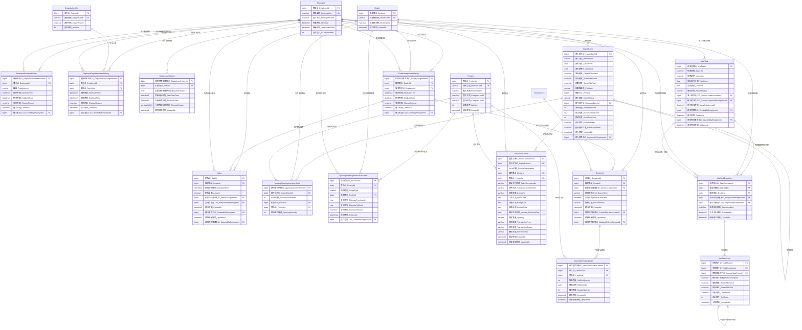

# 整合式人員、經銷商、庫存與巡店資料庫設計規格

> 文件狀態：討論版設計基準  
> 建立日期：2026-07-18  
> 用途：供後續討論、資料表設計、T-SQL 實作、匯入程式、手機巡店功能及 AI 工作階段使用。  
> 人員、處所、經銷商負責關係及既有 Sales 規則，沿用已完成的《業務人員與經銷商資料庫設計規格》。  
> Sell in 的唯一鍵、退貨表示方式尚未確認；實作前必須先處理本文件「待確認事項」。

## 1. 設計範圍

本設計整合下列功能：

1. 員工基本資料。
2. 員工職級歷史。
3. 員工所屬處所歷史。
4. 經銷商負責業務歷史。
5. 既有 Sales 資料及其負責人歸屬。
6. 產品主檔。
7. 月度期初庫存匯入。
8. Sell in 進貨資料重複匯入。
9. 業務巡店紀錄。
10. 巡店期間實銷數量。
11. 巡店當下陳列數量。
12. 經銷商、產品及指定日期的推估庫存計算。

## 2. 核心設計原則

### 2.1 不以一張庫存表反覆覆寫

庫存相關資料代表不同性質的事實：

| 資料 | 性質 | 粒度 |
|---|---|---|
| 月度期初庫存 | 月初庫存基準 | 匯入批次＋經銷商＋產品 |
| Sell in | 進貨交易流量 | 來源交易／文件項次＋經銷商＋產品 |
| 巡店實銷 | 兩次巡店間的實銷流量 | 巡店＋產品 |
| 巡店陳列 | 巡店當下的陳列快照 | 巡店＋產品 |

### 2.2 推估庫存不建立獨立實體表

初期以查詢計算：

```text
推估庫存
＝正式批次中的月度期初庫存
＋指定期間內的有效 Sell in
－指定期間內有效巡店的實銷數量
```

陳列數量不參與庫存加減。陳列數量是經銷商庫存中，巡店當下放在賣場供顧客看見的數量。

### 2.3 歷史資料不可因換線或離職消失

- 離職員工不得刪除。
- 員工職級、處所、經銷商負責關係保留歷史。
- Sales 與巡店紀錄保存事件發生當時的負責關係及負責員工。
- 修改者不會因修改資料而成為該事件的負責人。

### 2.4 有效期間採前閉後開

```text
StartDateTime <= TargetDateTime
AND (EndDateTime IS NULL OR TargetDateTime < EndDateTime)
```

- 開始時間包含在有效期間內。
- 結束時間不包含在有效期間內。
- 結束時間為 NULL 表示目前仍有效。

## 3. 已確認的業務規則

### 3.1 員工職級

職級由低至高為：

1. 業務
2. 處長
3. 經理

- 一名員工同一時間只能有一個有效職級。
- 處長可以親自負責經銷商，不需要同時再保存一個業務職級。
- 是否負責經銷商，由有效的經銷商負責關係判斷。

### 3.2 處所與處長

- 一名員工同一時間只能屬於一個處所。
- 同一處所可以同時有多名處長。
- 不建立員工與主管的獨立對應表。
- 處長定義為：目前在職、目前屬於該處所、目前有效職級為處長。
- 同處所的所有有效處長具有相同的處所查看權限。

### 3.3 經銷商負責關係

- 一個經銷商同一時間只能有一名負責員工。
- 經銷商可以更換負責員工。
- 換線時結束舊負責關係，再新增接手人的負責關係。
- 不修改舊負責紀錄中的員工，也不刪除舊紀錄。
- 目前不需要主要、協助、代理等 AssignmentType。

### 3.4 經銷商代碼

- `DealerCode` 是經銷商業務上的唯一值。
- 例如 `TW002351001H` 唯一代表一個經銷商。
- 期初庫存與 Sell in 匯入時，使用經銷商代碼查找 `DealerId`。
- 不建立經銷商來源代碼對照表。

### 3.5 產品與型號

- `Product.ProductCode` 保存系統標準品號且必須唯一。
- 來源型號可透過明確規則轉成正確的標準品號。
- 不建立產品來源品號對照表。
- 匯入時若標準化後仍找不到產品，不得自動新增產品，也不得寫入正式庫存或進貨資料；整批匯入失敗並重新上傳。

### 3.6 既有 Sales 歸屬

- Sales 以 `DealerId＋SaleDateTime` 查找當時有效的 `DealerAssignmentId`。
- Sales 保存 `ResponsibleEmployeeId` 作為交易當時負責人的快照。
- `ResponsibleEmployeeId` 必須等於該 `DealerAssignmentId` 的 `EmployeeId`。
- 修改 `DealerId` 或 `SaleDateTime` 時，必須重新計算負責關係。
- 修改其他內容時不重新計算負責人。
- Sales 建立後 120 小時內可以修改，判斷使用資料庫伺服器時間。
- `CreatedAt` 一旦建立不得修改。

### 3.7 月度期初庫存

- 每月匯入一次期初庫存，用於建立及核對月初庫存基準。
- `202606期末` 的期末數量，作為 `202607` 的正式期初庫存。
- 一份期初庫存 Excel 包含所有經銷商。
- 不建立月度庫存快照表。
- 一次正式期初庫存匯入批次，直接對應多筆月度期初庫存明細。
- 同一正式批次中，同一經銷商、同一產品只能有一筆期初庫存明細。
- 同一資料月份只能有一個有效的正式期初庫存批次。

#### 3.7.1 期初庫存商品排除規則

- 排除規則保存於 `OpeningInventoryProductExclusion`，只作用於 `ImportType = OPENING_INVENTORY`，不得影響 Sell in、巡店實銷、商品啟用狀態或其他匯入類型。
- `ScopeType` 只允許 `ALL` 與 `DEALER`：
  - `ALL`：`DealerId` 必須為 NULL；匯入時忽略經銷商，規則適用全部經銷商（包含日後新增的經銷商）。
  - `DEALER`：`DealerId` 必填；規則只適用指定經銷商。
- 匯入月份介於 `EffectiveFromMonth` 與 `EffectiveToMonth`（含）時規則有效；`EffectiveToMonth = NULL` 表示持續有效。
- `ALL` 與 `DEALER` 採聯集判斷：同一商品只要符合任一筆有效規則，該經銷商的來源列即排除，不建立 `MonthlyOpeningInventoryDetail`。
- 建立 `ALL` 規則時不得同步刪除既有 `DEALER` 規則。`ALL` 規則失效後，原有且仍在有效期間內的 `DEALER` 規則應自動恢復作用。
- 規則停止使用時應填入 `EffectiveToMonth`，不得為了停用而物理刪除，以保留歷史及稽核能力。
- 同一適用範圍、商品與開始月份不得重複；同一範圍、經銷商（若適用）與商品的有效期間不得重疊。

匯入判斷概念：

```sql
ScopeType = 'ALL'
OR (ScopeType = 'DEALER' AND DealerId = @DealerId)
```

#### 3.7.2 後續 UI 設計要求

- 商品排除規則畫面必須提供「全部經銷商」及「指定經銷商」兩種範圍選項。
- 選擇 `ALL` 時，經銷商欄位應停用並清空；送出資料的 `DealerId` 必須為 NULL。
- 選擇 `DEALER` 時，經銷商欄位必填，並應顯示經銷商代碼及名稱供搜尋選取。
- 畫面必須顯示商品、生效月份、失效月份、排除原因、建立者及目前狀態。
- 新增或修改前必須檢查有效期間重疊，並以清楚訊息提示衝突規則。
- 建立 `ALL` 規則時，UI 不得提供自動刪除既有 `DEALER` 規則的行為；可提示目前存在多少筆個別規則。
- 停用操作應寫入 `EffectiveToMonth`，不提供一般使用者實體刪除歷史規則的功能。

### 3.8 期初庫存整批替換

- 原始 Excel 永久保存。
- 若匯入內容有問題，不修改個別正式明細。
- 舊批次標記為 `Superseded` 或 `Voided`，再匯入新批次。
- 新批次以 `ReplacedBatchId` 指向被取代的舊批次。
- 正式庫存計算只採用目前有效的正式批次。
- 舊批次及其明細不物理刪除，以保留追查能力。

### 3.9 匯入原始檔案

- 不建立匯入原始資料列 Table。
- 每份原始 Excel 必須永久保存且不得被覆蓋。
- 實際儲存檔名應使用批次 ID 或其他唯一值。
- `ImportBatch` 保存原始檔名、實際儲存位置、檔案雜湊值及檔案大小。
- 正式明細保存 `ImportBatchId` 與 `SourceRowNumber`，可回到原始檔案的指定列追查。
- 資料庫備份與原始檔案備份必須配套。

### 3.10 Sell in

- Sell in 是經銷商的進貨交易流量。
- 同一月份會重複匯入多次。
- 目前暫時以 `BillingDate` 作為 `InventoryEffectiveDate`。
- 每筆正式進貨交易保存來源匯入批次及 Excel 列號。
- 重複匯入、交易更新、取消與退貨的最終規則尚待確認。

### 3.11 巡店

- 使用者在前端輸入期間不建立正式 `StoreVisit`，輸入內容只存在目前前端工作階段；本版不承諾離線或跨裝置草稿。
- 使用者按下「確認送出」後，後端必須在同一資料庫交易內建立一筆 `StoreVisit` 及其全部 `StoreVisitProductDetail`；任一驗證或寫入失敗時整筆回滾。
- `ReportDateTime` 不可為 NULL，由資料庫在正式送出交易建立 `StoreVisit` 時自動寫入，並作為 72 小時修改期限起算點；`StoreVisit` 不另設 `SubmittedAt`。
- `EntrySourceType` 區分 `EMPLOYEE`（業務／助理填寫）與 `DEALER`（經銷商自行回報）。
- `DealerAssignmentId` 保存回報當時的正式負責業務關係；實際填寫者由 `CreatedByUserAccountId` 保存，兩者不得混用。
- `CreatedByUserAccountId` 用於分析正式業務現場填寫、助理代填、經銷商主動回報頻率，以及未來經銷商回報獎勵。
- `StoreVisitProductDetail` 保存該次回報中有填寫內容之產品的實銷日期、實銷數量與陳列數量。
- 同一次巡店、同一產品只能有一筆巡店產品明細。
- 實銷日期由 `StoreVisitProductDetail.SellOutDate` 保存，不在 `StoreVisit` 保存統計起訖期間。
- 陳列數量代表本次巡店當下看到的陳列快照。
- `SellOutQuantity` 與 `DisplayQuantity` 都以完整個數計算，使用 `int`，並允許 `NULL`。
- `SellOutQuantity` 只允許 `NULL` 或 1～10；`NULL` 表示本次沒有回報實銷，不再使用 0 表示明確回報為零。
- `DisplayQuantity` 只允許 `NULL` 或 1；`NULL` 表示本次沒有回報陳列，1 表示本次確認陳列一台。
- `SellOutQuantity` 有值時，`SellOutDate` 必須有值；畫面自動帶入當天且使用者可以修改。
- 清除實銷數量時，`SellOutQuantity` 與 `SellOutDate` 必須一起改為 `NULL`。只有陳列數量時，兩者都必須為 `NULL`。
- `RecordStatus` 保存資料是否有效，目前使用 `ACTIVE`／`VOIDED`；`VOIDED` 不參與庫存計算。

### 3.12 巡店／回報修改期限

- 巡店／回報資料只允許在 `ReportDateTime` 後 72 小時內由一般使用者修改。
- 使用資料庫伺服器時間判斷。
- 72 小時期限即時計算，不另外保存 `LOCKED` 狀態。
- `CreatedAt` 不得修改。
- 超過 72 小時後，一般使用者不得修改。
- 業務帳號不得修改 `EntrySourceType = DEALER` 的經銷商自行回報；經銷商帳號只能修改由自己的帳號建立、且仍在 72 小時內的回報。
- `UpdatedAt` 與 `UpdatedByUserAccountId` 保存最後修改時間與實際修改帳號。
- 只要任一 `StoreVisitProductDetail` 被新增、修改或刪除，必須同步更新所屬 `StoreVisit.UpdatedAt` 與 `StoreVisit.UpdatedByUserAccountId`。

## 4. 資料表清單

### 4.1 已完成的人員、經銷商與 Sales

1. `Employee`：員工基本資料。
2. `EmployeePositionHistory`：員工職級歷史。
3. `OrganizationUnit`：處所主檔。
4. `EmployeeOrgAssignmentHistory`：員工處所歸屬歷史。
5. `Dealer`：經銷商主檔。
6. `DealerLevelHistory`：經銷商等級與結束經銷歷程。
7. `DealerAssignmentHistory`：經銷商負責員工歷史。
8. `Sales`：既有銷售資料及當時負責人歸屬。

### 4.2 新增的庫存、匯入與巡店

9. `Product`：產品主檔。
10. `ImportBatch`：匯入批次及永久保存原始檔案的追蹤資料。
11. `MonthlyOpeningInventoryDetail`：月度期初庫存明細。
12. `OpeningInventoryProductExclusion`：依全部或指定經銷商範圍設定的期初庫存商品排除規則。
13. `SellInTransaction`：Sell in 進貨交易。
14. `StoreVisit`：巡店主檔。
15. `StoreVisitProductDetail`：巡店產品實銷及陳列明細。

### 4.3 巡店任務

16. `VisitTask`：公司建立的巡店任務主檔。
17. `VisitTaskExecution`：系統為每個任務及經銷商建立的待辦與執行回報。
18. `VisitTaskPhoto`：樣本照片及一般業務逐張對應的任務照片。

## 5. 資料表欄位

### 5.1 Employee

- `EmployeeId` PK
- `EmployeeNo` UK
- `EmployeeName`
- `HireDate`
- `TerminationDate`
- `IsLoginEnabled`

### 5.2 EmployeePositionHistory

- `EmployeePositionHistoryId` PK
- `EmployeeId` FK
- `PositionLevel`
- `StartDateTime`
- `EndDateTime`
- `ChangeReason`
- `CreatedAt`
- `CreatedByEmployeeId` FK

同一員工的有效職級期間不得重疊。

### 5.3 OrganizationUnit

- `OrgUnitId` PK
- `OrgUnitCode` UK
- `OrgUnitName`
- `IsActive`

### 5.4 EmployeeOrgAssignmentHistory

- `EmployeeOrgAssignmentId` PK
- `EmployeeId` FK
- `OrgUnitId` FK
- `StartDateTime`
- `EndDateTime`
- `ChangeReason`
- `CreatedAt`
- `CreatedByEmployeeId` FK

同一員工的處所歸屬期間不得重疊。

### 5.5 Dealer

- `DealerId` PK
- `DealerCode` UK
- `DealerName`
- `CreatedAt`

`CreatedAt` 表示經銷商主檔在系統中的建立時間，不表示開始經銷或等級生效時間。

### 5.6 DealerLevelHistory

- `DealerLevelHistoryId` PK
- `DealerId` FK
- `DealerStatus` `char(1)`：`A`、`B`、`C`、`D`、`E` 為經銷商等級；`Z` 表示結束經銷
- `StartDateTime`
- `EndDateTime` NULL
- `ChangeReason` `varchar(MAX)` NULL
- `CreatedAt`

`Dealer` 與 `DealerLevelHistory` 為 1:N。每次升等、降等或結束經銷都新增一筆歷程；原有效歷程的 `EndDateTime` 同時結束，新歷程的 `StartDateTime` 由該異動生效時間開始。`ChangeReason` 用於記錄升等、降等或結束經銷原因。

同一經銷商的等級有效期間不得重疊，且同一時間最多只能有一筆 `EndDateTime IS NULL` 的目前歷程。目前歷程為 `Z` 時代表已結束經銷；目前歷程為 `A`～`E` 時代表其現行等級。等級代碼應以 `CHECK (DealerStatus IN ('A','B','C','D','E','Z'))` 或等效機制限制。

### 5.7 DealerAssignmentHistory

- `DealerAssignmentId` PK
- `DealerId` FK
- `EmployeeId` FK
- `StartDateTime`
- `EndDateTime`
- `ChangeReason`
- `CreatedAt`
- `CreatedByEmployeeId` FK

同一經銷商的負責期間不得重疊。

### 5.8 Sales

- `SaleId` PK
- `DealerId` FK
- `SaleDateTime`
- `Amount`
- `DealerAssignmentId` FK
- `ResponsibleEmployeeId` FK
- `CreatedAt`
- `CreatedByEmployeeId` FK
- `UpdatedAt`
- `UpdatedByEmployeeId` FK

### 5.9 Product

- `ProductId` PK
- `ProductCode` UK
- `ProductName`
- `CategoryLevel1`
- `CategoryLevel2`
- `IsActive`
- `CreatedAt`

### 5.10 ImportBatch

- `ImportBatchId` PK
- `ImportType`
- `DataMonth`
- `DataDate`
- `OriginalFileName`
- `StoredFileName`
- `StoredFilePath`
- `FileHash`
- `FileSize`
- `ImportStatus`
- `ReplacedBatchId` FK，可為 NULL
- `TotalRowCount`
- `SuccessRowCount`
- `ErrorRowCount`
- `ErrorSummary`
- `ErrorReportPath`
- `ImportedAt`
- `ImportedByEmployeeId` FK

建議匯入狀態至少包含：

```text
Processing
Failed
Official
Superseded
Voided
```

### 5.11 MonthlyOpeningInventoryDetail

- `OpeningInventoryDetailId` PK
- `ImportBatchId` FK
- `SourceRowNumber`
- `DealerId` FK
- `ProductId` FK
- `OpeningQuantity`

唯一性概念：

```text
ImportBatchId＋DealerId＋ProductId
```

### 5.12 OpeningInventoryProductExclusion

- `ExclusionId` PK
- `ProductId` FK
- `ScopeType`，只允許 `ALL`／`DEALER`
- `DealerId` FK，可為 NULL
- `EffectiveFromMonth`，`char(6)`，格式 `YYYYMM`
- `EffectiveToMonth`，`char(6)`，可為 NULL，格式 `YYYYMM`
- `ExclusionReason`，可為 NULL
- `CreatedAt`
- `CreatedByEmployeeId` FK

必要資料約束：

```sql
CHECK (
    (ScopeType = 'ALL' AND DealerId IS NULL)
    OR
    (ScopeType = 'DEALER' AND DealerId IS NOT NULL)
)
```

唯一性概念：

```text
ScopeType＋DealerId＋ProductId＋EffectiveFromMonth
```

實作時應針對 `ALL` 與 `DEALER` 分別建立 filtered unique index，避免 SQL Server 的 NULL 唯一鍵語意造成規則不清：

```text
ALL：ProductId＋EffectiveFromMonth（WHERE ScopeType = 'ALL'）
DEALER：DealerId＋ProductId＋EffectiveFromMonth（WHERE ScopeType = 'DEALER'）
```

同一適用範圍、經銷商（若適用）與商品的有效期間不得重疊；此規則須由寫入程序、Stored Procedure 或交易內驗證。

### 5.13 SellInTransaction

- `SellInTransactionId` PK
- `ImportBatchId` FK
- `SourceRowNumber`
- `DealerId` FK
- `ProductId` FK
- `SalesDocumentNo`
- `SalesDocumentItemNo`
- `InvoiceNo`
- `OrderDate`
- `BillingDate`
- `InvoiceDate`
- `InventoryEffectiveDate`
- `Quantity`
- `TransactionType`
- `TransactionStatus`
- `ReviewStatus`
- `CreatedAt`
- `UpdatedAt`

### 5.14 StoreVisit

- `StoreVisitId` PK
- `DealerId` FK
- `DealerAssignmentId` FK，可為 NULL
- `EntrySourceType`，`EMPLOYEE`／`DEALER`
- `ReportDateTime`，NOT NULL，正式送出交易建立 `StoreVisit` 時由資料庫自動寫入
- `RecordStatus`，`ACTIVE`／`VOIDED`
- `CreatedAt`
- `CreatedByUserAccountId` FK
- `UpdatedAt`
- `UpdatedByUserAccountId` FK，可為 NULL

前端輸入期間不建立正式 `StoreVisit`。使用者確認送出後，後端在同一交易建立表頭與全部明細；`ReportDateTime` 是正式回報時間及 72 小時修改期限起算點。`CreatedAt` 是資料列實際寫入資料庫的不可變稽核時間。`CreatedByUserAccountId` 必須保存真正操作的登入帳號，不可改填正式負責業務。

### 5.15 StoreVisitProductDetail

- `StoreVisitProductDetailId` PK
- `StoreVisitId` FK
- `ProductId` FK
- `SellOutQuantity`，`int`，可為 NULL；有值時只允許 1～10
- `SellOutDate`，`date`，可為 NULL；與 `SellOutQuantity` 必須同時有值或同時為 NULL
- `DisplayQuantity`，`int`，可為 NULL；有值時只允許 1
- `CreatedAt`
- `UpdatedAt`，可為 NULL

唯一性概念：

```text
StoreVisitId＋ProductId
```

資料紀錄規則：

- `SellOutQuantity` 只接受 `NULL` 或 1～10，不接受 0、負數或大於 10 的值。
- `DisplayQuantity` 只接受 `NULL` 或 1，不接受 0、負數或大於 1 的值。
- `NULL` 表示本次沒有填寫；不再保存「明確回報為零」。
- `SellOutQuantity` 與 `SellOutDate` 必須同時有值或同時為 `NULL`。選擇實銷數量時日期預設當天且可修改；清除實銷時日期必須同步清除。
- `SellOutDate` 與 `DisplayQuantity` 沒有必然關係；只有陳列數量時，`SellOutQuantity` 與 `SellOutDate` 都是 `NULL`。
- 畫面可以預先顯示所有可回報商品；若某商品的 `SellOutQuantity`、`SellOutDate` 與 `DisplayQuantity` 全部為 NULL，則不建立該商品的明細資料列。
- `CreatedAt` 是該商品明細資料列的建立時間；`UpdatedAt` 是該資料列最後修改時間，並不表示哪一個欄位被修改。
- 明細被新增、修改或刪除時，必須同步更新 `StoreVisit.UpdatedAt` 與 `StoreVisit.UpdatedByUserAccountId`，使表頭反映整張回報單最後的異動時間與異動者。

建議資料庫檢查約束概念：

```sql
CHECK (SellOutQuantity IS NULL OR SellOutQuantity BETWEEN 1 AND 10)
CHECK (DisplayQuantity IS NULL OR DisplayQuantity = 1)
CHECK (
    (SellOutQuantity IS NULL AND SellOutDate IS NULL)
    OR
    (SellOutQuantity IS NOT NULL AND SellOutDate IS NOT NULL)
)
```

### 5.16 VisitTask

- `VisitTaskId` PK
- `TaskTitle`，任務標題，例如「新機上市布置」
- `Instruction`，`nvarchar(max)`，任務詳細說明
- `ValidFrom`，`date`，任務開始執行日期
- `DueDate`，`date`，任務完成期限
- `RecordStatus`，`ACTIVE`／`VOIDED`
- `SampleTaskExecutionId` FK、UQ，可為 NULL，指定唯一樣本執行
- `SampleApprovedByEmployeeId` FK，可為 NULL，樣本核准員工
- `SampleApprovedAt`，可為 NULL，樣本核准時間
- `CreatedByEmployeeId` FK，實際建立任務的員工
- `CreatedAt`，資料庫寫入的建立時間
- `UpdatedByEmployeeId` FK，可為 NULL，最後修改任務的員工
- `UpdatedAt`，可為 NULL，最後修改時間

任務規則：

- 任務建立人不限定為經理；經理、助理或其他員工能否建立任務，由後端權限控制。
- `CreatedByEmployeeId` 與 `CreatedAt` 建立後不得因任務被修改而變更。
- `UpdatedAt` 有值時，`UpdatedByEmployeeId` 必須有值；尚未修改時兩者均為 NULL。
- `DueDate` 不得早於 `ValidFrom`。
- `RecordStatus` 只使用 `ACTIVE`／`VOIDED`。本版任務的暫停機制以兩者切換實作：`ACTIVE` 表示任務有效且可執行，`VOIDED` 表示任務暫停且不得新增正式回報；恢復時由 `VOIDED` 切回 `ACTIVE`。不另新增 `PAUSED` 狀態。
- 尚未開始、執行中及已截止由目前日期與 `ValidFrom`／`DueDate` 即時計算，不另外存入 `VisitTask`。
- 不保存 `IsSampleExecution`。樣本搜尋條件是 `VisitTask.SampleTaskExecutionId = VisitTaskExecution.TaskExecutionId`，被指到的執行紀錄就是唯一樣本。
- 為避免任務 A 指到任務 B 的執行紀錄，使用 `(VisitTaskId, SampleTaskExecutionId)` 對應 `VisitTaskExecution(VisitTaskId, TaskExecutionId)` 的複合外鍵概念。
- `SampleTaskExecutionId` 為 NULL 表示尚未指定樣本；`SampleApprovedAt` 為 NULL 表示尚未核准；`SampleApprovedAt` 有值後其他業務才可依樣本執行。
- 電腦版指定樣本及建立樣本前修改候選照片說明，不以 `VisitTaskExecution.SubmittedAt` 是否有值作為判斷條件；`SubmittedAt` 只表示該執行紀錄是否正式送出。

### 5.17 VisitTaskExecution

- `TaskExecutionId` PK
- `VisitTaskId` FK、UQ1
- `DealerId` FK、UQ1
- `ResponsibleEmployeeId` FK，任務發布時負責該經銷商的業務快照
- `CompletedByEmployeeId` FK，可為 NULL，實際回報員工
- `ExecutionNote`，`nvarchar(max)`，可為 NULL，執行或未執行的狀況說明
- `SubmittedAt`，可為 NULL，正式送出時間
- `CreatedAt`，系統建立待辦資料的時間

執行規則：

- 不使用 `VisitTaskAssignment`；任務發布時，系統依有效的 `DealerAssignmentHistory` 自動為所有應回報經銷商建立待辦資料。
- `VisitTaskId＋DealerId` 必須唯一，所以同一任務、同一家經銷商必須且只能有一筆執行資料。
- `SubmittedAt` 為 NULL 表示尚未正式回報。
- 正常拍照完成任務時，`ExecutionNote` 不必填寫，可為 NULL。
- 照片為 0 張時，畫面只能以「不拍照完成」送出，`ExecutionNote` 必填，內容必須說明無法執行拍照任務的原因。
- 有照片但仍在等待上傳、上傳中或上傳失敗時不得正式送出；全部必要照片上傳完成後才能寫入 `SubmittedAt`。
- 任務執行獨立於巡店，不保存 `StoreVisitId`。

### 5.18 VisitTaskPhoto

- `TaskPhotoId` PK
- `TaskExecutionId` FK
- `SampleTaskPhotoId` FK，可為 NULL，一般照片所對應的樣本照片
- `PhotoDescription`，樣本照片說明
- `StoredFileName`
- `StoredFilePath`
- `CapturedAt`
- `SortOrder`
- `UploadedAt`

照片規則：

- 被指定為樣本之執行紀錄中的照片，其 `SampleTaskPhotoId` 為 NULL，且 `PhotoDescription`、`SortOrder` 必填。
- 樣本照片例如依序定義「跳跳牌照片」、「製冰盒照片」、「鏡面烤漆照片」。
- 任務已有核准樣本時，一般業務的每張照片必須以 `SampleTaskPhotoId` 指向一張樣本照片。
- 任務已有核准樣本時，一般業務不可修改照片說明與順序；畫面必須從所指向的樣本照片讀取 `PhotoDescription` 及 `SortOrder`。
- 任務尚無核准樣本時，使用者可以自行新增照片；此時 `SampleTaskPhotoId` 為 NULL，每張照片的 `PhotoDescription`、`SortOrder` 必填。
- 尚無核准樣本的 `VisitTaskExecution` 日後可由電腦版管理介面指定為 `VisitTask.SampleTaskExecutionId`；不在手機拍照前預先建立「樣本任務模式」。
- 在寫入 `VisitTask.SampleTaskExecutionId` 建立樣本之前，具電腦版管理權限的人員可修改候選執行照片的 `VisitTaskPhoto.PhotoDescription`；此操作與該候選 `VisitTaskExecution.SubmittedAt` 無關。
- `VisitTaskPhoto.PhotoDescription` 的此類修改不保存修改時間及修改人；`VisitTaskPhoto` 不因此新增 `UpdatedAt`、`UpdatedByEmployeeId` 或其他修改稽核欄位。
- 樣本有幾個照片項目，一般已執行回報就必須完成幾個對應照片，因此不保存 `MinPhotoCount`。
- 所有任務照片、即時取景框、預覽與裁切結果均使用 1:1；正式輸出尺寸為 1200 × 1200 px。
- 拍照、選圖或修改後立即在背景逐張上傳；上傳成功前可保留於手機本機暫存，伺服器端已接收但任務尚未送出的照片屬於任務草稿。
- `UploadedAt` 有值表示該照片已上傳完成；`VisitTaskExecution.SubmittedAt` 為 NULL 表示整筆任務仍為草稿，照片已上傳不等於任務已正式完成。
- 使用者替換照片時，新的檔案必須上傳成功後才可取代目前有效照片，避免網路中斷造成原照片遺失。

孤立照片檔案與安全清理規則：

- 使用者「重拍」或替換照片時，系統先將新檔案完整上傳並驗證可讀，再更新原 `VisitTaskPhoto` 的 `StoredFileName`／`StoredFilePath`；新檔案或資料庫更新失敗時，原照片及原資料庫記錄必須保持可用。
- 替換成功後，舊的實體檔案不在上傳請求中立即刪除，先視為「待清理孤立檔案」，避免資料庫交易失敗、網路中斷或程式異常造成無法復原。
- 「孤立檔案」定義為：實體檔案存在於任務照片固定儲存根目錄內，但沒有任何 `VisitTaskPhoto.StoredFilePath` 指向它。任何仍被資料庫引用的任務照片、樣本照片或草稿照片都不屬於孤立檔案。
- 清理程序不可使用手機端傳入的檔名當作刪除目標；必須由伺服器解析、正規化絕對路徑，並再次確認目標位於固定的 `uploads/task_photos` 根目錄內。
- 孤立檔案至少保留 7 天後才可刪除；正式刪除前必須重新查詢資料庫，確認當下仍沒有任何 `VisitTaskPhoto` 引用該路徑。
- 清理以排程或管理工具執行，不在照片上傳、重拍或任務送出的線上請求內批次刪除。首次上線必須先以 dry-run 模式只列出候選檔案，人工確認後才啟用實際刪除。
- 每次清理至少記錄檔名、檔案大小、偵測時間、刪除時間與清理原因；初期可使用應用程式日誌，本階段不因此新增資料表。

### 5.19 任務照片手機 UI 與送出流程

共通版面與導覽：

- 手機線框固定使用 360 × 760 px；不得因照片數量或畫面狀態任意改變手機比例。
- 任務內容頁只保留「開始執行任務」，不在此頁提供「未拍照／填寫原因」的提前分支。
- 照片清單不使用分頁；照片項目依 `SortOrder` 在同一頁連續排列，超出可視高度時上下捲動。
- 同類照片項目必須使用相同 Layout；一張、兩張、三張或更多照片只重複相同元件，不因照片數量改變預覽圖尺寸或按鈕位置。
- 每張本次照片及樣本照片均以 1:1 顯示；`PhotoDescription` 顯示在照片項目上方並保留適當間距。

已有核准樣本：

- 畫面同時顯示本次照片與其對應樣本照片；本次照片為主要預覽，樣本照片為較小的 1:1 對照圖。
- 照片項目及數量由樣本決定，「新增照片」顯示但必須停用。
- 使用者可修改或重拍本次照片，不可修改由樣本取得的 `PhotoDescription`、`SortOrder`。
- 完全沒有拍攝任何照片時，可走「不拍照完成」流程；只完成部分樣本項目時不得送出，必須補齊全部項目或清除本次照片後改走不拍照完成。

尚無核准樣本：

- 「新增圖片」為啟用狀態，使用者可自行增加照片項目。
- 拍攝或選擇照片時必須輸入 `PhotoDescription`；照片加入清單後仍可透過「修改照片／說明」調整。
- 預覽與裁切畫面的「比較樣本」必須停用，並提示目前沒有核准樣本。
- 照片數量顯示採 `0/0`、`1/1`、`2/2` 等格式。
- 照片為 0 張時，底部按鈕顯示橘色外框「不拍照完成」；有一張以上有效照片時顯示「完成任務」。

上傳狀態與完成按鈕：

- 上傳狀態顯示於每個 `PhotoDescription` 同列右側，狀態至少包含「✓ 已上傳」、「上傳中 68%」、「等待上傳」及「上傳失敗」。
- 「✓ 已上傳」使用綠色；上傳中使用藍色；等待上傳使用灰色；上傳失敗使用紅色並提供重新上傳。
- 任何必要照片尚未上傳完成時，「完成任務」必須停用；上傳中時按鈕文字改為「照片上傳中」。
- 全部必要照片上傳完成後，「完成任務」才啟用；按下後由後端驗證並直接寫入 `SubmittedAt`，成功後進入完成畫面。
- 不另設獨立的「上傳完成與送出」頁；上傳進度、失敗與重試均在原照片清單內處理。

不拍照完成：

- 點選「不拍照完成」後，畫面必須先告知：「你選定不拍照完成，請在下方方格說明無法執行這個拍照任務的原因。」
- 原因寫入 `VisitTaskExecution.ExecutionNote`，為必填；確認後以 0 張照片完成任務並寫入 `SubmittedAt`。
- 「不拍照完成」及最終確認按鈕使用橘色警示樣式，不使用一般成功完成的綠色主要按鈕。

完成結果：

- 正常完成後顯示任務名稱、照片數量、完成時間，並提供查看回報與返回任務清單。
- 不拍照完成後顯示照片 0 張及無法執行原因已送出。
- 已有樣本但照片未完整或尚未全部上傳時不得顯示完成成功；應留在原畫面補拍或重試上傳。

樣本管理：

- 手機版不提供樣本指定、修改與核准管理介面。
- 樣本指定與核准應在電腦版管理介面處理，包括候選 `VisitTaskExecution`、照片、`PhotoDescription`、`SortOrder`、指定、退回及核准。
- 電腦版應提供「修改任務／照片說明」功能；建立樣本前可逐張修改候選 `VisitTaskPhoto.PhotoDescription`，不受候選執行之 `SubmittedAt` 限制。
- 修改照片說明畫面必須提供兩種儲存操作：「儲存」只更新候選照片的 `PhotoDescription`／`SortOrder`，不變更 `VisitTask.SampleTaskExecutionId`；「儲存並設為樣本任務」除更新照片說明與順序外，再將該候選 `TaskExecutionId` 寫入 `VisitTask.SampleTaskExecutionId`。

任務 PDF 匯出：

- 任務詳情提供 PDF 匯出功能；同一任務的全部 `VisitTaskExecution` 及其全部 `VisitTaskPhoto` 匯出至同一份橫向 PDF。
- PDF 第一頁顯示 `VisitTask` 任務內容；後續內容以每一筆 `VisitTaskExecution` 為排版單位。
- 單筆 `VisitTaskExecution` 有 4 張以上照片時獨占一頁；只有 1～3 張時使用半頁，下一筆執行紀錄可接續使用同頁的下半頁。
- 每張照片維持 1:1，並在照片上方顯示該筆 `VisitTaskPhoto.PhotoDescription`；同一執行紀錄內依 `VisitTaskPhoto.SortOrder` 排列。
- `VisitTaskExecution` 沒有照片或尚未執行，但 `ExecutionNote` 有值時，仍須匯出經銷商、負責業務、執行狀態及完整 `ExecutionNote`。
- 樣本版本、核准後修改及異動歷史可能需要後續調整 ERD；本版先不新增相關資料表或欄位。

### 5.20 任務電腦版 UI

本節以 `LGSale_UI_Desktop.drawio` 的 `01 任務瀏覽`、`01A_任務詳情`、`01B_任務匯出PDF` 與 `02 新增任務` 為正式設計基準。

#### 5.20.1 任務瀏覽

- 任務瀏覽提供「列表」與「圖片」兩種檢視，兩種檢視使用相同搜尋、狀態及樣本篩選條件。
- 列表檢視顯示任務、執行期間、樣本狀態、完成進度、狀態及操作；表頭與各資料欄必須使用相同欄位起點對齊，不以空白字元模擬欄距。
- 圖片檢視每個任務只取任一張已回報圖片作為封面；尚無回報圖片時顯示任務預設封面。
- 圖片檢視使用響應式網格，卡片維持合理最小寬度；螢幕越寬，同一列自動顯示越多任務，不固定為四欄。
- 任務階段「未開始／執行中／已截止」由 `ValidFrom`、`DueDate` 與目前日期即時計算；任務暫停則由 `RecordStatus = VOIDED` 判斷。

#### 5.20.2 任務詳情

- 任務詳情顯示任務名稱、任務編號、執行期間、完成進度、照片數量、樣本狀態、最後回報時間，以及修改任務、暫停／恢復與匯出 PDF 操作。
- 暫停按鈕將 `VisitTask.RecordStatus` 由 `ACTIVE` 切換為 `VOIDED`；恢復按鈕將其切回 `ACTIVE`。暫停後保留既有待辦、回報、照片與完成進度供查閱。
- 任務詳情提供「每家一張」與「每家一列」兩種檢視，兩種檢視的資料範圍、權限與可執行功能相同。
- 「每家一張」每家經銷商只顯示一張代表圖；點擊圖片查看該經銷商全部照片，點擊經銷商名稱進入修改照片說明。
- 「每家一列」一列代表一筆 `VisitTaskExecution`；該執行紀錄的所有照片依 `VisitTaskPhoto.SortOrder` 由左至右排列，點擊經銷商名稱同樣進入修改照片說明。
- 任務詳情及照片編輯畫面的所有照片、縮圖與代表圖均以 1:1 顯示。
- 一般回報與樣本回報使用相同卡片及圖片版型；樣本只以狀態標籤辨識，不建立另一套顯示 Layout。

#### 5.20.3 修改照片說明與設定樣本

- 「每家一張」及「每家一列」皆可由經銷商名稱進入「修改候選樣本照片說明」畫面，不限制只能從其中一種檢視進入。
- 編輯畫面一次顯示該候選 `VisitTaskExecution` 的全部照片；每張照片提供 `PhotoDescription` 必填欄位及 `SortOrder` 調整功能，照片維持 1:1。
- 建立樣本前，具電腦版管理權限的人員可修改候選照片說明與順序；是否允許進入或儲存與候選 `VisitTaskExecution.SubmittedAt` 無關。
- 修改候選 `VisitTaskPhoto.PhotoDescription`／`SortOrder` 不保存修改時間及修改人，也不更新 `VisitTask.UpdatedAt`／`UpdatedByEmployeeId`。
- 編輯畫面提供三個操作：「取消」、「儲存」及主要按鈕「儲存並設為樣本任務」。
- 「儲存」只更新候選照片的 `PhotoDescription`／`SortOrder`，不得變更 `VisitTask.SampleTaskExecutionId`。
- 「儲存並設為樣本任務」先更新照片說明與順序，再將該候選 `TaskExecutionId` 寫入 `VisitTask.SampleTaskExecutionId`。
- 樣本設定集中於照片說明編輯畫面；任務詳情的經銷商列表不再提供樣本核取方塊。

#### 5.20.4 任務 PDF 匯出介面

- 任務詳情在兩種檢視中都提供「匯出 PDF」按鈕；同一任務的所有執行紀錄及照片輸出成同一份橫向 PDF。
- PDF 第一頁使用一般閱讀文字，不顯示資料表或欄位名稱；內容包含任務名稱、任務編號、目前狀態、任務說明、任務執行摘要及樣本任務摘要。
- 執行期間整合於任務執行摘要；摘要至少顯示執行範圍、完成進度、未執行經銷商數量、回報照片數量、建立者及建立時間。
- 第一頁任務說明使用高於一般輔助文字的字級，確保列印後仍易於閱讀。
- 後續頁面以每一筆 `VisitTaskExecution` 為單位，對外文字只顯示經銷商名稱、負責業務、回報時間、照片數量、目前狀態與未執行原因，不顯示資料庫名稱。
- 單筆執行紀錄有 4 張以上照片時獨占一頁；版面以第一列四張為基準，超出的照片接續下一列。
- 單筆執行紀錄只有 1～3 張照片時使用半頁；照片使用與完整頁第一列相同的左起欄位、尺寸及間距，下一筆執行紀錄接續使用下半頁。
- 每張照片維持 1:1，照片說明以清楚的粗體文字顯示在照片上方。
- 未執行紀錄使用與已執行紀錄相同的「經銷商名稱＋負責業務＋狀態＋照片數量」標題 Layout；若 `ExecutionNote` 有值，內容區顯示「未執行原因」。
- PDF 不顯示「照片依拍攝項目順序排列」等內部排版提示，也不顯示 `VisitTask`、`VisitTaskExecution`、`SubmittedAt`、`ExecutionNote`、`PhotoDescription` 或 `SortOrder` 等技術名稱。

#### 5.20.5 新增任務與確認發布

- 新增任務畫面輸入任務標題、詳細說明、開始執行日期、完成期限及執行範圍，並即時顯示發布摘要與預估待辦數量。
- 「下一步：確認發布」只開啟確認對話方塊，不得立即建立正式任務或經銷商待辦。
- 確認對話方塊以遮罩覆蓋原表單，再次顯示任務名稱、執行期間、執行範圍、預估經銷商待辦數、負責人數及樣本尚未指定的提示。
- 使用者可選擇「返回修改」關閉對話方塊並保留原輸入內容；只有按下「確認發布」才正式發布。
- 確認發布時，後端應在同一交易中建立 `VisitTask`，並依開始日生效的 `DealerAssignmentHistory` 為範圍內每家經銷商建立唯一的 `VisitTaskExecution`；任一建立失敗時整筆回滾。
- 任務可在尚未指定樣本的狀態發布；收到候選回報後，再於任務詳情完成照片說明、樣本指定及核准。

### 5.21 人員基本資料與配對異動電腦版 UI

本節以 `LGSale_UI_Desktop.drawio` 的 `04員工基本資料維護` 與 `03 配對與異動` 為正式設計基準。基本資料維護負責「建立與維護主檔」，配對與異動負責「到職後的歷程變更」。

#### 5.21.1 員工基本資料維護

- 員工清單顯示員工編號、姓名、目前職級、目前處所、到職日與在職狀態，並提供姓名／員工編號搜尋及處所、職級、在職狀態篩選。
- 清單右上提供「新增員工」與「處所維護」兩個獨立入口。
- 員工編輯畫面只維護員工基本資料與離職日期；職級及處所異動紀錄僅供查看，不在此畫面新增異動。
- 異動紀錄顯示生效時間、結束時間、異動原因與建立者，不允許覆寫或刪除舊歷程。

#### 5.21.2 新增員工

- 使用者輸入 `EmployeeNo`（公司員工編號）、`EmployeeName` 與 `HireDate`，並選擇初始 `PositionLevel` 及所屬 `OrganizationUnit`。
- `EmployeeId` 由系統建立 `Employee` 後產生，不由使用者輸入。
- 後端必須在同一個資料庫交易中依序建立 `Employee`、第一筆 `EmployeePositionHistory` 及第一筆 `EmployeeOrgAssignmentHistory`；任一步驟失敗時整筆回滾。
- 兩筆初始歷程的 `EmployeeId` 使用剛建立的員工 ID；`EmployeePositionHistory.StartDateTime` 與 `EmployeeOrgAssignmentHistory.StartDateTime` 均使用 `Employee.HireDate`。
- 新增員工時已完成初始職級與處所歸屬；只有到職後發生調職、調處或編制變更時，才使用「配對與異動」。

#### 5.21.3 處所主檔維護

- 處所維護管理 `OrganizationUnit.OrgUnitCode`、`OrgUnitName` 與 `IsActive`，並顯示處所目前的員工數及處長數。
- 停用處所後，該處所不再提供新增員工或處所異動選取，但原有 `EmployeeOrgAssignmentHistory` 仍必須保留。
- 處所停用不得自動改寫員工歷程；需改編人員時，使用「處所異動」選取受影響員工後處理。

#### 5.21.4 配對與異動共通流程

- 三個異動入口依序為「經銷商轉移」、「處所異動」、「職級異動」；進入畫面時預設開啟「經銷商轉移」。
- 共通操作結構為：左側搜尋、篩選並選擇異動對象；中間指定新關係、生效時間與異動原因；右側預覽舊紀錄結束與新紀錄建立。
- 異動時不覆寫舊紀錄；舊紀錄的 `EndDateTime` 與新紀錄的 `StartDateTime` 使用同一個異動生效時間。
- 建立前必須預檢期間重疊；同一對象在同一時間不得有多筆目前有效的同類關係。
- 一次異動所有舊紀錄結束與新紀錄建立必須在同一個資料庫交易完成；任一筆失敗時整批回滾。
- 異動只影響指定的關係，不回寫歷史銷售、巡店、任務或已保存的負責人快照。

#### 5.21.5 職級異動

- 職級異動一次處理一位員工，顯示目前職級，並輸入新職級、生效時間及異動原因。
- 確認後結束目前有效的 `EmployeePositionHistory`，再新增一筆新職級紀錄。
- 職級異動不會連動變更員工處所或經銷商負責關係。

#### 5.21.6 處所異動

- 左側可依姓名、員工編號或目前處所篩選，並逐人勾選或「全選篩選結果」；同一次可選擇一人或多人。
- 已選員工可來自同一或不同處所；中間只指定一個共同的目標處所、生效時間與異動原因。
- 確認後，每位已選員工各自結束目前有效的 `EmployeeOrgAssignmentHistory`，並各自新增一筆指定目標處所的歷程。
- 單人調處、多人調處與處所改編共用同一流程，不另設「整批處所異動」按鈕。
- 處所異動不會連動變更職級或經銷商負責關係。

#### 5.21.7 經銷商轉移

- 左側可依經銷商名稱、經銷商編號或目前負責人篩選，並逐家勾選或「全選篩選結果」；同一次可選擇一家或多家經銷商。
- 已選經銷商可來自同一或不同負責員工；中間只指定一位共同的新負責員工、生效時間與轉移原因。
- 確認後，每家已選經銷商各自結束目前有效的 `DealerAssignmentHistory`，並各自新增一筆指定新負責員工的歷程。
- 經銷商轉移只變更負責關係，不會改變經銷商主檔、員工職級或員工處所。

## 6. 整合 ER Model


```mermaid
erDiagram
    Employee {
        bigint 員工ID_EmployeeId PK
        nvarchar 員工編號_EmployeeNo UK
        nvarchar 員工姓名_EmployeeName
        datetime2 到職時間_HireDate
        datetime2 離職時間_TerminationDate
        bit 允許登入_IsLoginEnabled
    }

    EmployeePositionHistory {
        bigint 職級歷史ID_EmployeePositionHistoryId PK
        bigint 員工ID_EmployeeId FK
        varchar 職級_PositionLevel
        datetime2 開始時間_StartDateTime
        datetime2 結束時間_EndDateTime
        nvarchar 異動原因_ChangeReason
        datetime2 建立時間_CreatedAt
        bigint 建立者員工ID_CreatedByEmployeeId FK
    }

    OrganizationUnit {
        bigint 處所ID_OrgUnitId PK
        varchar 處所代碼_OrgUnitCode UK
        nvarchar 處所名稱_OrgUnitName
        bit 是否啟用_IsActive
    }

    EmployeeOrgAssignmentHistory {
        bigint 處所歸屬歷史ID_EmployeeOrgAssignmentId PK
        bigint 員工ID_EmployeeId FK
        bigint 處所ID_OrgUnitId FK
        datetime2 開始時間_StartDateTime
        datetime2 結束時間_EndDateTime
        nvarchar 異動原因_ChangeReason
        datetime2 建立時間_CreatedAt
        bigint 建立者員工ID_CreatedByEmployeeId FK
    }

    Dealer {
        bigint 經銷商ID_DealerId PK
        varchar 經銷商代碼_DealerCode UK
        nvarchar 經銷商名稱_DealerName
        datetime2 建立時間_CreatedAt
    }

    DealerLevelHistory {
        bigint 經銷商等級歷程ID_DealerLevelHistoryId PK
        bigint 經銷商ID_DealerId FK
        char 經銷商等級或結束狀態_DealerStatus
        datetime2 等級開始時間_StartDateTime
        datetime2 等級結束時間_EndDateTime
        varchar(MAX) 升降等或結束原因_ChangeReason
        datetime2 歷程建立時間_CreatedAt
    }

    DealerAssignmentHistory {
        bigint 經銷商負責歷史ID_DealerAssignmentId PK
        bigint 經銷商ID_DealerId FK
        bigint 負責員工ID_EmployeeId FK
        datetime2 開始時間_StartDateTime
        datetime2 結束時間_EndDateTime
        nvarchar 異動原因_ChangeReason
        datetime2 建立時間_CreatedAt
        bigint 建立者員工ID_CreatedByEmployeeId FK
    }

    Sales {
        bigint 銷售ID_SaleId PK
        bigint 經銷商ID_DealerId FK
        datetime2 銷售發生時間_SaleDateTime
        decimal 銷售金額_Amount
        bigint 經銷商負責歷史ID_DealerAssignmentId FK
        bigint 當時負責員工ID_ResponsibleEmployeeId FK
        datetime2 建立時間_CreatedAt
        bigint 建立者員工ID_CreatedByEmployeeId FK
        datetime2 最後修改時間_UpdatedAt
        bigint 最後修改者員工ID_UpdatedByEmployeeId FK
    }

    Product {
        bigint 產品ID_ProductId PK
        varchar 標準品號_ProductCode UK
        nvarchar 產品名稱_ProductName
        nvarchar 產品大類_CategoryLevel1
        nvarchar 產品細類_CategoryLevel2
        bit 是否啟用_IsActive
        datetime2 建立時間_CreatedAt
    }

    ImportBatch {
        bigint 匯入批次ID_ImportBatchId PK
        varchar 匯入類型_ImportType
        char 資料月份_DataMonth
        date 資料基準日_DataDate
        nvarchar 原始檔名_OriginalFileName
        nvarchar 儲存檔名_StoredFileName
        nvarchar 檔案位置_StoredFilePath
        varchar 檔案雜湊值_FileHash
        bigint 檔案大小_FileSize
        varchar 匯入狀態_ImportStatus
        bigint 取代批次ID_ReplacedBatchId FK
        int 原始列數_TotalRowCount
        int 成功列數_SuccessRowCount
        int 錯誤列數_ErrorRowCount
        nvarchar 錯誤摘要_ErrorSummary
        nvarchar 錯誤報告位置_ErrorReportPath
        datetime2 匯入時間_ImportedAt
        bigint 匯入者員工ID_ImportedByEmployeeId FK
    }

    MonthlyOpeningInventoryDetail {
        bigint 期初庫存明細ID_OpeningInventoryDetailId PK
        bigint 匯入批次ID_ImportBatchId FK
        int Excel列號_SourceRowNumber
        bigint 經銷商ID_DealerId FK
        bigint 產品ID_ProductId FK
        int 期初庫存數量_OpeningQuantity
    }

    OpeningInventoryProductExclusion {
        bigint 排除規則ID_ExclusionId PK
        bigint 產品ID_ProductId FK
        varchar 適用範圍_ScopeType
        bigint 經銷商ID_DealerId FK
        char 生效月份_EffectiveFromMonth
        char 失效月份_EffectiveToMonth
        nvarchar 排除原因_ExclusionReason
        datetime2 建立時間_CreatedAt
        bigint 建立者員工ID_CreatedByEmployeeId FK
    }

    SellInTransaction {
        bigint 進貨交易ID_SellInTransactionId PK
        bigint 匯入批次ID_ImportBatchId FK
        int Excel列號_SourceRowNumber
        bigint 經銷商ID_DealerId FK
        bigint 產品ID_ProductId FK
        varchar 銷售文件號碼_SalesDocumentNo
        varchar 文件項次_SalesDocumentItemNo
        varchar 發票號碼_InvoiceNo
        date 訂單日期_OrderDate
        date 計帳日期_BillingDate
        date 發票日期_InvoiceDate
        date 庫存生效日期_InventoryEffectiveDate
        decimal 進貨數量_Quantity
        varchar 交易類型_TransactionType
        varchar 交易狀態_TransactionStatus
        varchar 審核狀態_ReviewStatus
        datetime2 建立時間_CreatedAt
        datetime2 最後更新時間_UpdatedAt
    }

    StoreVisit {
        bigint 巡店ID_StoreVisitId PK
        bigint 經銷商ID_DealerId FK
        bigint 經銷商負責歷史ID_DealerAssignmentId FK
        varchar 填寫來源_EntrySourceType
        datetime2 回報時間_ReportDateTime
        varchar 資料狀態_RecordStatus
        datetime2 建立時間_CreatedAt
        bigint 實際建立帳號ID_CreatedByUserAccountId FK
        datetime2 最後修改時間_UpdatedAt
        bigint 最後修改帳號ID_UpdatedByUserAccountId FK
    }

    StoreVisitProductDetail {
        bigint 巡店產品明細ID_StoreVisitProductDetailId PK
        bigint 巡店ID_StoreVisitId FK
        bigint 產品ID_ProductId FK
        int 實銷數量_SellOutQuantity
        date 實銷日期_SellOutDate
        int 陳列數量_DisplayQuantity
        datetime2 建立時間_CreatedAt
        datetime2 最後修改時間_UpdatedAt
    }

    VisitTask {
        bigint 巡店任務ID_VisitTaskId PK
        nvarchar 任務標題_TaskTitle
        nvarchar 任務說明_Instruction
        date 開始執行日期_ValidFrom
        date 完成期限_DueDate
        varchar 資料狀態_RecordStatus
        bigint 唯一樣本執行ID_SampleTaskExecutionId FK
        bigint 樣本核准員工ID_SampleApprovedByEmployeeId FK
        datetime2 樣本核准時間_SampleApprovedAt
        bigint 建立者員工ID_CreatedByEmployeeId FK
        datetime2 建立時間_CreatedAt
        bigint 最後修改者員工ID_UpdatedByEmployeeId FK
        datetime2 最後修改時間_UpdatedAt
    }

    VisitTaskExecution {
        bigint 任務執行ID_TaskExecutionId PK
        bigint 巡店任務ID_VisitTaskId FK
        bigint 經銷商ID_DealerId FK
        bigint 發布時負責業務ID_ResponsibleEmployeeId FK
        bigint 實際回報員工ID_CompletedByEmployeeId FK
        nvarchar 任務狀況說明_ExecutionNote
        datetime2 正式送出時間_SubmittedAt
        datetime2 待辦建立時間_CreatedAt
    }

    VisitTaskPhoto {
        bigint 任務照片ID_TaskPhotoId PK
        bigint 任務執行ID_TaskExecutionId FK
        bigint 對應樣本照片ID_SampleTaskPhotoId FK
        nvarchar 樣本照片說明_PhotoDescription
        nvarchar 儲存檔名_StoredFileName
        nvarchar 儲存路徑_StoredFilePath
        datetime2 拍照時間_CapturedAt
        int 顯示順序_SortOrder
        datetime2 上傳時間_UploadedAt
    }

    Employee ||--o{ EmployeePositionHistory : "具有職級歷史"
    Employee ||--o{ EmployeeOrgAssignmentHistory : "具有處所歷史"
    OrganizationUnit ||--o{ EmployeeOrgAssignmentHistory : "包含人員"

    Employee ||--o{ DealerAssignmentHistory : "負責經銷商"
    Dealer ||--o{ DealerAssignmentHistory : "具有負責歷史"
    Dealer ||--o{ DealerLevelHistory : "具有等級歷程"

    Dealer ||--o{ Sales : "發生銷售"
    DealerAssignmentHistory ||--o{ Sales : "決定銷售歸屬"
    Employee ||--o{ Sales : "負責或建立修改"

    Employee ||--o{ EmployeePositionHistory : "建立職級異動"
    Employee ||--o{ EmployeeOrgAssignmentHistory : "建立處所異動"
    Employee ||--o{ DealerAssignmentHistory : "建立換線異動"

    Employee ||--o{ ImportBatch : "執行匯入"
    ImportBatch o|--o{ ImportBatch : "整批取代"

    ImportBatch ||--o{ MonthlyOpeningInventoryDetail : "產生期初庫存"
    Dealer ||--o{ MonthlyOpeningInventoryDetail : "具有期初庫存"
    Product ||--o{ MonthlyOpeningInventoryDetail : "期初庫存產品"

    Product ||--o{ OpeningInventoryProductExclusion : "期初庫存排除產品"
    Dealer o|--o{ OpeningInventoryProductExclusion : "指定排除經銷商"
    Employee ||--o{ OpeningInventoryProductExclusion : "建立排除規則"

    ImportBatch ||--o{ SellInTransaction : "產生進貨交易"
    Dealer ||--o{ SellInTransaction : "收到進貨"
    Product ||--o{ SellInTransaction : "進貨產品"

    Dealer ||--o{ StoreVisit : "接受巡店"
    DealerAssignmentHistory ||--o{ StoreVisit : "巡店當時負責關係"
    UserAccount ||--o{ StoreVisit : "實際建立或修改"

    StoreVisit ||--o{ StoreVisitProductDetail : "包含產品資料"
    Product ||--o{ StoreVisitProductDetail : "被巡查產品"
    Employee ||--o{ VisitTask : "建立或修改任務"
    VisitTask ||--o{ VisitTaskExecution : "每家經銷商執行資料"
    Dealer ||--o{ VisitTaskExecution : "必須回報任務"
    Employee ||--o{ VisitTaskExecution : "負責或實際回報"
    VisitTaskExecution o|--o| VisitTask : "被指定為唯一樣本"
    VisitTaskExecution ||--o{ VisitTaskPhoto : "包含照片"
    VisitTaskPhoto o|--o{ VisitTaskPhoto : "一般照片對應樣本照片"
```

## 7. 推估庫存計算規則

### 7.1 計算維度

推估庫存以以下維度計算：

```text
DealerId＋ProductId＋TargetDateTime
```

### 7.2 計算來源

1. 從目標日期所屬月份的有效正式期初庫存批次，取得 `OpeningQuantity`。
2. 加總期初庫存基準日至目標日期間有效的 `SellInTransaction.Quantity`。
3. 加總並扣除同期間有效巡店中的 `StoreVisitProductDetail.SellOutQuantity`。

### 7.3 完整概念式

```text
EstimatedInventoryQuantity
= OpeningQuantity from MonthlyOpeningInventoryDetail
+ SUM(Quantity from valid SellInTransaction)
- SUM(SellOutQuantity from valid StoreVisitProductDetail)
```

### 7.4 有效資料條件

- 期初庫存所屬 `ImportBatch.ImportStatus = Official`。
- Sell in 所屬匯入批次必須有效，交易狀態也必須納入有效交易定義。
- 巡店狀態必須是已送出或已鎖定等有效狀態。
- 草稿、作廢、已被取代的資料不參與計算。

### 7.5 推估庫存的時間限制

巡店實銷不是即時 POS 銷售，而是業務巡店時回報上次巡店至本次巡店間的數量。因此兩次巡店之間，推估庫存可能高於實際庫存。使用者介面應顯示最近有效巡店時間或庫存資料截至時間。

## 8. 重要不變條件

1. 不刪除離職員工及歷史關係。
2. 同一員工的有效職級期間不得重疊。
3. 同一員工的有效處所歸屬期間不得重疊。
4. 同一經銷商的有效負責期間不得重疊。
5. 同一處所可以同時存在多名處長。
6. `Sales.DealerAssignmentId` 必須符合 `Sales.DealerId＋SaleDateTime`。
7. `Sales.ResponsibleEmployeeId` 必須與其負責關係的員工一致。
8. `StoreVisit.DealerAssignmentId` 有值時，必須符合 `StoreVisit.DealerId＋ReportDateTime` 當時有效的正式負責關係。
9. `StoreVisit.CreatedByUserAccountId` 必須是實際填寫者，不得以正式負責業務取代助理或經銷商帳號。
10. Sales 與巡店的 `CreatedAt` 不得修改。
11. 巡店／回報資料只能在 `ReportDateTime` 後 72 小時內由一般使用者修改。
12. `StoreVisit.RecordStatus = VOIDED` 的資料不得參與實銷及庫存計算。
13. 同一正式期初庫存批次中，`DealerId＋ProductId` 不得重複。
14. 同一月份只能有一個有效的正式期初庫存批次。
15. 同一次巡店中，`ProductId` 不得重複。
16. `SellOutQuantity` 只能是 NULL 或 1～10；`DisplayQuantity` 只能是 NULL 或 1；不保存明確回報為零。
17. `SellOutQuantity` 與 `SellOutDate` 必須同時有值或同時為 NULL；三個回報欄位全為 NULL 時不得建立空白明細。
18. `VisitTask.DueDate` 不得早於 `ValidFrom`。
19. `VisitTask.CreatedByEmployeeId` 永遠保存原始建立者；修改者只能寫入 `UpdatedByEmployeeId`。
20. `VisitTask.SampleTaskExecutionId` 必須指向同一 `VisitTaskId` 之下的執行紀錄，且一個任務只能指定一筆樣本。
21. 同一任務、同一家經銷商必須且只能有一筆 `VisitTaskExecution`。
22. 任務已有核准樣本時，一般照片必須逐張對應樣本照片且不得修改樣本說明與順序；尚無核准樣本時，新增照片的 `PhotoDescription` 與 `SortOrder` 必填；0 張照片完成任務時 `ExecutionNote` 必填。
23. 原始匯入 Excel 必須永久保存且不得被覆蓋。
24. 作廢或被取代的匯入批次不得參與正式庫存計算。
25. 型號無法依規則轉為有效 ProductId 時，整批匯入失敗。
26. `OpeningInventoryProductExclusion.ScopeType` 只能是 `ALL` 或 `DEALER`。
27. `ScopeType = ALL` 時 `DealerId` 必須為 NULL；`ScopeType = DEALER` 時 `DealerId` 必填。
27. 期初庫存匯入時，符合有效 `ALL` 規則或相同 `DealerId` 的有效 `DEALER` 規則即排除該商品。
28. 建立 `ALL` 規則不得刪除既有 `DEALER` 規則；規則停用應結束有效期間，不得物理刪除歷史紀錄。
29. 同一排除範圍、經銷商（若適用）及商品的有效期間不得重疊。

## 9. 待確認事項

### 9.1 Sell in 庫存生效日期

目前暫定：

```text
InventoryEffectiveDate = BillingDate
```

仍需確認應採用 `OrderDate`、`BillingDate` 或 `InvoiceDate`。

### 9.2 Sell in 唯一鍵

需要確認來源檔案是否有穩定的文件項次。候選組合可能包含：

```text
SalesDocumentNo＋SalesDocumentItemNo
```

不可在確認前假定 `SalesDocumentNo＋Model` 一定唯一。

### 9.3 退貨、取消與數量更正

需要確認來源系統是：

- 保留原文件號並改變狀態或數量；或
- 新增另一張退貨／沖銷文件。

確認後再定義 `TransactionType`、`TransactionStatus` 及重複匯入更新規則。

### 9.4 Sell in 重複匯入

同月份會重複匯入。待唯一鍵與退貨規則確認後，必須定義：

- 已存在且未變更：略過。
- 已存在但狀態或數量變更：更新或產生狀態歷史。
- 尚未存在：新增。
- 新檔案未出現的舊交易：不得直接刪除，除非確認新檔是完整取代型資料。

## 10. 機器可讀規則

```yaml
specification: integrated_employee_dealer_inventory_visit
status: discussion_baseline
date: 2026-08-05

temporal_interval:
  type: half_open
  predicate: "start <= target AND (end IS NULL OR target < end)"

employee:
  delete_after_termination: false
  active_position_max_count: 1
  active_org_unit_max_count: 1
  positions:
    - sales
    - director
    - manager

organization_unit:
  multiple_directors_allowed: true
  explicit_supervisor_relationship: false

dealer:
  dealer_code_is_unique: true
  external_code_table_required: false

dealer_assignment:
  active_employee_max_count_per_dealer: 1
  overlapping_periods_allowed: false
  history_is_immutable: true
  assignment_type_required: false

product:
  product_code_is_unique: true
  source_code_mapping_table_required: false
  normalize_source_model_by_rule: true
  auto_create_when_not_found: false

sales:
  assignment_basis: dealer_and_sale_datetime
  store_dealer_assignment_id: true
  store_responsible_employee_snapshot: true
  edit_window_hours: 120
  created_at_is_immutable: true

import:
  raw_row_table_required: false
  original_file_permanently_stored: true
  original_file_is_immutable: true
  detail_source_trace:
    - import_batch_id
    - source_row_number
  batch_replacement_supported: true
  physical_delete_replaced_batch: false

opening_inventory:
  snapshot_header_table_required: false
  file_contains_all_dealers: true
  one_official_batch_per_month: true
  correction_method: replace_whole_batch
  unique_detail_key:
    - import_batch_id
    - dealer_id
    - product_id

sell_in:
  repeated_import_during_month: true
  inventory_effective_date: billing_date_provisional
  unique_key: pending_confirmation
  return_and_cancel_rule: pending_confirmation

store_visit:
  store_assignment_snapshot: true
  actual_creator_account_required: true
  entry_source_types:
    - EMPLOYEE
    - DEALER
  report_datetime_required: true
  formal_record_created_on_confirm_submit: true
  formal_header_and_details_created_in_one_transaction: true
  store_visit_submitted_at_column_required: false
  report_datetime_written_by_database_on_formal_create: true
  edit_window_hours: 72
  employee_can_edit_dealer_created_report: false
  dealer_can_edit_only_own_created_report: true
  created_at_is_immutable: true
  record_statuses:
    - ACTIVE
    - VOIDED
  voided_record_affects_inventory: false
  sell_out_date_stored_in_product_detail: true
  sell_out_date_ui_default: current_date
  sell_out_date_is_editable: true
  sell_out_quantity_type: int
  sell_out_quantity_min_when_present: 1
  sell_out_quantity_max_when_present: 10
  display_quantity_type: int
  display_quantity_allowed_when_present: 1
  null_quantity_means_not_reported: true
  zero_quantity_means_explicit_zero: false
  zero_quantity_allowed: false
  negative_quantity_allowed: false
  sell_out_quantity_and_date_presence_must_match: true
  clearing_sell_out_also_clears_date: true
  display_only_requires_null_sell_out_and_date: true
  empty_product_detail_is_not_persisted: true
  checked_flag_columns_required: false
  product_detail_change_updates_store_visit_audit: true
  display_is_point_in_time_snapshot: true
  unique_product_detail_key:
    - store_visit_id
    - product_id

visit_task:
  record_statuses:
    - ACTIVE
    - VOIDED
  pause_status: VOIDED
  resume_status: ACTIVE
  paused_state_is_reversible: true
  separate_paused_status_required: false
  lifecycle_phase_is_derived_from_dates: true
  assignment_progress_stored_in_task: false
  creator_is_original_employee: true
  creator_is_immutable: true
  updater_employee_required_when_updated_at_exists: true
  due_date_must_not_precede_valid_from: true
  assignment_table_required: false
  sample_execution_pointer_column: sample_task_execution_id
  sample_search_predicate: "visit_task.sample_task_execution_id = visit_task_execution.task_execution_id"
  is_sample_execution_column_stored: false
  sample_execution_must_belong_to_same_task: true
  sample_approval_required_before_general_execution: true
  task_execution_unique_key:
    - visit_task_id
    - dealer_id
  execution_note_required_on_submit: false
  execution_note_required_when_photo_count_zero: true
  store_visit_link_required: false
  min_photo_count_column_required: false
  general_photo_references_sample_photo_when_approved_sample_exists: true
  photo_description_required_without_approved_sample: true
  general_photo_description_editable: false
  photo_aspect_ratio: "1:1"
  photo_output_size: "1200x1200"
  photo_upload_starts_before_task_submit: true
  photo_uploaded_at_indicates_upload_complete: true
  task_submitted_at_indicates_formal_completion: true
  task_submit_blocked_until_required_photos_uploaded: true
  independent_upload_and_submit_page_required: false
  mobile_sample_approval_enabled: false
  desktop_sample_approval_planned: true
  desktop_ui:
    task_browse_modes:
      - list
      - responsive_image_grid
    task_image_card_uses_any_reported_photo: true
    detail_modes:
      - one_representative_photo_per_dealer
      - one_execution_per_row
    all_photo_previews_are_square: true
    dealer_name_opens_photo_description_editor: true
    photo_click_opens_dealer_gallery: true
    sample_selection_is_in_photo_editor: true
    photo_editor_save_actions:
      - save_only
      - save_and_set_sample
    photo_description_edit_requires_submitted_at: false
    photo_description_edit_audit_required: false
    pdf_export_enabled: true
    create_next_step_opens_confirmation_dialog: true
    formal_task_created_only_after_confirm_publish: true
  pdf_export:
    orientation: landscape
    first_page_contains_task_summary: true
    expose_database_names: false
    execution_is_layout_unit: true
    photos_four_or_more_use_full_page: true
    photos_one_to_three_use_half_page: true
    photo_description_above_photo: true
    photo_aspect_ratio: "1:1"
    execution_note_exported_when_no_photos: true
  mobile_ui:
    viewport: "360x760"
    photo_list_pagination: false
    photo_list_scrolls: true
    repeated_item_layout_is_consistent: true
    add_photo_enabled_without_approved_sample: true
    add_photo_disabled_with_approved_sample: true
    compare_sample_disabled_without_approved_sample: true
    upload_status_is_inline: true
    no_photo_action_label: "不拍照完成"
    no_photo_action_style: warning

estimated_inventory:
  persisted_table_required: false
  formula: opening_inventory + valid_sell_in - valid_store_visit_sell_out
  display_quantity_affects_inventory: false
```

## 11. 統一登入與 Passkey／Face ID 設計

### 11.1 設計目標

- 員工與經銷商使用同一套登入機制，不再使用傳統使用者名稱與密碼。
- iPhone 使用者可利用 Passkey，由 Face ID、Touch ID 或裝置密碼核准登入。
- Android、Windows 等平台可使用其支援的 Passkey、指紋或 Windows Hello，不把系統綁定於 Apple 或 LINE。
- Python 後端只接收並驗證 WebAuthn 公鑰簽章，不接觸、保存或傳輸臉部及指紋資料。
- 登入身分與 Employee／Dealer 業務資料分離，所有 API 由伺服器端判斷角色及可存取資料範圍。

### 11.2 共用登入身分

新增 `UserAccount` 作為員工與經銷商共用的登入主體：

| 欄位 | 型別 | 規則 |
|---|---|---|
| UserAccountId | bigint | PK |
| AccountType | varchar | EMPLOYEE／DEALER |
| EmployeeId | bigint | FK NULL；員工帳號時必填 |
| DealerId | bigint | FK NULL；經銷商帳號時必填 |
| IsLoginEnabled | bit | 是否允許登入 |
| AccountStatus | varchar | ACTIVE／LOCKED／DISABLED |
| LastLoginAt | datetime2 | NULL；最近登入時間 |
| CreatedAt | datetime2 | 建立時間 |

必要限制：

```text
AccountType = EMPLOYEE：EmployeeId 有值且 DealerId 為 NULL
AccountType = DEALER：DealerId 有值且 EmployeeId 為 NULL
EmployeeId 在 UserAccount 中唯一
DealerId 在 UserAccount 中唯一（目前每家經銷商只有一個登入帳號）
```

### 11.3 Passkey 憑證

新增 `PasskeyCredential` 保存 WebAuthn 公鑰憑證：

| 欄位 | 型別 | 規則 |
|---|---|---|
| PasskeyCredentialId | bigint | PK |
| UserAccountId | bigint | FK |
| CredentialId | varbinary／varchar | UK；WebAuthn Credential ID |
| PublicKey | varbinary | 公鑰；不得保存私鑰 |
| SignCount | bigint | 驗證器簽章計數；允許為 0，僅作風險訊號，不得單獨用來拒絕登入 |
| Transports | varchar | 驗證器傳輸方式；可空 |
| DeviceName | nvarchar | 使用者辨識裝置的名稱；可空 |
| CreatedAt | datetime2 | 建立時間 |
| LastUsedAt | datetime2 | NULL；最近使用時間 |
| RevokedAt | datetime2 | NULL；撤銷時間 |

`UserAccount` 與 `PasskeyCredential` 採 1:N。多筆憑證代表同一登入主體可以註冊主要 iPhone及備援裝置，不代表新增不同的業務權限。每筆憑證可獨立撤銷並保留稽核紀錄。

### 11.4 首次註冊與換機

新增 `PasskeyRegistrationInvitation` 保存一次性註冊邀請：

| 欄位 | 型別 | 規則 |
|---|---|---|
| InvitationId | bigint | PK |
| UserAccountId | bigint | FK |
| TokenHash | varbinary | 只保存高強度隨機 Token 的雜湊值 |
| ExpiresAt | datetime2 | 失效時間，建議 5～15 分鐘 |
| UsedAt | datetime2 | NULL；使用時間 |
| RevokedAt | datetime2 | NULL；撤銷時間 |
| CreatedAt | datetime2 | 建立時間 |
| CreatedByEmployeeId | bigint | FK；簽發邀請的管理人員 |

首次註冊流程：

```text
管理員建立 Employee／Dealer 與 UserAccount
→ 系統產生一次性註冊網址或 QR Code
→ 使用者以 iPhone 開啟
→ Python 產生只能使用一次的 WebAuthn Challenge
→ 使用者以 Face ID 核准建立 Passkey
→ Python 驗證註冊結果並保存 CredentialId 與 PublicKey
→ Invitation 立即標記為已使用
```

換手機、承辦人更換或憑證遺失時，先撤銷舊 `PasskeyCredential`，再由管理員簽發新的註冊邀請。Face ID 及其他生物辨識資料只存在裝置端，不會進入本系統資料庫。

### 11.5 每次登入流程

```text
使用者開啟 index.html
→ index.html 向 Python 取得一次性 WebAuthn Challenge
→ 瀏覽器要求使用 Passkey
→ iPhone 以 Face ID／Touch ID／裝置密碼核准
→ 驗證器以私鑰簽署 Challenge
→ Python 以 PasskeyCredential.PublicKey 驗證簽章
→ Python 取得 UserAccount、AccountType、EmployeeId／DealerId
→ 建立伺服器端 Session 與 HttpOnly、Secure Cookie
→ 後續 API 依 Session 判斷角色及資料範圍
```

WebAuthn 必須設定 `userVerification = required`。Challenge 必須使用密碼學安全亂數、只能使用一次並設短期限，成功或失敗後均不得重播。

### 11.6 跨裝置與各平台登入

#### iPhone 直接開啟網站

```text
使用者以 Safari 開啟正式 HTTPS 網站
→ 點擊使用 Passkey 登入
→ Safari 呼叫 WebAuthn
→ iPhone 以 Face ID／Touch ID／裝置密碼核准
→ Python 驗證簽章並建立 Session
```

Face ID 只負責在 iPhone 上核准使用 Passkey 私鑰，不是由本系統辨識使用者臉部。登入成功後由伺服器端 Session 維持登入，不需要每次操作都重新進行 Face ID；登出、Session 逾時或高風險操作可要求重新驗證。

正式系統不能以 `file://` 直接開啟本機 `index.html` 來使用 Passkey。前端必須由固定網域及 HTTPS 提供，並與 WebAuthn RP ID／Origin 設定一致；本機開發可使用瀏覽器允許的 `localhost` 安全情境。

#### 電腦使用本機 Passkey

Windows 電腦若已保存該 Passkey，可直接使用 Windows Hello 臉部辨識、指紋或 PIN 核准，不需要手機。

#### 電腦使用手機 Passkey

```text
電腦瀏覽器開啟網站並呼叫 WebAuthn
→ 選擇使用其他裝置／附近裝置
→ 瀏覽器或作業系統顯示標準跨裝置 QR Code
→ 使用者以 iPhone 或 Android 掃描
→ 手機以 Face ID／指紋／臉部辨識／螢幕鎖定核准
→ 手機使用私鑰完成簽章
→ 電腦瀏覽器取得登入結果
→ Python 驗證簽章並建立電腦端 Session
```

跨裝置 QR Code 應由瀏覽器／作業系統的標準 WebAuthn 流程產生，不自行設計包含登入 Token 或私鑰的 QR Code。跨裝置驗證通常要求手機與電腦在附近、開啟藍牙且兩端均有網路；私鑰、生物辨識資料及裝置解鎖碼不會傳給電腦或 Python。

#### Android

Android 可使用指紋、支援的臉部辨識、PIN、解鎖圖形或裝置密碼核准 Passkey。Passkey 可保存在 Google Password Manager、Samsung Pass、1Password 或其他支援 Passkey 的密碼管理器。Python 後端仍使用相同 WebAuthn 驗證流程，不需要依 iPhone、Android 或 Windows 分別建立登入 API。

### 11.7 Passkey 同步、換機與計數器

- iCloud Keychain、Google Password Manager 或其他 Passkey Provider 可能以端對端加密方式同步 Passkey；同一個同步憑證在新裝置出現時，不一定會產生新的 `CredentialId`。
- `UserAccount` 與 `PasskeyCredential` 的 1:N 仍用於不同 Credential、備援安全金鑰或可獨立撤銷的其他憑證；不能假設每部實體裝置必然各有一筆資料。
- `DeviceName` 只作使用者辨識與管理提示，不得當成可信任的硬體身分。
- 部分驗證器不實作簽章計數器，`SignCount` 可能長期保持 0。非零計數倒退或未增加是風險訊號，但可能源於同步、競態或驗證器行為，不足以單獨證明憑證遭複製。
- 換手機時，若 Passkey 已由密碼管理器安全同步，可能不需要重新註冊；若無法同步或需要撤銷舊憑證，才由管理員簽發新的註冊邀請。

### 11.8 權限與機密資料

- `UserAccount` 只識別登入主體；經理、業務等公司權限仍由 Employee 的有效職級與組織關係決定。
- 經銷商帳號只能存取 `UserAccount.DealerId` 對應的資料。
- 經銷商目前等級由有效的 `DealerLevelHistory` 決定；各級權利必須由後端依 `A`～`E` 的權限規則驗證，`Z` 不得享有經銷中權利。
- 業務可存取範圍由有效的 `DealerAssignmentHistory` 決定。
- 任務建立權限由有效職級或授權規則判斷，可授予經理、助理或其他員工，不能只相信前端傳入的角色名稱。
- 下載 API 不接受前端任意指定 DealerId 後直接下載；必須由 Python 根據 Session 重新限制查詢範圍。
- 權限驗證必須在每支讀取、修改、上傳照片及下載 API 執行，不能只在 index.html 顯示階段檢查。
- Session Cookie 必須使用 `HttpOnly`、`Secure` 及適當的 `SameSite`，並設定閒置與最長有效時間。
- 正式環境必須使用 HTTPS 與固定網域；Passkey 的 WebAuthn RP ID 綁定該網域。

### 11.9 LINE LIFF 的定位

LINE LIFF／LINE Login 暫不作為主要登入方式。若未來需要 LINE 通知、LINE 官方帳號或備援登入，可新增 `ExternalLoginIdentity` 保存已驗證的 LINE `sub`，但不得以未經後端驗證的前端 userId、姓名或四位數代碼直接建立登入 Session。

目前主要決策如下：

```yaml
authentication:
  primary_method: passkey_webauthn
  password_login_enabled: false
  biometric_data_stored_by_server: false
  user_verification_required: true
  shared_account_table: UserAccount
  credential_table: PasskeyCredential
  registration_invitation_table: PasskeyRegistrationInvitation
  employee_and_dealer_share_authentication_model: true
  one_active_user_account_per_dealer: true
  line_liff_is_primary_login: false
  local_file_origin_supported: false
  production_https_required: true
  cross_device_qr_generated_by_web_authn_client: true
  android_verification:
    - fingerprint
    - supported_face_unlock
    - pin
    - pattern
    - device_password
  synced_passkey_supported: true
  sign_count_zero_allowed: true
  sign_count_is_risk_signal_only: true
```

參考資料：

- Apple：<https://support.apple.com/guide/iphone/use-passkeys-to-sign-in-to-websites-and-apps-iphf538ea8d0/ios>
- Android：<https://support.google.com/android/answer/14124480>
- Google Passkey 支援環境：<https://developers.google.com/identity/passkeys/supported-environments>
- W3C WebAuthn：<https://www.w3.org/TR/webauthn-3/>

## 12. 後續實作順序

在撰寫 T-SQL 前，建議依序完成：

1. 確認 Sell in 唯一鍵。
2. 確認 Sell in 退貨、取消及更正形式。
3. 確認 Sell in 庫存生效日期。
4. 確認 ImportStatus、TransactionStatus 的正式代碼集合；StoreVisit.RecordStatus 固定使用 ACTIVE／VOIDED。
5. 實作正式送出交易：同一交易建立 `StoreVisit` 與全部明細，並由資料庫寫入 `ReportDateTime`。
6. 實作 `SellOutQuantity`／`SellOutDate` 成對約束、實銷 1～10 約束及陳列 NULL／1 約束。
7. 實作業務不得修改經銷商自行回報，以及經銷商只能修改自己回報的後端授權檢查。
8. 最後建立其餘 T-SQL Table、Constraint、Index、Trigger／Stored Procedure 及匯入交易流程。

## 13. 修改紀錄

### 2026-08-21｜任務照片重拍與孤立檔案清理規則

- 明確定義沒有任何 `VisitTaskPhoto.StoredFilePath` 引用的實體任務照片為孤立檔案。
- 重拍或替換時必須先成功寫入新檔案與資料庫路徑，不在上傳請求中立即刪除舊檔案。
- 孤立檔案至少保留 7 天，刪除前必須再次確認無資料庫引用，且目標位於固定上傳根目錄。
- 清理工具首次上線採 dry-run 人工確認，並保留可追查的清理日誌；本階段不新增資料表。

### 2026-08-05｜人員基本資料與配對異動電腦版 UI 定案

- 完成員工清單、員工編輯、新增員工與處所主檔維護畫面。
- 新增員工時，同一交易建立 `Employee`、初始 `EmployeePositionHistory` 與初始 `EmployeeOrgAssignmentHistory`，兩筆歷程開始時間均使用到職日。
- 配對與異動入口定案為「經銷商轉移 → 處所異動 → 職級異動」，預設開啟經銷商轉移。
- 處所異動支援選擇一人或多人後統一移往指定處所，不另設整批異動流程。
- 經銷商轉移支援選擇一家或多家後統一轉給指定員工。
- 所有異動均結束舊歷程並建立新歷程，不覆寫舊紀錄，不回寫歷史任務、巡店、銷售或負責人快照。

### 2026-08-05｜任務電腦版 UI 設計定案

- 完成任務瀏覽的列表／響應式圖片雙模式；圖片模式每個任務以任一張已回報照片作為封面。
- 完成任務詳情的「每家一張」與「每家一列」雙模式，兩者皆可由經銷商名稱進入照片說明編輯。
- 任務詳情所有圖片統一使用 1:1；每家一列依 `VisitTaskPhoto.SortOrder` 由左至右顯示。
- 暫停／恢復不新增 `PAUSED` 狀態，使用 `VisitTask.RecordStatus` 的 `ACTIVE`／`VOIDED` 可逆切換。
- 建立樣本前，電腦版可修改候選 `PhotoDescription`／`SortOrder`，不受 `SubmittedAt` 限制且不記錄修改時間或修改人。
- 照片編輯提供「儲存」與「儲存並設為樣本任務」兩種儲存意圖；樣本設定集中於編輯畫面。
- 完成任務 PDF 匯出設計：第一頁為任務摘要，後續以 `VisitTaskExecution` 為單位；4 張以上照片獨占一頁，1～3 張使用半頁，無照片但有未執行原因時仍須輸出。
- PDF 對外文字不顯示資料表與欄位名稱；照片說明顯示在 1:1 照片上方，未執行紀錄使用與已執行紀錄相同標題 Layout。
- 完成新增任務的確認發布對話方塊；「下一步」只開啟確認，按下「確認發布」後才於同一交易建立任務及各經銷商待辦。

### 2026-08-04｜實銷 NULL、正式送出與 72 小時規則定案

- 定案前端輸入期間不建立正式 `StoreVisit`。
- 使用者按下「確認送出」後，後端在同一資料庫交易建立 `StoreVisit` 與全部 `StoreVisitProductDetail`；任一失敗時整筆回滾。
- `ReportDateTime` 由資料庫在正式建立 `StoreVisit` 時寫入，並由此起算 72 小時修改期限；`StoreVisit` 不新增 `SubmittedAt`。
- 取消實銷「明確回報為零」規則；`SellOutQuantity` 不允許 0，只允許 NULL 或 1～10。
- `SellOutQuantity = NULL` 代表本次沒有回報實銷。
- `SellOutQuantity` 與 `SellOutDate` 必須同時有值或同時為 NULL；清除實銷時日期同步清除。
- 只有陳列時，`SellOutQuantity` 與 `SellOutDate` 都必須為 NULL。
- `DisplayQuantity` 定案只允許 NULL 或 1。
- 業務帳號不得修改經銷商自行回報；經銷商只能修改自己的回報，且仍受 72 小時期限限制。
- 同步更新 `LGSale_UI_Wireframe.drawio` 的實銷0範例、NULL 顯示、清除實銷說明與72小時起算文案。
- 同步更新 `LGSale_ERD_標準.drawio` 的欄位說明、數值範圍及數量／日期成對約束。
