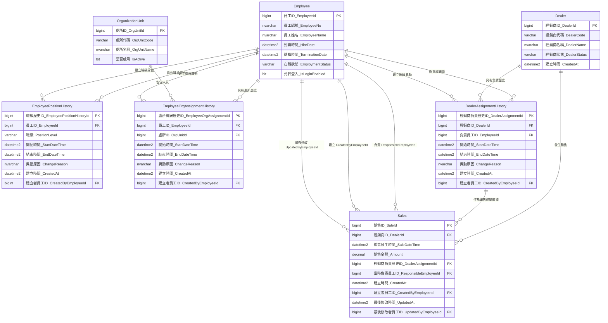

# 業務人員與經銷商資料庫設計規格

> 文件狀態：已確認的設計基準  
> 用途：後續設計資料表、撰寫 T-SQL、查詢權限及銷售維護功能時，應先閱讀本文件。  
> 本文件優先於早期討論筆記；若日後規則變動，應直接更新本文件。

## 1. 設計目標

系統需要保存以下資訊及其歷史變化：

- 員工基本資料與在職狀態。
- 員工職級歷史。
- 員工所屬處所歷史。
- 經銷商負責業務歷史。
- 銷售發生時的經銷商、負責業務及負責關係。
- 銷售資料的建立者及最後修改者。

歷史資料不得因員工離職、升職、調動或經銷商換線而被覆蓋或刪除。

## 2. 已確認的業務規則

### 2.1 職級

員工職級由低至高為：

1. 業務
2. 處長
3. 經理

處長可以親自負責經銷商，不需要同時再保存一個業務職級；是否負責經銷商，應由有效的經銷商負責關係判斷。

### 2.2 處所與處長

- 一名員工同一時間只能屬於一個處所。
- 一名員工同一時間只能有一個有效職級。
- 同一處所可以同時有多名處長，例如新舊處長正在交接。
- 不建立員工與主管的獨立對應表。
- 某處所的處長，定義為「目前在職、目前屬於該處所、目前有效職級為處長」的所有員工。
- 同處所的所有有效處長，都具有該處所的處長查看權限。

目前沒有指定唯一主管、單一簽核人或一對一主管關係的需求。未來若增加簽核流程，應另外設計簽核人或流程規則，不應改變目前的處所權限定義。

### 2.3 經銷商負責關係

- 一個經銷商同一時間只能有一名負責業務。
- 經銷商可以更換負責業務。
- 換線時結束舊負責關係，再新增接手人的負責關係。
- 不得修改舊負責紀錄的員工，也不得刪除舊紀錄。
- 因為不允許多人共同負責，所以目前不需要主要、協助、代理等 AssignmentType。

### 2.4 員工離職

- 離職員工不得刪除。
- Employee 必須保存離職時間及離職狀態。
- 離職時停用登入帳號。
- 離職時結束仍有效的職級、處所及經銷商負責關係。
- 所有歷史銷售與關聯資料必須保留。

### 2.5 銷售歸屬

- 銷售歸屬以銷售發生時間當下的經銷商負責人為準。
- Sales 必須保存當時採用的 DealerAssignmentId。
- Sales 也保存 ResponsibleEmployeeId，作為交易當時負責人的快照。
- 修改者不會因為修改資料而自動成為該筆銷售的負責人。
- 不提供數月後重新分配業績的功能。
- 不需要 SaleAttributionHistory 或其他長期業績調整表。

### 2.6 銷售修改期限

- 銷售資料建立後 5 天內可以修改。
- 5 天定義為從 CreatedAt 起算的連續 120 小時。
- 判斷時間必須使用資料庫伺服器時間，不使用使用者電腦時間。
- 只要使用者對該筆銷售具有查看及編輯權限，在期限內即可修改，不限制必須是原建立者。
- 因此，經銷商換線後，新業務可以在期限內修正前一位業務輸入的資料。
- 建立滿 120 小時後，銷售資料即固定，一般使用者不得再修改。
- CreatedByEmployeeId 只用來記錄建立者，不作為是否允許修改的判斷條件。

如果修改 DealerId 或 SaleDateTime，系統必須重新依照更正後的經銷商與銷售時間查找有效的 DealerAssignmentId，並同步更新 ResponsibleEmployeeId。只修改金額、備註或其他不影響歸屬的內容時，不重新計算負責人。

## 3. 資料查看權限

### 3.1 業務

現任業務可以查看：

- 目前由自己負責之經銷商的全部銷售歷史，包括接手前的銷售。
- 過去自己負責經銷商期間所發生、且歸屬於自己的銷售。

前任業務不能因為過去曾負責某經銷商，就查看交接後新發生且與自己無關的銷售。

例如：

```text
王小明負責經銷商 A：開始 ～ 2026-07-01 00:00
李小華負責經銷商 A：2026-07-01 00:00 ～ 現在
```

- 李小華目前負責經銷商 A，因此可以查看經銷商 A 的全部銷售歷史。
- 王小明可以查看 2026-07-01 以前、自己負責期間所發生的銷售。
- 王小明不能查看 2026-07-01 以後由李小華負責期間新發生的銷售。

### 3.2 處長

處長可以查看：

- 目前與自己同處所的業務及其相關銷售資料。
- 該處所管轄範圍內的經銷商與銷售資料。
- 自己親自負責之經銷商的資料。

交接期間若同一處所有兩名處長，兩名處長都具有相同的處所查看權限。

### 3.3 經理

經理可以查看所有員工、處所、經銷商及銷售資料。

## 4. 有效期間標準

所有歷史關係使用「前閉後開」區間：

```text
StartDateTime <= TargetDateTime
AND (EndDateTime IS NULL OR TargetDateTime < EndDateTime)
```

- StartDateTime 包含在有效期間內。
- EndDateTime 不包含在有效期間內。
- EndDateTime 為 NULL 代表目前仍有效。
- 不使用 23:59:59 表示一天結束。

例如：

```text
王小明：2026-01-01 00:00 ～ 2026-07-01 00:00
李小華：2026-07-01 00:00 ～ NULL
```

在 2026-07-01 00:00 時，負責人只有李小華。

## 5. 建議資料表

### 5.1 Employee

保存員工基本資料。

建議欄位：

- EmployeeId
- EmployeeNo
- EmployeeName
- HireDate
- TerminationDate
- EmploymentStatus
- IsLoginEnabled

### 5.2 EmployeePositionHistory

保存員工職級歷史。

建議欄位：

- EmployeePositionHistoryId
- EmployeeId
- PositionLevel
- StartDateTime
- EndDateTime
- ChangeReason
- CreatedAt
- CreatedByEmployeeId

同一員工的有效職級期間不得重疊。

### 5.3 OrganizationUnit

保存處所基本資料。

建議欄位：

- OrgUnitId
- OrgUnitCode
- OrgUnitName
- IsActive

### 5.4 EmployeeOrgAssignmentHistory

保存員工所屬處所歷史。

建議欄位：

- EmployeeOrgAssignmentId
- EmployeeId
- OrgUnitId
- StartDateTime
- EndDateTime
- ChangeReason
- CreatedAt
- CreatedByEmployeeId

同一員工的處所歸屬期間不得重疊。

### 5.5 Dealer

保存經銷商基本資料。Dealer 不直接以一個可覆蓋的 EmployeeId 作為負責歷史來源。

建議欄位：

- DealerId
- DealerCode
- DealerName
- DealerStatus
- CreatedAt

### 5.6 DealerAssignmentHistory

保存經銷商負責業務歷史。

建議欄位：

- DealerAssignmentId
- DealerId
- EmployeeId
- StartDateTime
- EndDateTime
- ChangeReason
- CreatedAt
- CreatedByEmployeeId

同一經銷商的負責期間不得重疊。

### 5.7 Sales

保存銷售資料及交易當時的負責關係。

建議欄位：

- SaleId
- DealerId
- SaleDateTime
- Amount
- DealerAssignmentId
- ResponsibleEmployeeId
- CreatedAt
- CreatedByEmployeeId
- UpdatedAt
- UpdatedByEmployeeId

CreatedAt 一旦建立不得修改，因為它是 120 小時修改期限的起算依據。

## 6. 不建立的資料表與功能

目前明確不需要：

- EmployeeSupervisorHistory：處長權限由在職狀態、處所及職級推導。
- SaleAttributionHistory：不提供長期事後調整業績的功能。
- 多人共同負責經銷商的關係表或 AssignmentType。
- 每個處所只能有一名處長的限制。
- 只有原建立者才能修改銷售的限制。

## 7. 重要操作情境

### 7.1 經銷商換線

1. 以交接時間結束舊 DealerAssignmentHistory。
2. 以同一交接時間新增接手人的 DealerAssignmentHistory。
3. 舊銷售保留原本的 DealerAssignmentId 與 ResponsibleEmployeeId。
4. 新銷售依 SaleDateTime 對應接手後的負責關係。

### 7.2 員工換處所

1. 結束舊 EmployeeOrgAssignmentHistory。
2. 新增新處所的 EmployeeOrgAssignmentHistory。
3. 經銷商是否隨員工移動，必須另依實際交接處理，不可自動假設。

### 7.3 業務升任處長

1. 結束業務職級紀錄。
2. 新增處長職級紀錄。
3. 原經銷商負責關係可以繼續，不因升職自動結束。
4. 若實際已交接經銷商，才結束原負責關係並新增接手人。

### 7.4 處長交接

- 新舊處長可以在一段期間內同時屬於同一處所並具有處長職級。
- 交接期間兩人都能查看該處所資料。
- 舊處長正式離職或調走時，才結束其職級或處所歸屬的有效期間。

## 8. 概念關係

以下 ER Model 的欄位以「中文_英文」表示；PK 為主鍵，FK 為外鍵。



### 8.1 Employee 與 Sales 的三種關係

`Employee.EmployeeId` 是一方的主鍵；Sales 透過三個不同用途的外鍵指向 Employee，因此是三種獨立的一對多關係：

| Employee 一方 | Sales 多方 | 用途 |
|---|---|---|
| `Employee.EmployeeId` | `Sales.ResponsibleEmployeeId` | 銷售發生當時的負責業務，也是業績歸屬快照。 |
| `Employee.EmployeeId` | `Sales.CreatedByEmployeeId` | 建立這筆銷售資料的人。 |
| `Employee.EmployeeId` | `Sales.UpdatedByEmployeeId` | 最後修改這筆銷售資料的人。尚未修改時可以為 NULL。 |

這三個欄位不得混用。修改者不會因修改資料而自動成為該筆銷售的負責人；`ResponsibleEmployeeId` 必須與該筆 `DealerAssignmentId` 所指向的 EmployeeId 一致。

## 9. 實作時必須遵守的不變條件

1. 不刪除離職員工及歷史關係。
2. 同一員工的職級有效期間不得重疊。
3. 同一員工的處所歸屬有效期間不得重疊。
4. 同一經銷商的負責期間不得重疊。
5. 同一處所可以同時存在多名處長。
6. Sales.DealerAssignmentId 必須與 Sales.DealerId、Sales.SaleDateTime 相符。
7. Sales.ResponsibleEmployeeId 必須與該 DealerAssignmentId 的 EmployeeId 相符。
8. Sales.CreatedAt 不得修改。
9. 銷售只能在 CreatedAt 後 120 小時內修改。
10. 修改 DealerId 或 SaleDateTime 時，必須重新計算負責關係。
11. 超過修改期限後，不得直接更新銷售內容。

## 10. 機器可讀規則

以下區塊用於讓後續程式設計或 AI 工作階段快速取得規則；內容應與上方文字保持一致。

```yaml
specification: sales_dealer_assignment
status: confirmed
temporal_interval: half_open
temporal_predicate: "start <= target AND (end IS NULL OR target < end)"

employee:
  delete_after_termination: false
  active_org_unit_max_count: 1
  active_position_max_count: 1
  positions:
    - sales
    - director
    - manager

organization_unit:
  active_director_max_count: null
  multiple_directors_allowed: true
  director_definition:
    - employee_is_active
    - active_org_assignment_matches_unit
    - active_position_is_director
  explicit_supervisor_relationship: false

dealer_assignment:
  active_employee_max_count_per_dealer: 1
  overlapping_periods_allowed: false
  assignment_type_required: false
  history_is_immutable: true

sales:
  assignment_basis: dealer_and_sale_datetime
  store_dealer_assignment_id: true
  store_responsible_employee_snapshot: true
  edit_window_hours: 120
  edit_window_basis: database_server_time_minus_created_at
  creator_only_edit: false
  created_at_is_immutable: true
  recalculate_assignment_when:
    - dealer_id_changes
    - sale_datetime_changes
  long_term_attribution_adjustment: false

visibility:
  sales:
    - all_sales_of_currently_assigned_dealers
    - own_sales_from_historical_assignment_periods
  former_sales:
    post_handover_sales_visible: false
  director:
    - current_org_unit_scope
    - personally_assigned_dealers
  manager:
    - all_data
```
