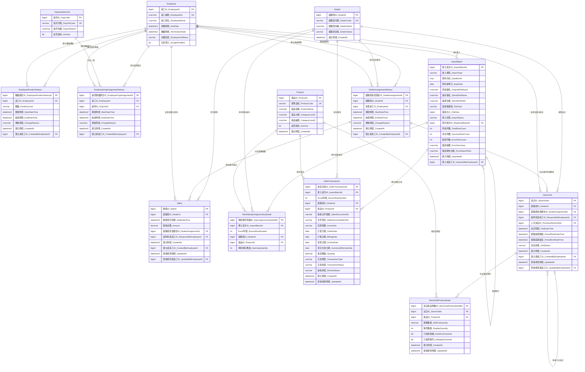

# 整合式人員、經銷商、庫存與巡店資料庫設計規格

> 文件狀態：討論版設計基準  
> 建立日期：2026-07-18  
> 用途：供後續討論、資料表設計、T-SQL 實作、匯入程式、手機巡店功能及 AI 工作階段使用。  
> 人員、處所、經銷商負責關係及既有 Sales 規則，沿用已完成的《業務人員與經銷商資料庫設計規格》。  
> Sell in 匯入的現行規則已於 2026-09-13 確認並實作；若早期討論內容不同，以第 14 節為準。

## 1. 設計範圍

本設計整合下列功能：

1. 員工基本資料與在職狀態。
2. 員工職級歷史。
3. 員工所屬處所歷史。
4. 經銷商負責業務歷史。
5. 既有 Sales 資料及其負責人歸屬。
6. 產品主檔。
7. 月度期初庫存匯入。
8. Sell in 進貨資料重複匯入。
9. 業務巡店紀錄。
10. 巡店期間實銷數量。
11. 巡店當下陳列數量。
12. 經銷商、產品及指定日期的推估庫存計算。

## 2. 核心設計原則

### 2.1 不以一張庫存表反覆覆寫

庫存相關資料代表不同性質的事實：

| 資料 | 性質 | 粒度 |
|---|---|---|
| 月度期初庫存 | 月初庫存基準 | 匯入批次＋經銷商＋產品 |
| Sell in | 進貨交易流量 | 來源交易／文件項次＋經銷商＋產品 |
| 巡店實銷 | 兩次巡店間的實銷流量 | 巡店＋產品 |
| 巡店陳列 | 巡店當下的陳列快照 | 巡店＋產品 |

### 2.2 推估庫存不建立獨立實體表

初期以查詢計算：

```text
推估庫存
＝正式批次中的月度期初庫存
＋指定期間內的有效 Sell in
－指定期間內有效巡店的實銷數量
```

陳列數量不參與庫存加減。陳列數量是經銷商庫存中，巡店當下放在賣場供顧客看見的數量。

### 2.3 歷史資料不可因換線或離職消失

- 離職員工不得刪除。
- 員工職級、處所、經銷商負責關係保留歷史。
- Sales 與巡店紀錄保存事件發生當時的負責關係及負責員工。
- 修改者不會因修改資料而成為該事件的負責人。

### 2.4 有效期間採前閉後開

```text
StartDateTime <= TargetDateTime
AND (EndDateTime IS NULL OR TargetDateTime < EndDateTime)
```

- 開始時間包含在有效期間內。
- 結束時間不包含在有效期間內。
- 結束時間為 NULL 表示目前仍有效。

## 3. 已確認的業務規則

### 3.1 員工職級

職級由低至高為：

1. 業務
2. 處長
3. 經理

- 一名員工同一時間只能有一個有效職級。
- 處長可以親自負責經銷商，不需要同時再保存一個業務職級。
- 是否負責經銷商，由有效的經銷商負責關係判斷。

### 3.2 處所與處長

- 一名員工同一時間只能屬於一個處所。
- 同一處所可以同時有多名處長。
- 不建立員工與主管的獨立對應表。
- 處長定義為：目前在職、目前屬於該處所、目前有效職級為處長。
- 同處所的所有有效處長具有相同的處所查看權限。

### 3.3 經銷商負責關係

- 一個經銷商同一時間只能有一名負責員工。
- 經銷商可以更換負責員工。
- 換線時結束舊負責關係，再新增接手人的負責關係。
- 不修改舊負責紀錄中的員工，也不刪除舊紀錄。
- 目前不需要主要、協助、代理等 AssignmentType。

### 3.4 經銷商代碼

- `DealerCode` 是經銷商業務上的唯一值。
- 例如 `TW002351001H` 唯一代表一個經銷商。
- 期初庫存與 Sell in 匯入時，使用經銷商代碼查找 `DealerId`。
- 不建立經銷商來源代碼對照表。

### 3.5 產品與型號

- `Product.ProductCode` 保存系統標準品號且必須唯一。
- 來源型號可透過明確規則轉成正確的標準品號。
- 不建立產品來源品號對照表。
- 期初庫存匯入依第 13 節規則，在使用者確認後可隨批次建立產品。
- SaleIn 匯入中，只有 `Sold-to` 能對應既有 `Dealer` 的資料才屬本系統管理範圍；範圍內資料的 `Model(Prefix)` 若尚無對應 `Product.ProductCode`，預覽列為「新增型號」，正式確認時在同一交易先建立產品，再建立進貨交易。
- SaleIn 自動建立產品時，`ProductCode` 與 `ProductName` 均先使用 `Model(Prefix)`；同一新型號在同一批次只建立一次。

### 3.6 既有 Sales 歸屬

- Sales 以 `DealerId＋SaleDateTime` 查找當時有效的 `DealerAssignmentId`。
- Sales 保存 `ResponsibleEmployeeId` 作為交易當時負責人的快照。
- `ResponsibleEmployeeId` 必須等於該 `DealerAssignmentId` 的 `EmployeeId`。
- 修改 `DealerId` 或 `SaleDateTime` 時，必須重新計算負責關係。
- 修改其他內容時不重新計算負責人。
- Sales 建立後 120 小時內可以修改，判斷使用資料庫伺服器時間。
- `CreatedAt` 一旦建立不得修改。

### 3.7 月度期初庫存

- 每月匯入一次期初庫存，用於建立及核對月初庫存基準。
- `202606期末` 的期末數量，作為 `202607` 的正式期初庫存。
- 一份期初庫存 Excel 包含所有經銷商。
- 不建立月度庫存快照表。
- 一次正式期初庫存匯入批次，直接對應多筆月度期初庫存明細。
- 同一正式批次中，同一經銷商、同一產品只能有一筆期初庫存明細。
- 同一資料月份只能有一個有效的正式期初庫存批次。

### 3.8 期初庫存整批替換

- 原始 Excel 永久保存。
- 若匯入內容有問題，不修改個別正式明細。
- 舊批次標記為 `Superseded` 或 `Voided`，再匯入新批次。
- 新批次以 `ReplacedBatchId` 指向被取代的舊批次。
- 正式庫存計算只採用目前有效的正式批次。
- 舊批次及其明細不物理刪除，以保留追查能力。

### 3.9 匯入原始檔案

- 不建立匯入原始資料列 Table。
- 每份原始 Excel 必須永久保存且不得被覆蓋。
- 實際儲存檔名應使用批次 ID 或其他唯一值。
- `ImportBatch` 保存原始檔名、實際儲存位置、檔案雜湊值及檔案大小。
- 正式明細保存 `ImportBatchId` 與 `SourceRowNumber`，可回到原始檔案的指定列追查。
- 資料庫備份與原始檔案備份必須配套。

### 3.10 Sell in

- Sell in 是公司銷售給經銷商的進貨交易流量，寫入 `SellInTransaction`；巡店時輸入、代表經銷商對外賣出的 SaleOut 寫入 `StoreVisitProductDetail.SellOutQuantity`，兩者不得混用。
- 同一月份會重複匯入多次。
- 已確認以 `BillingDate` 作為 `InventoryEffectiveDate`。
- 每筆正式進貨交易保存來源匯入批次及 Excel 列號。
- 來源業務鍵為 `SalesDocumentNo＋SalesDocumentItemNo`，對應 Excel 的 `Order No＋Item`；同一檔案內不得重複，資料庫已存在時不重複寫入。
- `Category = Sales` 對應 `TransactionType = SALE` 且數量必須為正；`Category = Return` 對應 `TransactionType = RETURN` 且數量必須為負。數量保存 Excel 的 `Invoiced Qty` 正負號，不得為零。
- SaleIn 是進貨事實。`BillingDate` 早於最近正式期初庫存月份時必須警示並分頁列出，但不得因此排除；使用者額外確認後仍完整匯入。
- `Sold-to` 不存在於 `Dealer.DealerCode` 時，代表非本程式管理範圍的經銷商，直接跳過，不視為 TW Code 輸入錯誤，也不自動建立經銷商。

### 3.11 巡店

- 每次到店建立一筆 `StoreVisit`。
- `StoreVisit` 保存經銷商、巡店時間、實銷期間、當時負責關係及當時負責員工。
- `StoreVisitProductDetail` 保存該次巡店每個產品的實銷數量與陳列數量。
- 同一次巡店、同一產品只能有一筆巡店產品明細。
- 實銷數量代表上一次巡店到本次巡店之間的銷售流量。
- 陳列數量代表本次巡店當下看到的陳列快照。
- 陳列數量為 0 與未檢查必須能區分。

### 3.12 巡店修改期限

- 巡店資料建立後 120 小時內可以修改。
- 使用資料庫伺服器時間判斷。
- `CreatedAt` 不得修改。
- 超過 120 小時後，一般使用者不得修改。
- 建立者、最後修改者與當時負責員工是不同用途，不得混用。

## 4. 資料表清單

### 4.1 已完成的人員、經銷商與 Sales

1. `Employee`：員工基本資料。
2. `EmployeePositionHistory`：員工職級歷史。
3. `OrganizationUnit`：處所主檔。
4. `EmployeeOrgAssignmentHistory`：員工處所歸屬歷史。
5. `Dealer`：經銷商主檔。
6. `DealerAssignmentHistory`：經銷商負責員工歷史。
7. `Sales`：既有銷售資料及當時負責人歸屬。

### 4.2 新增的庫存、匯入與巡店

8. `Product`：產品主檔。
9. `ImportBatch`：匯入批次及永久保存原始檔案的追蹤資料。
10. `MonthlyOpeningInventoryDetail`：月度期初庫存明細。
11. `SellInTransaction`：Sell in 進貨交易。
12. `StoreVisit`：巡店主檔。
13. `StoreVisitProductDetail`：巡店產品實銷及陳列明細。

## 5. 資料表欄位

### 5.1 Employee

- `EmployeeId` PK
- `EmployeeNo` UK
- `EmployeeName`
- `HireDate`
- `TerminationDate`
- `EmploymentStatus`
- `IsLoginEnabled`

### 5.2 EmployeePositionHistory

- `EmployeePositionHistoryId` PK
- `EmployeeId` FK
- `PositionLevel`
- `StartDateTime`
- `EndDateTime`
- `ChangeReason`
- `CreatedAt`
- `CreatedByEmployeeId` FK

同一員工的有效職級期間不得重疊。

### 5.3 OrganizationUnit

- `OrgUnitId` PK
- `OrgUnitCode` UK
- `OrgUnitName`
- `IsActive`

### 5.4 EmployeeOrgAssignmentHistory

- `EmployeeOrgAssignmentId` PK
- `EmployeeId` FK
- `OrgUnitId` FK
- `StartDateTime`
- `EndDateTime`
- `ChangeReason`
- `CreatedAt`
- `CreatedByEmployeeId` FK

同一員工的處所歸屬期間不得重疊。

### 5.5 Dealer

- `DealerId` PK
- `DealerCode` UK
- `DealerName`
- `DealerStatus`
- `CreatedAt`

### 5.6 DealerAssignmentHistory

- `DealerAssignmentId` PK
- `DealerId` FK
- `EmployeeId` FK
- `StartDateTime`
- `EndDateTime`
- `ChangeReason`
- `CreatedAt`
- `CreatedByEmployeeId` FK

同一經銷商的負責期間不得重疊。

### 5.7 Sales

- `SaleId` PK
- `DealerId` FK
- `SaleDateTime`
- `Amount`
- `DealerAssignmentId` FK
- `ResponsibleEmployeeId` FK
- `CreatedAt`
- `CreatedByEmployeeId` FK
- `UpdatedAt`
- `UpdatedByEmployeeId` FK

### 5.8 Product

- `ProductId` PK
- `ProductCode` UK
- `ProductName`
- `CategoryLevel1`
- `CategoryLevel2`
- `IsActive`
- `CreatedAt`

### 5.9 ImportBatch

- `ImportBatchId` PK
- `ImportType`
- `DataMonth`
- `DataDate`
- `OriginalFileName`
- `StoredFileName`
- `StoredFilePath`
- `FileHash`
- `FileSize`
- `ImportStatus`
- `ReplacedBatchId` FK，可為 NULL
- `TotalRowCount`
- `SuccessRowCount`
- `ErrorRowCount`
- `ErrorSummary`
- `ErrorReportPath`
- `ImportedAt`
- `ImportedByEmployeeId` FK

建議匯入狀態至少包含：

```text
Processing
Failed
Official
Superseded
Voided
```

### 5.10 MonthlyOpeningInventoryDetail

- `OpeningInventoryDetailId` PK
- `ImportBatchId` FK
- `SourceRowNumber`
- `DealerId` FK
- `ProductId` FK
- `OpeningQuantity`

唯一性概念：

```text
ImportBatchId＋DealerId＋ProductId
```

### 5.11 SellInTransaction

- `SellInTransactionId` PK
- `ImportBatchId` FK
- `SourceRowNumber`
- `DealerId` FK
- `ProductId` FK
- `SalesDocumentNo`
- `SalesDocumentItemNo`
- `InvoiceNo`
- `OrderDate`
- `BillingDate`
- `InvoiceDate`
- `InventoryEffectiveDate`
- `Quantity`
- `TransactionType`
- `TransactionStatus`
- `ReviewStatus`
- `CreatedAt`
- `UpdatedAt`

### 5.12 StoreVisit

- `StoreVisitId` PK
- `DealerId` FK
- `DealerAssignmentId` FK
- `ResponsibleEmployeeId` FK
- `PreviousStoreVisitId` FK，可為 NULL
- `VisitDateTime`
- `PeriodStartDateTime`
- `PeriodEndDateTime`
- `VisitStatus`
- `CreatedAt`
- `CreatedByEmployeeId` FK
- `UpdatedAt`
- `UpdatedByEmployeeId` FK

### 5.13 StoreVisitProductDetail

- `StoreVisitProductDetailId` PK
- `StoreVisitId` FK
- `ProductId` FK
- `SellOutQuantity`
- `DisplayQuantity`
- `IsSellOutChecked`
- `IsDisplayChecked`
- `CreatedAt`
- `UpdatedAt`

唯一性概念：

```text
StoreVisitId＋ProductId
```

## 6. 整合 ER Model



## 7. 推估庫存計算規則

### 7.1 計算維度

推估庫存以以下維度計算：

```text
DealerId＋ProductId＋TargetDateTime
```

### 7.2 計算來源

1. 從目標日期所屬月份的有效正式期初庫存批次，取得 `OpeningQuantity`。
2. 加總期初庫存基準日至目標日期間有效的 `SellInTransaction.Quantity`。
3. 加總並扣除同期間有效巡店中的 `StoreVisitProductDetail.SellOutQuantity`。

### 7.3 完整概念式

```text
EstimatedInventoryQuantity
= OpeningQuantity from MonthlyOpeningInventoryDetail
+ SUM(Quantity from valid SellInTransaction)
- SUM(SellOutQuantity from valid StoreVisitProductDetail)
```

### 7.4 有效資料條件

- 期初庫存所屬 `ImportBatch.ImportStatus = Official`。
- Sell in 所屬匯入批次必須有效，交易狀態也必須納入有效交易定義。
- 巡店狀態必須是已送出或已鎖定等有效狀態。
- 草稿、作廢、已被取代的資料不參與計算。

### 7.5 推估庫存的時間限制

巡店實銷不是即時 POS 銷售，而是業務巡店時回報上次巡店至本次巡店間的數量。因此兩次巡店之間，推估庫存可能高於實際庫存。使用者介面應顯示最近有效巡店時間或庫存資料截至時間。

## 8. 重要不變條件

1. 不刪除離職員工及歷史關係。
2. 同一員工的有效職級期間不得重疊。
3. 同一員工的有效處所歸屬期間不得重疊。
4. 同一經銷商的有效負責期間不得重疊。
5. 同一處所可以同時存在多名處長。
6. `Sales.DealerAssignmentId` 必須符合 `Sales.DealerId＋SaleDateTime`。
7. `Sales.ResponsibleEmployeeId` 必須與其負責關係的員工一致。
8. `StoreVisit.DealerAssignmentId` 必須符合 `StoreVisit.DealerId＋VisitDateTime`。
9. `StoreVisit.ResponsibleEmployeeId` 必須與其負責關係的員工一致。
10. Sales 與巡店的 `CreatedAt` 不得修改。
11. Sales 與巡店資料只能在建立後 120 小時內由一般使用者修改。
12. 同一正式期初庫存批次中，`DealerId＋ProductId` 不得重複。
13. 同一月份只能有一個有效的正式期初庫存批次。
14. 同一次巡店中，`ProductId` 不得重複。
15. 原始匯入 Excel 必須永久保存且不得被覆蓋。
16. 作廢或被取代的匯入批次不得參與正式庫存計算。
17. SaleIn 中屬於既有經銷商的新型號，必須在正式匯入交易內先建立 `Product` 再建立 `SellInTransaction`；非系統管理範圍經銷商的資料直接跳過。期初庫存產品建立規則依第 13 節。

## 9. Sell in 決策與剩餘待確認事項

### 9.1 Sell in 庫存生效日期

已於 2026-09-13 確認：

```text
InventoryEffectiveDate = BillingDate
```

`OrderDate` 與 `InvoiceDate` 仍保存來源事實，但不作為庫存生效日期；部分退貨可以沒有 `InvoiceDate`。

### 9.2 Sell in 唯一鍵

已確認來源檔案的穩定文件項次為：

```text
SalesDocumentNo＋SalesDocumentItemNo
```

不得以 `SalesDocumentNo＋Model` 取代此鍵。

### 9.3 退貨、取消與數量更正

需要確認來源系統是：

- 保留原文件號並改變狀態或數量；或
- 新增另一張退貨／沖銷文件。

確認後再定義 `TransactionType`、`TransactionStatus` 及重複匯入更新規則。

### 9.4 Sell in 重複匯入

同月份會重複匯入。目前已實作：

- 已存在且未變更：略過。
- 尚未存在：新增。
- 同一檔案中的 `Order No＋Item` 重複：列為格式錯誤，不建立正式交易。
- 相同原始檔案雜湊已完成正式匯入：回傳原批次結果，不重複寫入。
- 已存在但狀態或數量不同的更正歷史機制尚未實作；目前依唯一鍵略過，後續若來源系統提供正式更正規則再擴充。
- 新檔案未出現的舊交易不得直接刪除。

## 10. 機器可讀規則

```yaml
specification: integrated_employee_dealer_inventory_visit
status: discussion_baseline
date: 2026-07-18

temporal_interval:
  type: half_open
  predicate: "start <= target AND (end IS NULL OR target < end)"

employee:
  delete_after_termination: false
  active_position_max_count: 1
  active_org_unit_max_count: 1
  positions:
    - sales
    - director
    - manager

organization_unit:
  multiple_directors_allowed: true
  explicit_supervisor_relationship: false

dealer:
  dealer_code_is_unique: true
  external_code_table_required: false

dealer_assignment:
  active_employee_max_count_per_dealer: 1
  overlapping_periods_allowed: false
  history_is_immutable: true
  assignment_type_required: false

product:
  product_code_is_unique: true
  source_code_mapping_table_required: false
  normalize_source_model_by_rule: true
  auto_create_when_not_found: false

sales:
  assignment_basis: dealer_and_sale_datetime
  store_dealer_assignment_id: true
  store_responsible_employee_snapshot: true
  edit_window_hours: 120
  created_at_is_immutable: true

import:
  raw_row_table_required: false
  original_file_permanently_stored: true
  original_file_is_immutable: true
  detail_source_trace:
    - import_batch_id
    - source_row_number
  batch_replacement_supported: true
  physical_delete_replaced_batch: false

opening_inventory:
  snapshot_header_table_required: false
  file_contains_all_dealers: true
  one_official_batch_per_month: true
  correction_method: replace_whole_batch
  unique_detail_key:
    - import_batch_id
    - dealer_id
    - product_id

sell_in:
  repeated_import_during_month: true
  inventory_effective_date: billing_date_provisional
  unique_key: pending_confirmation
  return_and_cancel_rule: pending_confirmation

store_visit:
  store_assignment_snapshot: true
  store_responsible_employee_snapshot: true
  edit_window_hours: 120
  created_at_is_immutable: true
  sell_out_is_interval_flow: true
  display_is_point_in_time_snapshot: true
  unique_product_detail_key:
    - store_visit_id
    - product_id

estimated_inventory:
  persisted_table_required: false
  formula: opening_inventory + valid_sell_in - valid_store_visit_sell_out
  display_quantity_affects_inventory: false
```

## 11. 後續實作順序

在撰寫 T-SQL 前，建議依序完成：

1. Sell in 唯一鍵已確認為 `SalesDocumentNo＋SalesDocumentItemNo`。
2. Sell in 庫存生效日期已確認為 `BillingDate`。
3. 銷貨與退貨正負號及 `TransactionType` 已依第 14 節實作；取消及既有交易更正歷史仍待來源系統規則確認。
4. `ImportStatus` 與 SellIn 的 `TransactionStatus`、`ReviewStatus` 已依第 14 節實作；其他資料的狀態集合仍依各功能確認。
5. 確認巡店第一次沒有上次巡店時，實銷區間開始時間的規則。
6. 確認巡店是否要求實銷與陳列必填，或允許未檢查狀態。
7. 後續建立 PSI 查詢時，依第 14.2 節以期初基準、報表期間及 `InventoryEffectiveDate` 計算，不得在匯入階段排除歷史 SaleIn。

## 12. 三台實體電腦部署與 2026-09-03 更新

- LGDevA、LGDevB、LGSalesOut 使用同一份 Git 程式碼及 `啟動-LGSale.cmd`。
- 各機器的環境名稱、Port、RP ID、Origin 與資料庫連線資料寫在本機 `.env.local`，不得 Push。
- `.lgsale-session-secret`、`.venv`、`runtime`、Log、上傳檔及 Cloudflare Tunnel token 不得 Push。
- 程式不再內建 LGDevA／LGDevB 網址或資料庫帳密；缺少必要設定時停止啟動，避免連錯環境。
- Cloudflare Tunnel 使用 `tools/Install-Cloudflare-Tunnel.ps1`，每台機器傳入自己的 ServiceName 與本機 token。

Pull 本次版本後：

1. 將 `.env.example` 複製成 `.env.local`，填入該電腦自己的設定。
2. 執行 `.venv\Scripts\python.exe -m pip install -r requirements.txt`。
3. 執行 `TSQL資料/Migrations/20260903_三機同步與異動工作台.sql`。
4. 正式機執行 Migration 前先備份資料庫。
5. 關閉舊 Python，改用 `啟動-LGSale.cmd` 啟動並完成登入、巡店與異動工作台驗證。

本次 Migration 建立 `DealerTransferReview`、補齊經銷商主檔欄位，並將陳列數量限制修正為 `NULL` 或 `1～10`。處所異動與經銷商轉移維持兩個獨立工作，保留全部歷史資料；經銷商可分批交給不同業務，員工離職時現行負責關係結束並進入待移轉。

## 13. 2026-09-11 期初庫存匯入實作更新

本節記錄目前已實作並測試的期初匯入規則；若與第 3.5、3.7、3.8 節的早期討論基線不同，以本節為準。產品可在使用者確認後隨批次建立，同月份可用後續正式批次保存逐筆更正來源，不再限定只能整批取代。

### 13.1 來源、月份與欄位對應

- 匯入來源為期末庫存 Excel 的「期末」工作表；例如 `202608期末.xlsx` 作為 2026 年 9 月期初庫存。
- 使用者必須在預覽頁確認期初月份。檔名月份只用來建議下一個月份，正式寫入月份以畫面選擇值為準。
- 來源欄位固定為 `TW CODE、簡稱、產品別、產品別2、型號、陳列、期末、不計、業務員`。
- `TW CODE` 對應 `Dealer.DealerCode`，簡稱只供顯示及建立新經銷商時使用。
- `產品別` 對應 `Product.CategoryLevel1`，`產品別2` 對應 `Product.CategoryLevel2`，`型號` 同時寫入 `Product.ProductCode` 及 `Product.ProductName`。
- 期末數量寫入 `MonthlyOpeningInventoryDetail.OpeningQuantity`。期末已包含陳列，陳列數量只供預覽，不再加到期初數量。
- 負數及零庫存都屬有效庫存資料，完整寫入 `MonthlyOpeningInventoryDetail`。

### 13.2 匯入前預覽與確認

- 「讀取檔案並預覽」只讀取檔案及主檔，不寫入正式資料表。
- 預覽分為期初庫存、新增經銷商、新增業務、新增產品及新增配對五個頁籤。
- 五個頁籤均可選擇每頁顯示 25、50 或 100 筆；期初庫存預設每頁 50 筆。
- 預覽提供一般搜尋、`TWCode＋經銷商名稱` 及狀態篩選；篩選與換頁只影響顯示，不縮小正式匯入範圍。
- 新經銷商依 `TW CODE` 判斷並建立；既有經銷商只用 `TW CODE` 對應，不以簡稱覆蓋主檔。
- 來源業務姓名是檔案唯一可辨識條件。姓名唯一符合既有員工時沿用；找不到時，使用者必須在預覽填寫員工編號、到職日、所屬處所及職級，確認匯入時才建立員工。
- 新增員工、經銷商、產品、配對、庫存與 PSI 排除規則必須在同一資料庫交易完成；任何一步失敗時整批回滾。
- 使用者修改預覽資料後必須按「重新比對主檔」。系統重新讀取主檔並產生驗證摘要；只有沒有錯誤且使用者勾選最終確認時才開放「確認匯入」。
- 預覽證明值包含來源資料、月份、主檔快照、員工補充資料、庫存重複處理決定及配對處理決定。正式寫入前再次比對，防止使用過期預覽。

### 13.3 重複匯入與庫存更正

- 重複判斷的業務鍵為 `期初月份＋TW CODE＋型號`，不依檔名判斷；檔名相同或不同都適用同一規則。
- 發現既有庫存時，預覽列出原批次、原檔名、原匯入時間、原數量及本次數量。
- 使用者逐筆或整批選擇「保留原資料」或「以本次數量更正」。
- 保留原資料時略過該列，不重複新增。
- 更正時建立新的正式 `ImportBatch`，在 `OpeningInventoryCorrection` 保存原明細、來源列、原數量與新數量，再更新原 `MonthlyOpeningInventoryDetail` 數量。
- 同一上傳工作產生的正式批次可安全重試；已完成時回傳原批次結果，不重複寫入。

### 13.4 「不計」與 PSI 排除

- 「不計」不代表沒有庫存，也不會從期初庫存排除；該列數量仍完整寫入 `MonthlyOpeningInventoryDetail`。
- 對本次接受新增或更正且標記「不計」的型號去重後，在 `OpeningInventoryProductExclusion` 建立：
  - `ScopeType = 'ALL'`
  - `DealerId = NULL`
  - `ExclusionReason = 'PSIRemove'`
  - `EffectiveFromMonth = 匯入的期初月份`
  - `EffectiveToMonth = NULL`
- 此規則只供 PSI 報表排除計算，不修改實際庫存。

### 13.5 期初匯入時的配對差異

- 預覽以使用者指定的移轉生效時間查找當時有效的 `DealerAssignmentHistory`。預設時間為期初月份 1 日 00:00:00，使用者可以改為該月份內的其他時間。
- 檔案業務與指定時間負責人不同時，使用者必須選擇下列一種處理方式：
  1. **不變更負責人，只匯入庫存**：不修改 `DealerAssignmentHistory`。
  2. **從指定時間起改由檔案業務負責**：結束指定時間當下的原配對，新增沒有截止時間的新配對；只適用於指定時間之後沒有其他配對異動。
  3. **補登至下一次移轉前**：結束指定時間當下的原配對，新增從指定時間到下一筆配對開始前的歷史區間，保留後續配對。
- 系統依是否存在後續配對顯示建議動作，但不得未經使用者選擇就變更配對。
- 例如 2026 年 9 月期初檔案記錄錢亮均，而同一經銷商已於 9 月 11 日由陳輔杰轉給王正文，確認補登後的歷程為：
  - 陳輔杰截止於 2026-09-01。
  - 錢亮均自 2026-09-01 至 2026-09-11。
  - 王正文自 2026-09-11 起繼續有效。
- 配對期間採半開區間，不得重疊；修改原配對與新增新配對都在期初匯入交易內完成。
- 經銷商移轉不會推定員工離職，也不會更新 `Employee.TerminationDate`。員工離職仍由員工基本資料功能處理。

### 13.6 預覽警示狀態

- 「錯誤訊息」及「配對差異確認」使用可展開／收合區塊。
- 每次按「讀取檔案並預覽」或「重新比對主檔」完成後，兩個區塊預設收合；摘要仍顯示問題或經銷商數量。
- 有未選處理方式、無效時間或歷程衝突時，配對差異區顯示紅底及「待處理」。
- 所有配對選擇通過重新比對後，摘要改為「已處理完成」並恢復白底；使用者再次修改任何選擇時立即回到待處理狀態。
- 「從指定時間起移轉」建議使用藍色標籤；「補登歷史期間」建議使用橘色標籤；已存在的後續移轉使用紅字提示。

### 13.7 員工列表與手機回報型號

- 員工基本資料列表新增「經銷商數量」，只計算目前時間有效的 `DealerAssignmentHistory`：`StartDateTime <= 現在 AND (EndDateTime IS NULL OR EndDateTime > 現在)`。
- 點擊數量可查看目前配對的 TW Code、經銷商名稱及配對起始時間；沒有配對時顯示 0 家。
- 手機巡店的新回報型號只取 SQL Server 當月的正式期初庫存，不取資料庫最後一次匯入的舊月份。
- 若今天為 2026 年 9 月，只讀取 `ImportBatch.DataMonth = '202609'`、`ImportType = 'OPENING_INVENTORY'` 且 `ImportStatus = 'Official'` 的產品。
- 歷史月份庫存繼續保留，但不得因經銷商後來轉給新業務而出現在目前月份的新回報畫面。

## 14. 2026-09-13 SaleIn 匯入實作更新

本節記錄已確認並實作的 SaleIn 桌機匯入規則。SaleIn 是公司對經銷商的進貨交易事實，是 PSI 中的進貨流量；匯入階段不得因交易日期早於期初庫存月份而捨棄有效進貨。若本節與第 3、8、9 或 11 節的早期討論內容不同，以本節為準。

### 14.1 來源檔案與欄位對應

- 匯入來源為 SAP 匯出的 `.xlsx`，使用 `Data` 工作表；單檔上限 15 MB，解壓後上限 100 MB，最多 50,000 列、150 欄。
- 第一列必須且只能有一個必要欄位：`Category`、`Order No`、`Item`、`Sold-to`、`Model(Prefix)`、`Invoiced Qty`、`Order Date`、`Billing Date`。
- `Invoice No`、`Invoice Date` 為選用欄位；退貨可以沒有發票號碼及發票日期。

| Excel 欄位 | 目標資料 | 規則 |
|---|---|---|
| `Order No` | `SellInTransaction.SalesDocumentNo` | 必填，最長 50 字元 |
| `Item` | `SellInTransaction.SalesDocumentItemNo` | 必填，最長 20 字元 |
| `Sold-to` | `Dealer.DealerCode` → `DealerId` | 僅查找既有經銷商，不自動建立 |
| `Model(Prefix)` | `Product.ProductCode` → `ProductId` | 轉大寫後比對；不存在時可隨正式批次建立 |
| `Invoice No` | `SellInTransaction.InvoiceNo` | 可為 NULL |
| `Order Date` | `SellInTransaction.OrderDate` | 必填有效日期 |
| `Billing Date` | `BillingDate`、`InventoryEffectiveDate` | 必填有效日期，作為庫存與 PSI 的交易日期 |
| `Invoice Date` | `SellInTransaction.InvoiceDate` | 可為 NULL |
| `Invoiced Qty` | `SellInTransaction.Quantity` | 非零，最多三位小數，保留正負號 |
| `Category` | `TransactionType` | `Sales` → `SALE`；`Return` → `RETURN` |
| Excel 實際列號 | `SourceRowNumber` | 從標題列後的來源列號保存 |

### 14.2 日期有效性與歷史 SaleIn

- 有效日期接受 Excel 原生日期、`YYYY-MM-DD`、`YYYY/MM/DD` 或 `YYYYMMDD`，且必須是實際存在的日曆日期。
- `OrderDate` 與 `BillingDate` 必填；`InvoiceDate` 可空白。
- 目前不限制日期必須早於匯入日，也不強制 `OrderDate <= BillingDate`；來源事實依原值保存。
- 預覽讀取最近一次 `ImportType = 'OPENING_INVENTORY'` 且 `ImportStatus = 'Official'` 的最大 `DataMonth`，作為期初庫存提示基準。
- 可匯入列的 `BillingDate` 早於該期初月份第一日時，標記為「期初月份前」，在獨立頁籤列出並顯示筆數及基準月份。
- 「期初月份前」只是一項重要警示，不是排除條件。使用者必須額外勾選「我確認這些是實際進貨資料，仍要一併匯入」；前端未確認時停用正式匯入，後端也必須再次驗證。
- 使用者確認後，期初月份前、期初月份內及期初月份後的有效 SaleIn 均完整寫入；`InventoryEffectiveDate` 保存各列真正的 `BillingDate`。
- PSI 與推估庫存查詢必須依報表期間、期初基準及 `InventoryEffectiveDate` 決定加總範圍，不得在匯入階段刪除或忽略真實的歷史進貨交易。

### 14.3 經銷商範圍與新產品

- `Sold-to` 以不分大小寫的完整代碼比對 `Dealer.DealerCode`。
- 找不到 `DealerCode` 代表該客戶不是本程式管理範圍內的經銷商，預覽列為「範圍外經銷商」並直接跳過；不將其視為 TW Code 輸入錯誤、不阻擋其他有效資料，也不自動建立 `Dealer`。
- 經銷商存在但 `Model(Prefix)` 找不到 `Product.ProductCode` 時，預覽列為「新增型號」，仍計入可匯入筆數。
- 正式匯入在同一資料庫交易中先建立新產品，再以新 `ProductId` 建立所有相關 `SellInTransaction`；任一步失敗時整批回滾。
- 新產品的 `ProductCode` 與 `ProductName` 先使用 `Model(Prefix)`；同一批次相同新型號去重後只建立一次。
- 若該列 `Order No＋Item` 已存在，該列列為「已匯入」，不得只為該重複列新增產品。

### 14.4 可匯入判定、退貨與防重

一列 SaleIn 必須同時符合下列條件才可寫入：

1. 必要欄位存在且不是公式或 Excel 錯誤。
2. `Category` 只能是 `Sales` 或 `Return`。
3. `Sales` 數量為正；`Return` 數量為負；數量不可為零且最多三位小數。
4. 必填日期是有效日曆日期。
5. `Sold-to` 能對應既有 `Dealer`。
6. `Model(Prefix)` 能對應既有 `Product`，或已列為本批待建立的新產品。
7. 同一來源檔案內沒有重複 `Order No＋Item`。
8. `SellInTransaction` 尚無相同 `SalesDocumentNo＋SalesDocumentItemNo`。

- 正式交易使用 `TransactionStatus = 'VALID'`、`ReviewStatus = 'APPROVED'`。
- 匯入前只查詢本批出現之訂單號的既有交易，不掃描完整 `SellInTransaction`。
- 匯入以資料庫應用鎖、`SERIALIZABLE` 交易隔離及 `XACT_ABORT ON` 執行。
- 完成前核對本批 `SellInTransaction` 實際筆數及 `Quantity` 合計；不一致時整批回滾。
- 相同檔案雜湊已正式完成時，回傳既有批次，不重複寫入。

### 14.5 ImportBatch 與稽核

- SaleIn 批次使用 `ImportType = 'SELL_IN'`、`ImportStatus = 'Official'`。
- `ImportBatch.DataDate` 保存本批可匯入資料最大的 `BillingDate`；來源可跨月份，不能以 `DataDate` 推定整批只有單一月份。
- `TotalRowCount` 保存來源明細及格式錯誤總數；`SuccessRowCount` 保存實際寫入筆數；`ErrorRowCount` 保存未寫入筆數，包括範圍外經銷商、重複資料及格式錯誤。
- `ErrorSummary` 保存各分類數量及格式錯誤摘要；`OriginalFileName`、`StoredFilePath`、`FileHash`、`FileSize`、匯入者及匯入時間保留完整來源追蹤。
- 正式明細保存 `ImportBatchId＋SourceRowNumber`，可回查原始 Excel 列。

### 14.6 桌機預覽與確認

- 桌機入口為 `/sellin-import`，僅員工帳號可以使用；所有寫入 API 使用獨立 CSRF 驗證。
- 流程分為「選擇檔案」、「檢查預覽」及「確認匯入」。上傳與預覽階段不得寫入 `Product`、`ImportBatch` 或 `SellInTransaction`。
- 預覽提供：全部、可匯入、期初月份前、新增型號、範圍外經銷商、已匯入及格式錯誤頁籤。
- 每個頁籤預設每頁 50 筆，使用者可選擇每頁 25、50 或 100 筆；切換筆數時回到第 1 頁。
- 預覽表格不得限制在固定高度的內部垂直捲動區。當頁選擇 50 筆時，必須在整個網頁中展開 50 筆，由瀏覽器頁面本身上下捲動；只有欄位寬度超出畫面時才允許水平捲動。

- 搜尋、頁籤及換頁只影響顯示，不縮小正式匯入範圍。
- 一般最終確認必須涵蓋可匯入筆數、退貨負數及跳過／問題清單；含期初月份前資料時另須完成歷史 SaleIn 確認。
- 使用者可下載跳過與問題清單；新產品屬可匯入資料，不列入問題清單。
- 匯入結果顯示批次 ID、寫入筆數、未寫入筆數、銷貨筆數、退貨筆數、淨數量、新增產品數及資料日期，並提供最近 SaleIn 匯入批次列表。

## 15. 共用 UI 選取光棒規格

手機版、桌機版及 PSI 等 Grid／表格介面，資料列被點選、聚焦或成為目前操作列時，統一使用下列選取光棒配色：

| 項目 | 色碼 | 用途 |
|---|---|---|
| 光棒背景色 | `#FFF2CC` | 被選取資料列的實色淡橘黃色背景 |
| 光棒外框色 | `#D79B00` | 被選取資料列的深橘色外框或邊界標記 |

實作規則：

- 選取背景必須使用實色 `#FFF2CC`，不得僅使用透明 hover 覆色，以免在不同底色或固定欄上無法辨識。
- 選取列的上、下外框使用 `2px solid #D79B00`；大型橫向 Grid 可在列首增加 `3px solid #D79B00` 左側標記。
- 手機版表格若以每個儲存格形成連續外框，各儲存格選取邊線使用 `2px solid #D79B00`。
- 淡藍色 hover 只能表示滑鼠停留，不得取代橘黃色的持續選取狀態。
- 點選後的選取狀態應持續保留，直到使用者選取其他資料列、切換資料範圍，或頁面重新初始化。
